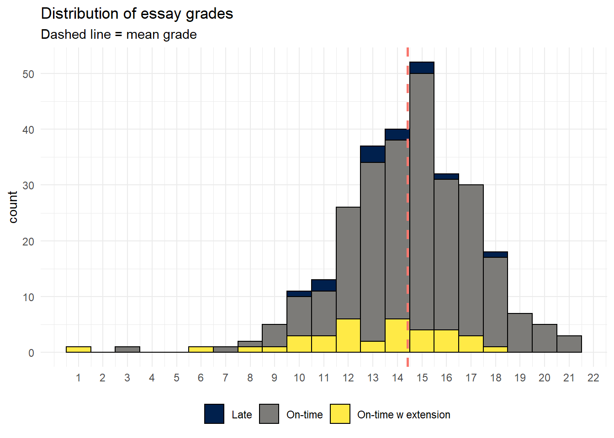
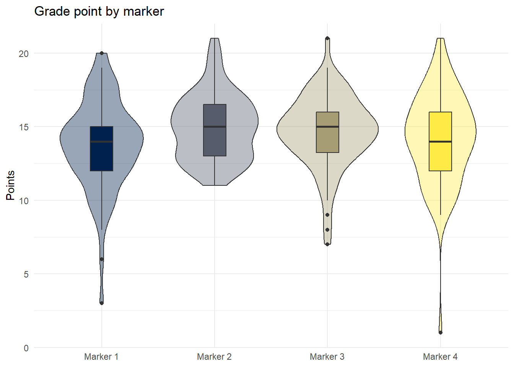
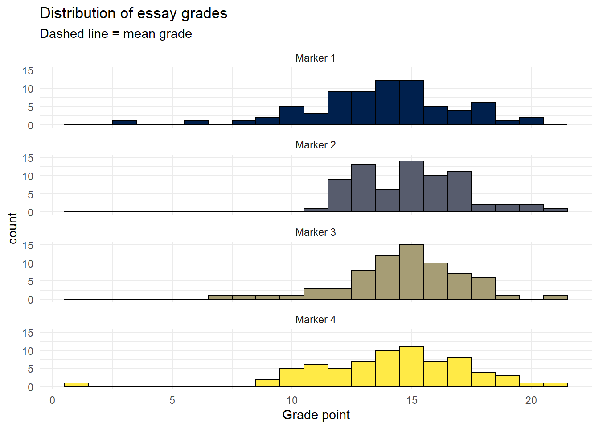

# Moodle Assignment submission reports

Platforms like Moodle provide extremely detailed assignment submission reports that contain data on when the student submitted, extensions, and their grade. This tutorial explains how to use R to create a series of simple reports on the data provided by [Moodle Assignment Submission reports](https://moodle.org/plugins/report_assign) that can be helpful for generating insights into student behavior on your course. This tutorial is designed with a Moodle report in mind, but it would be possible to adapt much of this code to the reports produced by other systems.

## Set-up

Install (if required) and load the following packages


```r
library(tidyverse) # data wrangling and visualisation
library(rio) # import data
library(lubridate) # working with dates
library(plotly) # interactive plots
library(psych) # for descriptive stats
```

The data file is a simulated assignment submission report for 300 students for an essay submission. Although the data has been simulated, the file is identical to the one that is downloaded from Moodle so you should be able to use this code with any assignment submission reports downloaded from Moodle (assuming that the variable names don't change between institutions!).

* The assignment submission report is an .xlsx file. There are lots of functions you can use in R to import specific types of files, however, the `import` function from the `rio` package is a great wrapper function that works for pretty much any type of file and avoids me having to remember which function I need for each specific file type.
* The first three lines of the assignment submission report file are blank and the main data table starts on line 4, so we add `skip = 3` to skip the first three lines of data from the import.


```r
dat <- import("https://github.com/emilynordmann/scholaRship/raw/master/book/data/essay_data.xlsx", skip = 3)
```

## Data types

Before we do anything we need to do a little work to tidy up the file and ensure that R has our data encoded as the right type. First, check the data using `str()`:


```r
str(dat)
```

```
## 'data.frame':	300 obs. of  14 variables:
##  $ #             : num  1 2 3 4 5 6 7 8 9 10 ...
##  $ Username      : chr  "Name 1" "Name 2" "Name 3" "Name 4" ...
##  $ Participant No: chr  "100000252" "100000128" "100000244" "100000587" ...
##  $ Email address : chr  "myemail@student.ac.uk" "myemail@student.ac.uk" "myemail@student.ac.uk" "myemail@student.ac.uk" ...
##  $ ID number     : chr  "1234818" "1234694" "1234810" "1235153" ...
##  $ Groups        : chr  "group6" "group10" "group8" "group7" ...
##  $ Status        : chr  "submitted" "submitted" "submitted" "submitted" ...
##  $ Grade         : chr  "C3" "C1" "A4" "C1" ...
##  $ Turnitin      : chr  "16" "16" "12" "15" ...
##  $ Grader        : chr  "Marker 4" "Marker 4" "Marker 4" "Marker 3" ...
##  $ Modified      : chr  "16/11/20, 20:14" "13/11/20, 08:26" "13/11/20, 08:50" "12/11/20, 18:05" ...
##  $ Released      : chr  "7/12/20, 12:01" "7/12/20, 12:01" "7/12/20, 12:01" "7/12/20, 12:00" ...
##  $ Extension     : chr  "16/11/20, 12:00" "-" "-" "-" ...
##  $ Files         : chr  "essay1" "essay2" "essay3" "essay4" ...
```

Based on this, there's three things we need to do:

* Remove the `-` Moodle uses to represent missing data and replace with an actual empty cell (i.e., an `NA`) using `mutate()` and `na_if`
* Convert all date and time variables to a date/time class as R currently has it stored as character. `Modified` (the time the student last changed the file, i.e., when they submitted), `Extension`, and `Released` are currently in the format day-month-year-hour-minute so we'll use the `dmy_hm` function from the `lubridate` package.
* Convert any numeric data to numeric. If a variable has any character text in it, R will read that variable in as a character. Because Moodle used `-` to encode missing values, the numeric Turnitin score is represented as character variable so once we've gotten rid of the `-` we need to convert it back.  


```r
dat_cleaned <- dat %>%
  mutate(across(where(is.character), ~na_if(., "-"))) %>% # replace - with NAs
  mutate(Modified = dmy_hm(Modified),
         Extension = dmy_hm(Extension),
         Released = dmy_hm(Released),
         Turnitin = as.numeric(Turnitin))
```

There's a lot you can do with the data contained in this file, below are some suggestions for insights you can generate.

## Extensions and late submissions

Rates of extensions and late submission increased significantly over covid and we've found it helpful to look at patterns of when students submit their work relative to the deadline.

* First, create a date time variable that contains the deadline. We'll use the same format as above as therefore use the `dmy_hm` function again to convert this information to the right format so R recognises it as a date. The deadline you state should be the time at which the assignment would become a late submission - for us it's one minute after the stated deadline so in this example it would be 1 minute past 12 noon on 13th November 2020.
* It's also helpful to have variables that store how many students were on the course in total, and how many submitted.


```r
deadline <-dmy_hm("13/11/2020 12:01")
total_students <- nrow(dat_cleaned)
total_submissions <- dat_cleaned %>%
  filter(Status == "submitted") %>%
  nrow()
```

There's a few ways we can look at the extension and late submission data. First, let's calculate the number of extensions that were applied with a simple count. The below code gives us the number of extensions for each day.


```r
dat_cleaned %>%
  count(Extension)
```

<div class="kable-table">

<table>
 <thead>
  <tr>
   <th style="text-align:left;"> Extension </th>
   <th style="text-align:right;"> n </th>
  </tr>
 </thead>
<tbody>
  <tr>
   <td style="text-align:left;"> 2020-11-15 12:00:00 </td>
   <td style="text-align:right;"> 2 </td>
  </tr>
  <tr>
   <td style="text-align:left;"> 2020-11-16 12:00:00 </td>
   <td style="text-align:right;"> 6 </td>
  </tr>
  <tr>
   <td style="text-align:left;"> 2020-11-17 12:00:00 </td>
   <td style="text-align:right;"> 8 </td>
  </tr>
  <tr>
   <td style="text-align:left;"> 2020-11-18 12:00:00 </td>
   <td style="text-align:right;"> 14 </td>
  </tr>
  <tr>
   <td style="text-align:left;"> 2020-11-20 12:00:00 </td>
   <td style="text-align:right;"> 9 </td>
  </tr>
  <tr>
   <td style="text-align:left;"> NA </td>
   <td style="text-align:right;"> 261 </td>
  </tr>
</tbody>
</table>

</div>

To get the total number of extensions, we adapt the same code but remove the NAs from the calculation and then sum up the total and calculate what percent of submissions had an extension applied:


```r
dat_cleaned %>%
  count(Extension) %>%
  filter(!is.na(Extension)) %>% # remove rows that don't have an extension date
  summarise(total = sum(n),
            percent = round((total/total_submissions)*100, 2))
```

<div class="kable-table">

<table>
 <thead>
  <tr>
   <th style="text-align:right;"> total </th>
   <th style="text-align:right;"> percent </th>
  </tr>
 </thead>
<tbody>
  <tr>
   <td style="text-align:right;"> 39 </td>
   <td style="text-align:right;"> 13.64 </td>
  </tr>
</tbody>
</table>

</div>

We might want something more fine-grained than that and need to look at the numbers of on-time submissions, extensions, late submissions, and non-submissions and this requires a bit of data wrangling.

`case_when()` allows you to recode values based on multiple if-then statements. Our conditions are:

1. If the essay is submitted on or before the deadline, it is labelled as on-time. 
2. If the essay is submitted after the deadline but on or before the extension deadline, it is labelled as on-time with an extension. 
3 If the essay is submitted after the deadline and there is no extension applied, it is labelled as late. 
4. If the essay is not submitted it is labelled as non-submission.

If this makes your head explode, please know that this code took me half an hour and multiple errors to write before I got the logic correct.


```r
dat_cleaned <- dat_cleaned %>%
  mutate(submission_category= case_when((Status == "submitted" & Modified <= deadline)~ "On-time",
                            (Modified > deadline & deadline <= Extension) ~ "On-time w extension",
                            (Modified > deadline & is.na(Extension)) ~ "Late",
                            (Modified > Extension) ~ "Late with extension",
                            TRUE ~ "Non-submission"))
```

We can then use these new categories to calculate descriptives:


```r
dat_cleaned %>%
  count(submission_category) %>%
  mutate(percent = round((n/total_submissions)*100, 2))
```

<div class="kable-table">

<table>
 <thead>
  <tr>
   <th style="text-align:left;"> submission_category </th>
   <th style="text-align:right;"> n </th>
   <th style="text-align:right;"> percent </th>
  </tr>
 </thead>
<tbody>
  <tr>
   <td style="text-align:left;"> Late </td>
   <td style="text-align:right;"> 12 </td>
   <td style="text-align:right;"> 4.20 </td>
  </tr>
  <tr>
   <td style="text-align:left;"> Non-submission </td>
   <td style="text-align:right;"> 14 </td>
   <td style="text-align:right;"> 4.90 </td>
  </tr>
  <tr>
   <td style="text-align:left;"> On-time </td>
   <td style="text-align:right;"> 238 </td>
   <td style="text-align:right;"> 83.22 </td>
  </tr>
  <tr>
   <td style="text-align:left;"> On-time w extension </td>
   <td style="text-align:right;"> 36 </td>
   <td style="text-align:right;"> 12.59 </td>
  </tr>
</tbody>
</table>

</div>

We'll remove the non-submissions from the distribution plot as otherwise they are plotted as having been submitted when the assignment first opened:


```r
p1 <- dat_cleaned %>%
  filter(submission_category != "Non-submission") %>%
  ggplot(aes(Modified, fill = submission_category)) +
  geom_histogram(colour = "black") +
  theme_minimal() + # add theme
  theme(legend.position = "bottom") + # move legend to bottom
  labs(fill = NULL, x = NULL, title = "Assignment submission report") + #labels
  scale_fill_viridis_d(option = "E") + # colour blind friendly palette
  theme(axis.text.x = element_text(angle=90)) + # rotate axis labels
  scale_x_datetime(date_breaks = "1 day", date_labels = "%b %d") + # set breaks
  geom_vline(xintercept = deadline, colour = "red", linetype = "dashed", size = 1.5) # add dashed line

p1
```


You can also produce a interactive version of the plot using `ggplotly()` - you can hover over the bars to see the counts and remove certain groups from the data:


```r
ggplotly(p1)
```

```{=html}
<div id="htmlwidget-3295ff220c2c5f887770" style="width:100%;height:480px;" class="plotly html-widget"></div>
<script type="application/json" data-for="htmlwidget-3295ff220c2c5f887770">{"x":{"data":[{"orientation":"v","width":[47445.517241478,47445.517241478,47445.517241478,47445.517241478,47445.517241478,47445.517241478,47445.517241478,47445.517241478,47445.517241478,47445.517241478,47445.517241478,47445.517241478,47445.517241478,47445.517241478,47445.517241478,47445.517241478,47445.517241478,47445.517241478,47445.517241478,47445.517241478,47445.517241478,47445.517241478,47445.517241478,47445.517241478,47445.517241478,47445.517241478,47445.517241478,47445.517241478,47445.517241478,47445.517241478],"base":[3,2,6,8,16,26,94,83,0,0,0,3,3,6,2,5,6,2,1,2,4,1,0,0,0,0,0,0,0,1],"x":[1604939511.72414,1604986957.24138,1605034402.75862,1605081848.27586,1605129293.7931,1605176739.31034,1605224184.82759,1605271630.34483,1605319075.86207,1605366521.37931,1605413966.89655,1605461412.41379,1605508857.93103,1605556303.44828,1605603748.96552,1605651194.48276,1605698640,1605746085.51724,1605793531.03448,1605840976.55172,1605888422.06897,1605935867.58621,1605983313.10345,1606030758.62069,1606078204.13793,1606125649.65517,1606173095.17241,1606220540.68966,1606267986.2069,1606315431.72414],"y":[0,0,0,0,0,0,0,9,0,1,1,0,0,0,1,0,0,0,0,0,0,0,0,0,0,0,0,0,0,0],"text":["count:  0<br />Modified: 1604939512<br />submission_category: Late","count:  0<br />Modified: 1604986957<br />submission_category: Late","count:  0<br />Modified: 1605034403<br />submission_category: Late","count:  0<br />Modified: 1605081848<br />submission_category: Late","count:  0<br />Modified: 1605129294<br />submission_category: Late","count:  0<br />Modified: 1605176739<br />submission_category: Late","count:  0<br />Modified: 1605224185<br />submission_category: Late","count:  9<br />Modified: 1605271630<br />submission_category: Late","count:  0<br />Modified: 1605319076<br />submission_category: Late","count:  1<br />Modified: 1605366521<br />submission_category: Late","count:  1<br />Modified: 1605413967<br />submission_category: Late","count:  0<br />Modified: 1605461412<br />submission_category: Late","count:  0<br />Modified: 1605508858<br />submission_category: Late","count:  0<br />Modified: 1605556303<br />submission_category: Late","count:  1<br />Modified: 1605603749<br />submission_category: Late","count:  0<br />Modified: 1605651194<br />submission_category: Late","count:  0<br />Modified: 1605698640<br />submission_category: Late","count:  0<br />Modified: 1605746086<br />submission_category: Late","count:  0<br />Modified: 1605793531<br />submission_category: Late","count:  0<br />Modified: 1605840977<br />submission_category: Late","count:  0<br />Modified: 1605888422<br />submission_category: Late","count:  0<br />Modified: 1605935868<br />submission_category: Late","count:  0<br />Modified: 1605983313<br />submission_category: Late","count:  0<br />Modified: 1606030759<br />submission_category: Late","count:  0<br />Modified: 1606078204<br />submission_category: Late","count:  0<br />Modified: 1606125650<br />submission_category: Late","count:  0<br />Modified: 1606173095<br />submission_category: Late","count:  0<br />Modified: 1606220541<br />submission_category: Late","count:  0<br />Modified: 1606267986<br />submission_category: Late","count:  0<br />Modified: 1606315432<br />submission_category: Late"],"type":"bar","textposition":"none","marker":{"autocolorscale":false,"color":"rgba(0,32,77,1)","line":{"width":1.88976377952756,"color":"rgba(0,0,0,1)"}},"name":"Late","legendgroup":"Late","showlegend":true,"xaxis":"x","yaxis":"y","hoverinfo":"text","frame":null},{"orientation":"v","width":[47445.517241478,47445.517241478,47445.517241478,47445.517241478,47445.517241478,47445.517241478,47445.517241478,47445.517241478,47445.517241478,47445.517241478,47445.517241478,47445.517241478,47445.517241478,47445.517241478,47445.517241478,47445.517241478,47445.517241478,47445.517241478,47445.517241478,47445.517241478,47445.517241478,47445.517241478,47445.517241478,47445.517241478,47445.517241478,47445.517241478,47445.517241478,47445.517241478,47445.517241478,47445.517241478],"base":[0,0,0,0,0,0,0,0,0,0,0,3,3,6,2,5,6,2,1,2,4,1,0,0,0,0,0,0,0,1],"x":[1604939511.72414,1604986957.24138,1605034402.75862,1605081848.27586,1605129293.7931,1605176739.31034,1605224184.82759,1605271630.34483,1605319075.86207,1605366521.37931,1605413966.89655,1605461412.41379,1605508857.93103,1605556303.44828,1605603748.96552,1605651194.48276,1605698640,1605746085.51724,1605793531.03448,1605840976.55172,1605888422.06897,1605935867.58621,1605983313.10345,1606030758.62069,1606078204.13793,1606125649.65517,1606173095.17241,1606220540.68966,1606267986.2069,1606315431.72414],"y":[3,2,6,8,16,26,94,83,0,0,0,0,0,0,0,0,0,0,0,0,0,0,0,0,0,0,0,0,0,0],"text":["count:  3<br />Modified: 1604939512<br />submission_category: On-time","count:  2<br />Modified: 1604986957<br />submission_category: On-time","count:  6<br />Modified: 1605034403<br />submission_category: On-time","count:  8<br />Modified: 1605081848<br />submission_category: On-time","count: 16<br />Modified: 1605129294<br />submission_category: On-time","count: 26<br />Modified: 1605176739<br />submission_category: On-time","count: 94<br />Modified: 1605224185<br />submission_category: On-time","count: 83<br />Modified: 1605271630<br />submission_category: On-time","count:  0<br />Modified: 1605319076<br />submission_category: On-time","count:  0<br />Modified: 1605366521<br />submission_category: On-time","count:  0<br />Modified: 1605413967<br />submission_category: On-time","count:  0<br />Modified: 1605461412<br />submission_category: On-time","count:  0<br />Modified: 1605508858<br />submission_category: On-time","count:  0<br />Modified: 1605556303<br />submission_category: On-time","count:  0<br />Modified: 1605603749<br />submission_category: On-time","count:  0<br />Modified: 1605651194<br />submission_category: On-time","count:  0<br />Modified: 1605698640<br />submission_category: On-time","count:  0<br />Modified: 1605746086<br />submission_category: On-time","count:  0<br />Modified: 1605793531<br />submission_category: On-time","count:  0<br />Modified: 1605840977<br />submission_category: On-time","count:  0<br />Modified: 1605888422<br />submission_category: On-time","count:  0<br />Modified: 1605935868<br />submission_category: On-time","count:  0<br />Modified: 1605983313<br />submission_category: On-time","count:  0<br />Modified: 1606030759<br />submission_category: On-time","count:  0<br />Modified: 1606078204<br />submission_category: On-time","count:  0<br />Modified: 1606125650<br />submission_category: On-time","count:  0<br />Modified: 1606173095<br />submission_category: On-time","count:  0<br />Modified: 1606220541<br />submission_category: On-time","count:  0<br />Modified: 1606267986<br />submission_category: On-time","count:  0<br />Modified: 1606315432<br />submission_category: On-time"],"type":"bar","textposition":"none","marker":{"autocolorscale":false,"color":"rgba(124,123,120,1)","line":{"width":1.88976377952756,"color":"rgba(0,0,0,1)"}},"name":"On-time","legendgroup":"On-time","showlegend":true,"xaxis":"x","yaxis":"y","hoverinfo":"text","frame":null},{"orientation":"v","width":[47445.517241478,47445.517241478,47445.517241478,47445.517241478,47445.517241478,47445.517241478,47445.517241478,47445.517241478,47445.517241478,47445.517241478,47445.517241478,47445.517241478,47445.517241478,47445.517241478,47445.517241478,47445.517241478,47445.517241478,47445.517241478,47445.517241478,47445.517241478,47445.517241478,47445.517241478,47445.517241478,47445.517241478,47445.517241478,47445.517241478,47445.517241478,47445.517241478,47445.517241478,47445.517241478],"base":[0,0,0,0,0,0,0,0,0,0,0,0,0,0,0,0,0,0,0,0,0,0,0,0,0,0,0,0,0,0],"x":[1604939511.72414,1604986957.24138,1605034402.75862,1605081848.27586,1605129293.7931,1605176739.31034,1605224184.82759,1605271630.34483,1605319075.86207,1605366521.37931,1605413966.89655,1605461412.41379,1605508857.93103,1605556303.44828,1605603748.96552,1605651194.48276,1605698640,1605746085.51724,1605793531.03448,1605840976.55172,1605888422.06897,1605935867.58621,1605983313.10345,1606030758.62069,1606078204.13793,1606125649.65517,1606173095.17241,1606220540.68966,1606267986.2069,1606315431.72414],"y":[0,0,0,0,0,0,0,0,0,0,0,3,3,6,2,5,6,2,1,2,4,1,0,0,0,0,0,0,0,1],"text":["count:  0<br />Modified: 1604939512<br />submission_category: On-time w extension","count:  0<br />Modified: 1604986957<br />submission_category: On-time w extension","count:  0<br />Modified: 1605034403<br />submission_category: On-time w extension","count:  0<br />Modified: 1605081848<br />submission_category: On-time w extension","count:  0<br />Modified: 1605129294<br />submission_category: On-time w extension","count:  0<br />Modified: 1605176739<br />submission_category: On-time w extension","count:  0<br />Modified: 1605224185<br />submission_category: On-time w extension","count:  0<br />Modified: 1605271630<br />submission_category: On-time w extension","count:  0<br />Modified: 1605319076<br />submission_category: On-time w extension","count:  0<br />Modified: 1605366521<br />submission_category: On-time w extension","count:  0<br />Modified: 1605413967<br />submission_category: On-time w extension","count:  3<br />Modified: 1605461412<br />submission_category: On-time w extension","count:  3<br />Modified: 1605508858<br />submission_category: On-time w extension","count:  6<br />Modified: 1605556303<br />submission_category: On-time w extension","count:  2<br />Modified: 1605603749<br />submission_category: On-time w extension","count:  5<br />Modified: 1605651194<br />submission_category: On-time w extension","count:  6<br />Modified: 1605698640<br />submission_category: On-time w extension","count:  2<br />Modified: 1605746086<br />submission_category: On-time w extension","count:  1<br />Modified: 1605793531<br />submission_category: On-time w extension","count:  2<br />Modified: 1605840977<br />submission_category: On-time w extension","count:  4<br />Modified: 1605888422<br />submission_category: On-time w extension","count:  1<br />Modified: 1605935868<br />submission_category: On-time w extension","count:  0<br />Modified: 1605983313<br />submission_category: On-time w extension","count:  0<br />Modified: 1606030759<br />submission_category: On-time w extension","count:  0<br />Modified: 1606078204<br />submission_category: On-time w extension","count:  0<br />Modified: 1606125650<br />submission_category: On-time w extension","count:  0<br />Modified: 1606173095<br />submission_category: On-time w extension","count:  0<br />Modified: 1606220541<br />submission_category: On-time w extension","count:  0<br />Modified: 1606267986<br />submission_category: On-time w extension","count:  1<br />Modified: 1606315432<br />submission_category: On-time w extension"],"type":"bar","textposition":"none","marker":{"autocolorscale":false,"color":"rgba(255,234,70,1)","line":{"width":1.88976377952756,"color":"rgba(0,0,0,1)"}},"name":"On-time w extension","legendgroup":"On-time w extension","showlegend":true,"xaxis":"x","yaxis":"y","hoverinfo":"text","frame":null},{"x":["2020-11-13 12:01:00.000000","2020-11-13 12:01:00.000000"],"y":[-4.7,98.7],"text":"xintercept: 2020-11-13 12:01:00","type":"scatter","mode":"lines","line":{"width":5.66929133858268,"color":"rgba(255,0,0,1)","dash":"dash"},"hoveron":"points","showlegend":false,"xaxis":"x","yaxis":"y","hoverinfo":"text","frame":null}],"layout":{"margin":{"t":43.7625570776256,"r":7.30593607305936,"b":48.9497716894977,"l":37.2602739726027},"font":{"color":"rgba(0,0,0,1)","family":"","size":14.6118721461187},"title":{"text":"Assignment submission report","font":{"color":"rgba(0,0,0,1)","family":"","size":17.5342465753425},"x":0,"xref":"paper"},"xaxis":{"domain":[0,1],"automargin":true,"type":"linear","autorange":false,"range":[1604844620.68966,1606410322.75862],"tickmode":"array","ticktext":["Nov 09","Nov 10","Nov 11","Nov 12","Nov 13","Nov 14","Nov 15","Nov 16","Nov 17","Nov 18","Nov 19","Nov 20","Nov 21","Nov 22","Nov 23","Nov 24","Nov 25","Nov 26"],"tickvals":[1604880000,1604966400,1605052800,1605139200,1605225600,1605312000,1605398400,1605484800,1605571200,1605657600,1605744000,1605830400,1605916800,1606003200,1606089600,1606176000,1606262400,1606348800],"categoryorder":"array","categoryarray":["Nov 09","Nov 10","Nov 11","Nov 12","Nov 13","Nov 14","Nov 15","Nov 16","Nov 17","Nov 18","Nov 19","Nov 20","Nov 21","Nov 22","Nov 23","Nov 24","Nov 25","Nov 26"],"nticks":null,"ticks":"","tickcolor":null,"ticklen":3.65296803652968,"tickwidth":0,"showticklabels":true,"tickfont":{"color":"rgba(77,77,77,1)","family":"","size":11.689497716895},"tickangle":-90,"showline":false,"linecolor":null,"linewidth":0,"showgrid":true,"gridcolor":"rgba(235,235,235,1)","gridwidth":0.66417600664176,"zeroline":false,"anchor":"y","title":{"text":"","font":{"color":"rgba(0,0,0,1)","family":"","size":14.6118721461187}},"hoverformat":".2f"},"yaxis":{"domain":[0,1],"automargin":true,"type":"linear","autorange":false,"range":[-4.7,98.7],"tickmode":"array","ticktext":["0","25","50","75"],"tickvals":[0,25,50,75],"categoryorder":"array","categoryarray":["0","25","50","75"],"nticks":null,"ticks":"","tickcolor":null,"ticklen":3.65296803652968,"tickwidth":0,"showticklabels":true,"tickfont":{"color":"rgba(77,77,77,1)","family":"","size":11.689497716895},"tickangle":-0,"showline":false,"linecolor":null,"linewidth":0,"showgrid":true,"gridcolor":"rgba(235,235,235,1)","gridwidth":0.66417600664176,"zeroline":false,"anchor":"x","title":{"text":"count","font":{"color":"rgba(0,0,0,1)","family":"","size":14.6118721461187}},"hoverformat":".2f"},"shapes":[{"type":"rect","fillcolor":null,"line":{"color":null,"width":0,"linetype":[]},"yref":"paper","xref":"paper","x0":0,"x1":1,"y0":0,"y1":1}],"showlegend":true,"legend":{"bgcolor":null,"bordercolor":null,"borderwidth":0,"font":{"color":"rgba(0,0,0,1)","family":"","size":11.689497716895},"title":{"text":"","font":{"color":"rgba(0,0,0,1)","family":"","size":14.6118721461187}}},"hovermode":"closest","barmode":"relative"},"config":{"doubleClick":"reset","modeBarButtonsToAdd":["hoverclosest","hovercompare"],"showSendToCloud":false},"source":"A","attrs":{"58ec66b6353f":{"x":{},"fill":{},"type":"bar"},"58ec1dea342c":{"xintercept":{}}},"cur_data":"58ec66b6353f","visdat":{"58ec66b6353f":["function (y) ","x"],"58ec1dea342c":["function (y) ","x"]},"highlight":{"on":"plotly_click","persistent":false,"dynamic":false,"selectize":false,"opacityDim":0.2,"selected":{"opacity":1},"debounce":0},"shinyEvents":["plotly_hover","plotly_click","plotly_selected","plotly_relayout","plotly_brushed","plotly_brushing","plotly_clickannotation","plotly_doubleclick","plotly_deselect","plotly_afterplot","plotly_sunburstclick"],"base_url":"https://plot.ly"},"evals":[],"jsHooks":[]}</script>
```

If you don't have the extensions applied through Moodle or if you just wanted to look at the difference between on-time submissions and collapse lates and extensions into one group then you could do the following:


```r
dat_cleaned <- dat_cleaned %>%
  mutate(submission_category_blunt= case_when((Status == "submitted" & 
                                                 Modified <= deadline)~ "On-time",
                            (Modified > deadline) ~ "Late or extension",
                            
                            TRUE ~ "Non-submission"))
```

## Grades

We use a 22-point scale where each alphanumeric grade has a corresponding grade point total on a 22-point scale (e.g., a B2 = 16).The grades in Moodle are stored as in their alphanumeric form so we need to convert this to numbers. 

I do this so often that the easiest way is to have a spreadsheet that contains the grades with the associated gradepoints, import this, and then use `inner_join()` to combine the two files. This will join the two files by their common columns, so we now have a variable `Points` in our dataset that has the corresponding


```r
grade_points <- import("https://raw.githubusercontent.com/emilynordmann/scholaRship/master/book/data/grade_points.csv")
dat_cleaned <- inner_join(dat_cleaned, grade_points, by = "Grade")
```

We can now create some basic descriptive stats and visualisations on the grade point values. The `describe()` function from the `psych()` library is great for quickly producing a range of descriptive statistics.

**At this stage I want to highlight again that these are simulated data so don't read anything into the actual patterns, it's not real data, any patterns you see are meaningless**


```r
dat_cleaned %>%
  select(Points) %>% # just select points column for stats
  describe()
```

<div class="kable-table">

<table>
 <thead>
  <tr>
   <th style="text-align:left;">   </th>
   <th style="text-align:right;"> vars </th>
   <th style="text-align:right;"> n </th>
   <th style="text-align:right;"> mean </th>
   <th style="text-align:right;"> sd </th>
   <th style="text-align:right;"> median </th>
   <th style="text-align:right;"> trimmed </th>
   <th style="text-align:right;"> mad </th>
   <th style="text-align:right;"> min </th>
   <th style="text-align:right;"> max </th>
   <th style="text-align:right;"> range </th>
   <th style="text-align:right;"> skew </th>
   <th style="text-align:right;"> kurtosis </th>
   <th style="text-align:right;"> se </th>
  </tr>
 </thead>
<tbody>
  <tr>
   <td style="text-align:left;"> Points </td>
   <td style="text-align:right;"> 1 </td>
   <td style="text-align:right;"> 285 </td>
   <td style="text-align:right;"> 14.40702 </td>
   <td style="text-align:right;"> 2.800142 </td>
   <td style="text-align:right;"> 15 </td>
   <td style="text-align:right;"> 14.50655 </td>
   <td style="text-align:right;"> 2.9652 </td>
   <td style="text-align:right;"> 1 </td>
   <td style="text-align:right;"> 21 </td>
   <td style="text-align:right;"> 20 </td>
   <td style="text-align:right;"> -0.6750928 </td>
   <td style="text-align:right;"> 2.13971 </td>
   <td style="text-align:right;"> 0.1658661 </td>
  </tr>
</tbody>
</table>

</div>


```r
ggplot(dat_cleaned, aes(Points)) +
  geom_histogram(binwidth = 1, colour = "black") +
  theme_minimal() +
  labs(title = "Distribution of essay grades", 
       x = NULL, 
       colour = NULL, 
       subtitle = "Dashed line = mean grade") +
  scale_x_continuous(breaks = seq(1,22, by = 1)) + 
  geom_vline(aes(xintercept=mean(Points),color="red"), 
             linetype="dashed",
             size = 1, 
             show.legend = FALSE) 
```


We could also look at the distribution of grades by submission category:


```r
ggplot(dat_cleaned, aes(Points, fill = submission_category)) +
  geom_histogram(binwidth = 1, colour = "black") +
  theme_minimal() +
  labs(title = "Distribution of essay grades", 
       x = NULL, 
       subtitle = "Dashed line = mean grade",
       fill = NULL) +
  geom_vline(aes(xintercept=mean(Points),color="red"), 
             linetype="dashed",
             size=1,
             show.legend = FALSE) +
  theme(legend.position = "bottom") +
  scale_fill_viridis_d(option = "E")
```



Or the descriptives by category:


```r
dat_cleaned %>%
  group_by(submission_category) %>%
  summarise(mean_grade = mean(Points, na.rm = TRUE),
            median_grade = median(Points, na.rm = TRUE))
```

<div class="kable-table">

<table>
 <thead>
  <tr>
   <th style="text-align:left;"> submission_category </th>
   <th style="text-align:right;"> mean_grade </th>
   <th style="text-align:right;"> median_grade </th>
  </tr>
 </thead>
<tbody>
  <tr>
   <td style="text-align:left;"> Late </td>
   <td style="text-align:right;"> 13.58333 </td>
   <td style="text-align:right;"> 13.5 </td>
  </tr>
  <tr>
   <td style="text-align:left;"> On-time </td>
   <td style="text-align:right;"> 14.68776 </td>
   <td style="text-align:right;"> 15.0 </td>
  </tr>
  <tr>
   <td style="text-align:left;"> On-time w extension </td>
   <td style="text-align:right;"> 12.83333 </td>
   <td style="text-align:right;"> 13.5 </td>
  </tr>
</tbody>
</table>

</div>

With an associated visualization:


```r
ggplot(dat_cleaned, aes(x = submission_category, y = Points, fill = submission_category)) +
  geom_violin(show.legend = FALSE,
              alpha = .4) +
  geom_boxplot(width = .2, show.legend = FALSE) +
  theme_minimal() +
  scale_fill_viridis_d(option = "E") +
  labs(x = NULL, title = "Grade point by submission category")
```


The correlation between Turnitin score and grade (even with real data I think this would be a bit pointless but you never know):


```r
ggplot(dat_cleaned, aes(Points, Turnitin)) +
  geom_jitter() + # use jitter rather than geom_point as some overlapping data points
  geom_smooth(method = "loess") + # no clear linear relationship, otherwise use method = "lm"
  labs(x = "Grade point", y = "Turnitin score")
```

```
## `geom_smooth()` using formula 'y ~ x'
```


The relationship between Turnitin score and submission category - this code removes the two outliers - remove the filter line to put them back in.


```r
dat_cleaned %>%
  filter(Turnitin < 75) %>%
  group_by(submission_category) %>%
  summarise(mean_grade = mean(Turnitin, na.rm = TRUE),
            median_grade = median(Turnitin, na.rm = TRUE))
```

<div class="kable-table">

<table>
 <thead>
  <tr>
   <th style="text-align:left;"> submission_category </th>
   <th style="text-align:right;"> mean_grade </th>
   <th style="text-align:right;"> median_grade </th>
  </tr>
 </thead>
<tbody>
  <tr>
   <td style="text-align:left;"> Late </td>
   <td style="text-align:right;"> 19.50000 </td>
   <td style="text-align:right;"> 18 </td>
  </tr>
  <tr>
   <td style="text-align:left;"> On-time </td>
   <td style="text-align:right;"> 19.00847 </td>
   <td style="text-align:right;"> 18 </td>
  </tr>
  <tr>
   <td style="text-align:left;"> On-time w extension </td>
   <td style="text-align:right;"> 19.85714 </td>
   <td style="text-align:right;"> 18 </td>
  </tr>
</tbody>
</table>

</div>

With an associated visualisation:


```r
dat_cleaned %>%
  filter(Turnitin < 75) %>%
  ggplot(aes(x = submission_category, y = Turnitin, fill = submission_category)) +
  geom_violin(show.legend = FALSE,
              alpha = .4) +
  geom_boxplot(width = .2, show.legend = FALSE) +
  theme_minimal() +
  scale_fill_viridis_d(option = "E") +
  labs(x = NULL, title = "Turnitin score by submission category")
```


Finally, we could also look at grades by marker:


```r
dat_cleaned %>%
  group_by(Grader) %>%
  summarise(mean_grade = mean(Points, na.rm = TRUE),
            median_grade = median(Points, na.rm = TRUE))
```

<div class="kable-table">

<table>
 <thead>
  <tr>
   <th style="text-align:left;"> Grader </th>
   <th style="text-align:right;"> mean_grade </th>
   <th style="text-align:right;"> median_grade </th>
  </tr>
 </thead>
<tbody>
  <tr>
   <td style="text-align:left;"> Marker 1 </td>
   <td style="text-align:right;"> 13.78082 </td>
   <td style="text-align:right;"> 14 </td>
  </tr>
  <tr>
   <td style="text-align:left;"> Marker 2 </td>
   <td style="text-align:right;"> 14.98592 </td>
   <td style="text-align:right;"> 15 </td>
  </tr>
  <tr>
   <td style="text-align:left;"> Marker 3 </td>
   <td style="text-align:right;"> 14.67143 </td>
   <td style="text-align:right;"> 15 </td>
  </tr>
  <tr>
   <td style="text-align:left;"> Marker 4 </td>
   <td style="text-align:right;"> 14.21127 </td>
   <td style="text-align:right;"> 14 </td>
  </tr>
</tbody>
</table>

</div>

Violin-boxplots:


```r
dat_cleaned %>%
  ggplot(aes(x = Grader, y = Points, fill = Grader)) +
  geom_violin(show.legend = FALSE,
              alpha = .4) +
  geom_boxplot(width = .2, show.legend = FALSE) +
  theme_minimal() +
  scale_fill_viridis_d(option = "E") +
  labs(x = NULL, title = "Grade point by marker")
```



Finally, rather than using grouped histograms as we've done previously, it's better to visualise the distributions of different markers using `facet_wrap()` as it makes it easier to compare the distributions:


```r
ggplot(dat_cleaned, aes(Points, fill = Grader)) +
  geom_histogram(binwidth = 1, colour = "black", show.legend = FALSE) +
  theme_minimal() +
  labs(title = "Distribution of essay grades", 
       x = "Grade point", 
       subtitle = "Dashed line = mean grade",
       fill = NULL) +
  theme(legend.position = "bottom") +
  scale_fill_viridis_d(option = "E") +
  facet_wrap(~Grader, nrow = 4)
```



