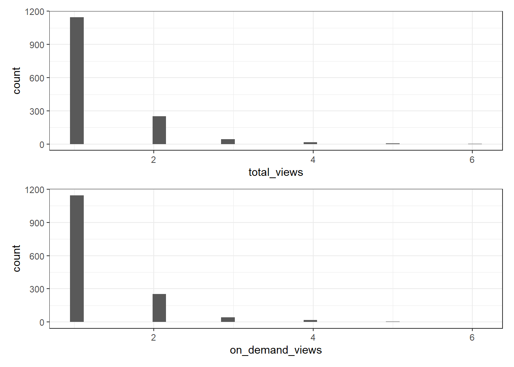

# Getting started with Echo360 data with `tidyverse` {#Echo_tidy}

## Reading data into R

Before we start with the tutorial, you will down to install the following packages. We note in a comment what we need each package for. 


```r
library(tidyverse) # Package of packages for plotting and wrangling 
library(psych) # for descriptive statistics
```

The `readr` package in the `tidyverse` provides us with a host of functions for reading in data to R. Often in a course, you will have multiple video recordings which you have Echo360 data on. It is useful to keep all this data within one data frame in R for analysis, as we will often consider metrics across the full course and not for one video. 

The `list.files` command will list all of the files available within a given working directory. To download the data for this tutorial, please [download the .zip file](data/Echo360_Data/Echo360_data.zip) containing 9 files of Echo360 data. 

To set up your working directory the same as ours, create a folder named `data` on your computer and then extract the zip folder into this data (so there should be a folder named data that has a folder named Echo360_data in it).

See [Chapter 4](#anonymous) for how we created anonymous synthetic data to use in these tutorials. The data are stored in .csv files and we can specifically list those files using the command `pattern = ".csv"` as shown below:


```r
# Obtain list of files from directory
files <- list.files(path = "data/Echo360_Data/", 
                    pattern=".csv") 

# Read in all files
data <- read_csv(paste0("data/Echo360_Data/", files), # Add our working directory to the list of files 
                 id="video") # What should be call the column containing the name of the video file? 

# Fill in spaces between column names
data <- tibble(data, 
               .name_repair = "universal") # Setting to universal makes all names unique and syntactic
```

The object we created (`data`) contains the names of the various Echo360 videos in the variable `video`, though the naming conventions are awkward to handle in R. We can simply number these videos by using the code below.


```r
# To break this code down, we start with the innermost function
# 1. We first make each unique video name a factor (unique category)
# 2. We then make each factor a number, so we get an ascending number from 1 to 9
# 3. We then make the numbers a factor, because they're actually labels rather than real numbers
data$video <-as.factor(as.numeric(as.factor(data$video)))
```

## Data descriptions for each field in downloaded data

Within the Echo360 data, we will have various fields of data in different formats. It is important to understand what each of these fields corresponds to for any exploratory analysis of the data. 

R will often read the data in the correct format and store the variables in the right way. However, that is not always the case, so it is best to check this has been carried out correctly. We can obtain a summary of each column of data using the `str` command:


```r
str(data)
```

```
## tibble [1,466 × 16] (S3: tbl_df/tbl/data.frame)
##  $ video            : Factor w/ 9 levels "1","2","3","4",..: 1 1 1 1 1 1 1 1 1 1 ...
##  $ media_id         : chr [1:1466] "631c9eb6-7828-4e41-9e9e-ae3b261ae741" "631c9eb6-7828-4e41-9e9e-ae3b261ae741" "631c9eb6-7828-4e41-9e9e-ae3b261ae741" "631c9eb6-7828-4e41-9e9e-ae3b261ae741" ...
##  $ media_name       : chr [1:1466] "Physiological Psychology Week 1 Part 1" "Physiological Psychology Week 1 Part 1" "Physiological Psychology Week 1 Part 1" "Physiological Psychology Week 1 Part 1" ...
##  $ create_date      : chr [1:1466] "01/07/2022" "01/07/2022" "01/07/2022" "01/07/2022" ...
##  $ duration         : 'hms' num [1:1466] 00:13:11 00:13:11 00:13:11 00:13:11 ...
##   ..- attr(*, "units")= chr "secs"
##  $ owner_name       : chr [1:1466] "James Bartlett" "James Bartlett" "James Bartlett" "James Bartlett" ...
##  $ course           : chr [1:1466] "Physiological Psychology (PSYCH4065/5029) 2022-23" "Physiological Psychology (PSYCH4065/5029) 2022-23" "Physiological Psychology (PSYCH4065/5029) 2022-23" "Physiological Psychology (PSYCH4065/5029) 2022-23" ...
##  $ user_name        : chr [1:1466] "Ianto, Tasadduq" "Alessa, Tamarah" "Mary-Ann, Abdussalam" "Aderyn, Cahil" ...
##  $ email_address    : chr [1:1466] "210396@university.ac.uk" "205650@university.ac.uk" "211437@university.ac.uk" "298179@university.ac.uk" ...
##  $ total_views      : num [1:1466] 1 1 1 2 2 4 2 2 1 1 ...
##  $ total_view_time  : 'hms' num [1:1466] 00:10:55 00:12:46 00:13:09 00:10:32 ...
##   ..- attr(*, "units")= chr "secs"
##  $ average_view_time: 'hms' num [1:1466] 00:10:55 00:12:46 00:13:09 00:05:16 ...
##   ..- attr(*, "units")= chr "secs"
##  $ on_demand_views  : num [1:1466] 1 1 1 2 2 4 2 2 1 1 ...
##  $ live_view_count  : num [1:1466] 0 0 0 0 0 0 0 0 0 0 ...
##  $ downloads        : num [1:1466] 0 0 0 0 0 0 0 0 0 0 ...
##  $ last_viewed      : chr [1:1466] "01/16/2023" "01/18/2023" "01/24/2023" "01/15/2023" ...
##  - attr(*, "spec")=
##   .. cols(
##   ..   media_id = col_character(),
##   ..   media_name = col_character(),
##   ..   create_date = col_character(),
##   ..   duration = col_time(format = ""),
##   ..   owner_name = col_character(),
##   ..   course = col_character(),
##   ..   user_name = col_character(),
##   ..   email_address = col_character(),
##   ..   total_views = col_double(),
##   ..   total_view_time = col_time(format = ""),
##   ..   average_view_time = col_time(format = ""),
##   ..   on_demand_views = col_double(),
##   ..   live_view_count = col_double(),
##   ..   downloads = col_double(),
##   ..   last_viewed = col_character()
##   .. )
##  - attr(*, "problems")=<externalptr>
```

The output of this command details the variable type of each column and how this has been stored in R. For example, `owner_name` is a character variable, whereas `total_views` is numerical. 

An alternative way to check the data is to use the function `glimpse()` which gives a similar summary in a different output format:


```r
glimpse(data)
```

```
## Rows: 1,466
## Columns: 16
## $ video             <fct> 1, 1, 1, 1, 1, 1, 1, 1, 1, 1, 1, 1, 1, 1, 1, 1, 1, 1…
## $ media_id          <chr> "631c9eb6-7828-4e41-9e9e-ae3b261ae741", "631c9eb6-78…
## $ media_name        <chr> "Physiological Psychology Week 1 Part 1", "Physiolog…
## $ create_date       <chr> "01/07/2022", "01/07/2022", "01/07/2022", "01/07/202…
## $ duration          <time> 00:13:11, 00:13:11, 00:13:11, 00:13:11, 00:13:11, 0…
## $ owner_name        <chr> "James Bartlett", "James Bartlett", "James Bartlett"…
## $ course            <chr> "Physiological Psychology (PSYCH4065/5029) 2022-23",…
## $ user_name         <chr> "Ianto, Tasadduq", "Alessa, Tamarah", "Mary-Ann, Abd…
## $ email_address     <chr> "210396@university.ac.uk", "205650@university.ac.uk"…
## $ total_views       <dbl> 1, 1, 1, 2, 2, 4, 2, 2, 1, 1, 1, 1, 1, 1, 1, 1, 1, 2…
## $ total_view_time   <time> 00:10:55, 00:12:46, 00:13:09, 00:10:32, 00:19:58, 0…
## $ average_view_time <time> 00:10:55, 00:12:46, 00:13:09, 00:05:16, 00:09:59, 0…
## $ on_demand_views   <dbl> 1, 1, 1, 2, 2, 4, 2, 2, 1, 1, 1, 1, 1, 1, 1, 1, 1, 2…
## $ live_view_count   <dbl> 0, 0, 0, 0, 0, 0, 0, 0, 0, 0, 0, 0, 0, 0, 0, 0, 0, 0…
## $ downloads         <dbl> 0, 0, 0, 0, 0, 0, 0, 0, 0, 0, 0, 0, 0, 0, 0, 0, 0, 0…
## $ last_viewed       <chr> "01/16/2023", "01/18/2023", "01/24/2023", "01/15/202…
```

Whichever method you use, at this point, it is worthwhile checking the raw data (by visually inspecting the .csv file(s) read in) and the output of `str()` to check that R has correctly converted each column to it's preferred variable type. 

## Quick summaries of data

We can obtain some quick summaries of our variables to get an early feel for our data and check for any potential errors or outliers in our data.

### Numerical data

For numerical data, we can obtain a series of numerical summaries. 

The `select()` command allows us to select all variables based on specific criteria (such as variable name or a condition). Here, we select those variables which are numeric by using `where(is.numeric)`. We can then obtain the mean for all numeric variables by using the `summarise_all()` command and then specifying our chosen summary metric (which here, is `mean`).

We can compute the mean observations for all numerical columns by using the following code: 


```r
data %>% # The data frame you are using
  # select chooses or omits the columns you want included
  select(where(is.numeric)) %>% # By using where() within select(), we can ask R to show us all the numeric variables
  summarise_all(mean) # For all the numeric variables, calculate the mean value
```

<div class="kable-table">

| total_views| on_demand_views| live_view_count| downloads|
|-----------:|---------------:|---------------:|---------:|
|    1.287858|        1.287858|               0|         0|

</div>

The summary stats suggest that the distribution of the data might not be normal - the mean live view count and downloads are both zero. To see what's going on, we can visualise the spread of the data in histograms.


```r
ggplot(data, aes(x = live_view_count)) +
  geom_histogram()

ggplot(data, aes(x = downloads)) +
  geom_histogram()
```


```
## `stat_bin()` using `bins = 30`. Pick better value with `binwidth`.
## `stat_bin()` using `bins = 30`. Pick better value with `binwidth`.
```


These plots look a bit weird - that's because it turns out all of the values in both of these variables are zero.


```r
data %>%
  count(live_view_count)

data %>%
  count(downloads)
```

<div class="kable-table">

| live_view_count|    n|
|---------------:|----:|
|               0| 1466|

</div><div class="kable-table">

| downloads|    n|
|---------:|----:|
|         0| 1466|

</div>

For total views and on demand views, the mean value is identical and we can see by plotting this data that it is indeed the same data - which makes sense because if there are 0 live views then all of them must come from on demand views so the on demand viewing figures will equal the total viewing figures. Knowing this helps us better understand the utility of each variable. 


```r
ggplot(data, aes(x = total_views)) +
  geom_histogram()

ggplot(data, aes(x = on_demand_views)) +
  geom_histogram()
```




Given the distribution, in this case the mean isn't that useful on it's own and we also don't need all of the variables so we can just select the ones that are useful and compute a range of stats using the `describe()` function from the `psych` package. In this case, we could eithr select `total_views` or `on_demand_views` as they're the same thing. We'll go with `total_views` as it's a shorter variable name.

In order for `describe()` to work, we need to transform our object into a data frame as it's currently stored as a tibble (a type of data object used by the tidyverse).


```r
data %>%
  select(total_views) %>%
  as.data.frame() %>%
  describe()
```

<div class="kable-table">

|            | vars|    n|     mean|        sd| median|  trimmed| mad| min| max| range|     skew| kurtosis|        se|
|:-----------|----:|----:|--------:|---------:|------:|--------:|---:|---:|---:|-----:|--------:|--------:|---------:|
|total_views |    1| 1466| 1.287858| 0.6348921|      1| 1.149063|   0|   1|   6|     5| 2.902835| 10.88082| 0.0165818|

</div>

Another way to represent count data is to use `summarise()` and the function `n()`. `n()` can be unintuitive in that you don't need to pass any arguments to it, it will simply count whatever you have given it. In this case, we pass our data and use `group_by()` to tell it to group the data by each value in `total_views`. This means that `n()` will then count how many observations there are for for total viewing number.


```r
data %>% # The data frame you are using
  group_by(total_views) %>% # Group by the total_views variable
  summarise(n = n()) # Calculate the number of observations for each group
```

<div class="kable-table">

| total_views|    n|
|-----------:|----:|
|           1| 1145|
|           2|  253|
|           3|   44|
|           4|   17|
|           5|    5|
|           6|    2|

</div>

The `group_by()` function allows us to carry out computations by groups. We can then use `summarise()` to obtain the total number of counts for each total number of views using `n()`.

Although the code in this chapter doesn't really extend what you can get through the Echo360 dashboards, loading and checking your data through simple descriptive stats and visualisation can help identify any issues and help you better understand your data fr more complex analyses. 

