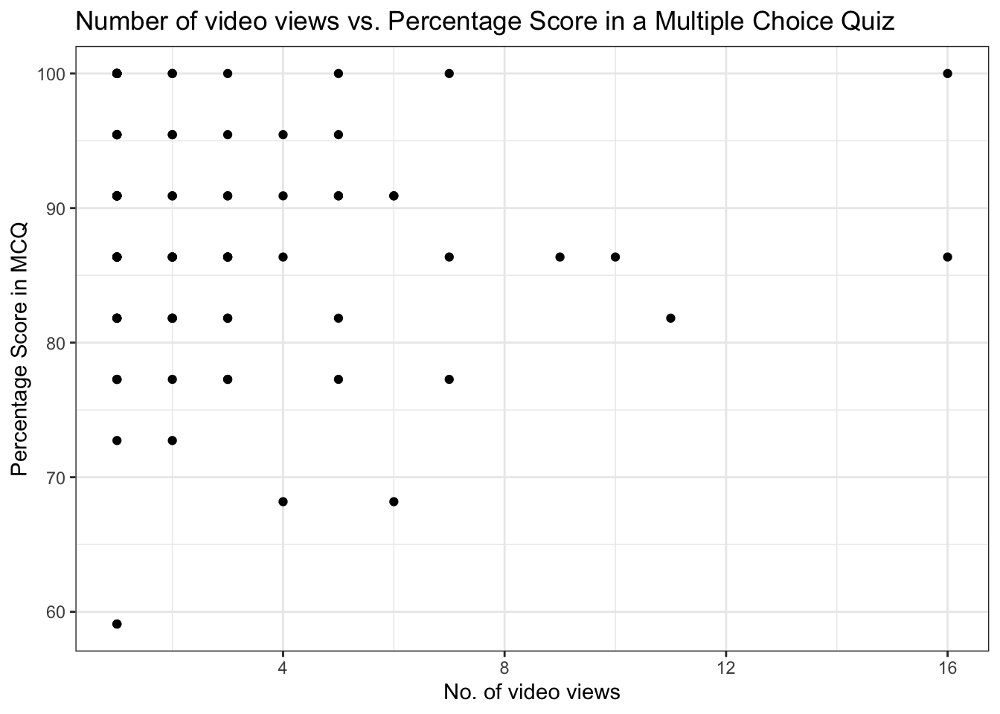

# Combining Echo360 data with other sources of data in R with tidyverse {#Echo_combine}


```r
library(tidyverse)
library(plotly)
```

```
## 
## Attaching package: 'plotly'
```

```
## The following object is masked from 'package:ggplot2':
## 
##     last_plot
```

```
## The following object is masked from 'package:stats':
## 
##     filter
```

```
## The following object is masked from 'package:graphics':
## 
##     layout
```

```r
library(lubridate)
```

```
## Loading required package: timechange
```

```
## 
## Attaching package: 'lubridate'
```

```
## The following objects are masked from 'package:base':
## 
##     date, intersect, setdiff, union
```

```r
library(ggpubr)
library(purrr)
library(scales)
```

```
## 
## Attaching package: 'scales'
```

```
## The following object is masked from 'package:purrr':
## 
##     discard
```

```
## The following object is masked from 'package:readr':
## 
##     col_factor
```


The `dplyr` package in `tidyverse` has a number of functions that merge or "join" data. As the [reference page](https://dplyr.tidyverse.org/reference/mutate-joins.html) states:

> Mutating joins add columns from y to x, matching observations based on the keys. There are four mutating joins: the inner join, and the three outer joins.

> Inner join
> An inner_join() only keeps observations from x that have a matching key in y.

> The most important property of an inner join is that unmatched rows in either input are not included in the result. This means that generally inner joins are not appropriate in most analyses, because it is too easy to lose observations.

> Outer joins
> The three outer joins keep observations that appear in at least one of the data frames:

> - A left_join() keeps all observations in x.

> - A right_join() keeps all observations in y.

> - A full_join() keeps all observations in x and y.


To illustrate these functions we will consider data from Echo360 together with data from a checklist which records the percentage of tasks that student have marked as complete and also with data containing the results of multiple choice quizzes (MCQ). In both the checklist and MCQ data objects each student only appears once.

## Merging data where each student only appears once in each data object

If we are interested in combining Echo360 data from just one lecture (and thus where each student will appear once) together with the MCQ data we could follow the following steps.

* First select the variables of interest from each data object, where `Lectures_01` contains the Echo360 data from the first lecture.


```r
Lecture01_to_merge <- Lecture01 %>% 
  select(user_name,email_address,total_views,total_view_time,average_view_time,last_viewed)
MCQ_to_merge <- MCQ %>% 
  select(first_name,surname,id_number,email_address,quiz_mcq_summative_assessment_real,quiz_mcq_summative_assessment_perc)
```

* Second, specify the type of 'join', e.g.

```r
Lecture01_MCQ_left <- left_join(Lecture01_to_merge,MCQ_to_merge,by = "email_address")
Lecture01_MCQ_right <- right_join(Lecture01_to_merge,MCQ_to_merge,by = "email_address")
Lecture01_MCQ_full <- full_join(Lecture01_to_merge,MCQ_to_merge,by = "email_address")
```


* Third, check that the input and ouput data objects are as we expect.  For example the `dim()` and `names()` functions return the dimensions and variable names of each object.


```r
dim(Lecture01_to_merge)
dim(MCQ_to_merge)

names(Lecture01_to_merge)
names(MCQ_to_merge)

dim(Lecture01_MCQ_left)
dim(Lecture01_MCQ_right)
dim(Lecture01_MCQ_full)

names(Lecture01_MCQ_left)
names(Lecture01_MCQ_right)
names(Lecture01_MCQ_full)
```

```
## [1] 67  6
## [1] 243   6
## [1] "user_name"         "email_address"     "total_views"      
## [4] "total_view_time"   "average_view_time" "last_viewed"      
## [1] "first_name"                         "surname"                           
## [3] "id_number"                          "email_address"                     
## [5] "quiz_mcq_summative_assessment_real" "quiz_mcq_summative_assessment_perc"
## [1] 67 11
## [1] 243  11
## [1] 245  11
##  [1] "user_name"                          "email_address"                     
##  [3] "total_views"                        "total_view_time"                   
##  [5] "average_view_time"                  "last_viewed"                       
##  [7] "first_name"                         "surname"                           
##  [9] "id_number"                          "quiz_mcq_summative_assessment_real"
## [11] "quiz_mcq_summative_assessment_perc"
##  [1] "user_name"                          "email_address"                     
##  [3] "total_views"                        "total_view_time"                   
##  [5] "average_view_time"                  "last_viewed"                       
##  [7] "first_name"                         "surname"                           
##  [9] "id_number"                          "quiz_mcq_summative_assessment_real"
## [11] "quiz_mcq_summative_assessment_perc"
##  [1] "user_name"                          "email_address"                     
##  [3] "total_views"                        "total_view_time"                   
##  [5] "average_view_time"                  "last_viewed"                       
##  [7] "first_name"                         "surname"                           
##  [9] "id_number"                          "quiz_mcq_summative_assessment_real"
## [11] "quiz_mcq_summative_assessment_perc"
```

We note the following properties, each of which are as expected:

* each type of join/merge returns the same variables
* the `left` join retains all 67 student email addresses listed in the Echo360 `Lecture01_to_merge` object
* the `right` join retains all 243 student email addresses listed in the `MCQ_to_merge` object
* the `full` join retains all 245 unique student email addresses listed in both `Lecture01_to_merge` and `MCQ_to_merge`.  On inspection, there are two observations in `Lecture01_to_merge` that have missing values (`NA`) for `email_address` and these correspond to the two "extra" observations in `Lecture01_MCQ_full` compared to `Lecture01_MCQ_right`.

## Merging data where each student may appear more than once in the Echo360 data

If we are interested in combining Echo360 data from *multiple* lectures (and thus where students may appear more than once) together with another data object where the students appear only once (such as the checklist and MCQ data described above) then we can still use the `left_join()` function. Despite the function including the argument `multiple` for the "handling of rows in x with multiple matches in y", this argument is not relevant to our scenario since if the Echo360 data is the `x` argument and has multiple rows for each student it can be merged with another data source as the `y` argument (within which each student only appears once) in one of the ways shown previously: 

* First select the variables of interest from each data object, where `Lectures_010203` contains the Echo360 data from the first three lectures.


```r
Lecture010203_to_merge <- Lectures_010203 %>% 
  select(user_name, email_address,media_name,total_views,
         total_view_time,average_view_time,last_viewed)

MCQ_to_merge <- MCQ %>% 
  select(first_name,surname,id_number,email_address,
         quiz_mcq_summative_assessment_real,quiz_mcq_summative_assessment_perc)
```

NB. Where students may appear more than once, its necessary to include a variable that distinguishes between the repeated appearances.  In this case its the variable `media_name` which identifies the lecture that the Echo360 data is from.

* Second, specify the type of 'join', in this case there is only one :


```r
Lecture010203_MCQ_left <- left_join(Lecture010203_to_merge,MCQ_to_merge,by = "email_address")
```

* Third, check that the input and output data objects are as we expect. 


```r
dim(Lecture010203_to_merge)
dim(MCQ_to_merge)

names(Lecture010203_to_merge)
names(MCQ_to_merge)

dim(Lecture010203_MCQ_left)
names(Lecture010203_MCQ_left)
```

```
## [1] 145   7
## [1] 243   6
## [1] "user_name"         "email_address"     "media_name"       
## [4] "total_views"       "total_view_time"   "average_view_time"
## [7] "last_viewed"      
## [1] "first_name"                         "surname"                           
## [3] "id_number"                          "email_address"                     
## [5] "quiz_mcq_summative_assessment_real" "quiz_mcq_summative_assessment_perc"
## [1] 145  12
##  [1] "user_name"                          "email_address"                     
##  [3] "media_name"                         "total_views"                       
##  [5] "total_view_time"                    "average_view_time"                 
##  [7] "last_viewed"                        "first_name"                        
##  [9] "surname"                            "id_number"                         
## [11] "quiz_mcq_summative_assessment_real" "quiz_mcq_summative_assessment_perc"
```

We note the following property:

* the `left` join retains all 145 observations listed in the Echo360 `Lecture010203_to_merge` object and combines them the (single) corresponding observation in `MCQ_to_merge`

## Illustration: Visualizing merged data

Merging data enables the exploration of how video engagement (recorded in the Echo360 data) is related to student performance.  For example, the number of times each student views video content can be combined with their performance in an assessment (such as contained in the the MCQ data above).  A visualization of this data can be obtained as follows:


```r
student_data <- Lectures_010203 %>% 
  group_by(email_address) %>%
  summarise(total_views=sum(total_views)) %>%
  mutate_at('email_address', factor)

student_MCQ <- left_join(student_data,MCQ_to_merge,by = "email_address")

fig.no_viewed.mcq <- ggplot(student_MCQ, aes(x=total_views, y=quiz_mcq_summative_assessment_perc)) +
  geom_point()+ 
  labs(title="Number of video views vs. Percentage Score in a Multiple Choice Quiz") + 
  ylab("Percentage Score in MCQ") +
  xlab("No. of video views") +
  theme_bw()

fig.no_viewed.mcq
```



The plot can be made interactive using the `plotly()` funciton as illustrated in previous sections.


