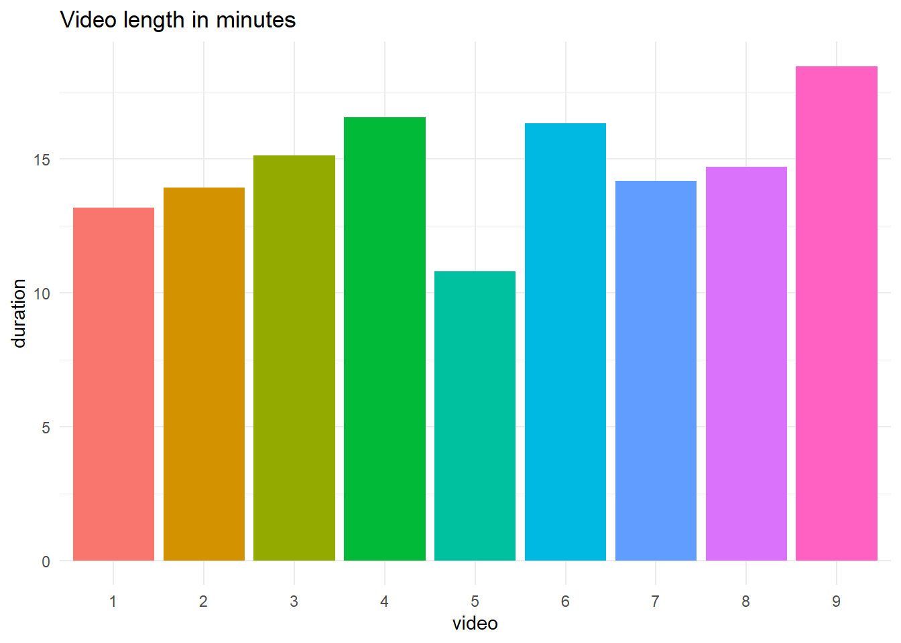
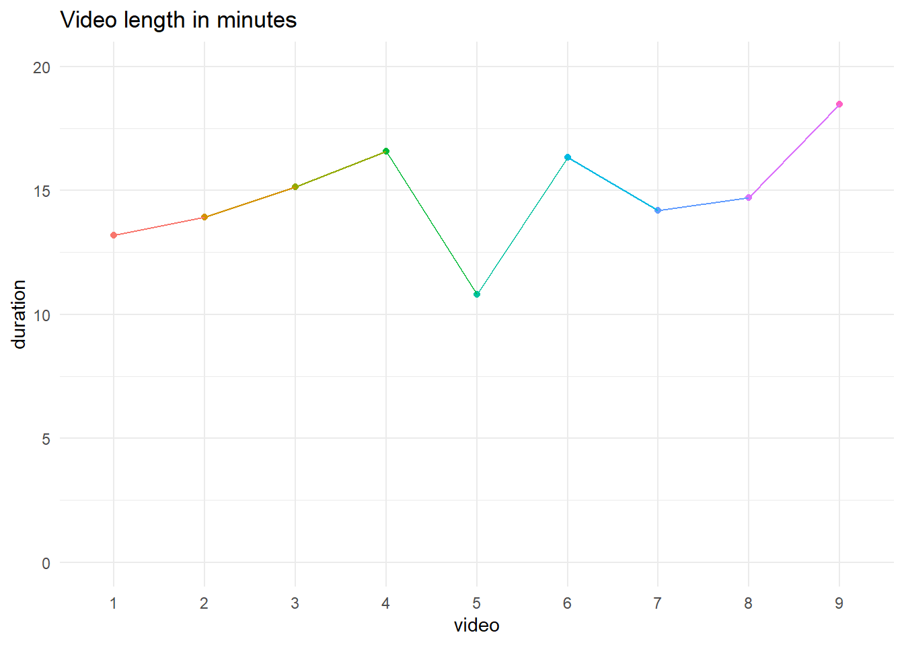
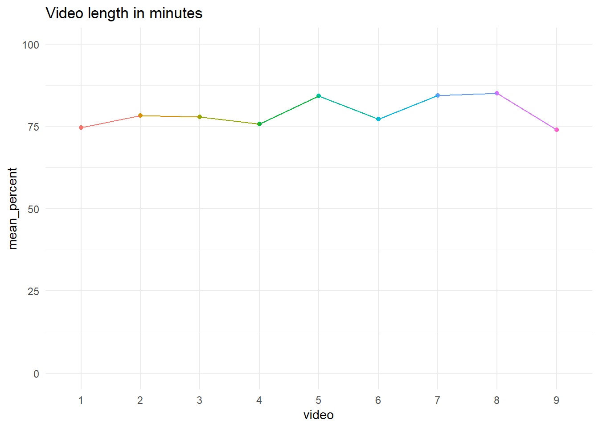

# Exploring Echo360 video/course level data with `tidyverse` {#Echo_course}

## Introduction

Now we have introduced you to the basic principles of reading and summarising Echo360 data, in this chapter we will explore how you can wrangle and visualise video and course level data to recreate and build on the kind of dashboards you can access on Echo360. 

You will need the following packages which are the same as chapter 6, but with the addition of `scales` to add some useful functions for plotting graph axes. You will also need the `data` object you created in chapter 6, but you can rerun the code below if you do not have it available already. If you do not have the data downloaded already, please [download the .zip file](data/Echo360_Data/Echo360_data.zip) containing 9 files of Echo360 data. Our tutorial assumes you have a folder called "data" in your working directory, and we created a subfolder called "Echo360_Data" to place these files. If you saved the data in another way, remember to edit the file paths first. 


```r
library(tidyverse) # Package of packages for plotting and wrangling 
library(plotly) # Creates interactive plots 
library(ggpubr) # Builds on ggplot2 to build specific publication ready plots 
library(scales) # Includes functions for specifying plot scales
library(lubridate)
```


```r
# Obtain list of files from directory
files <- list.files(path = "data/Echo360_Data/", 
                    pattern=".csv") 

# Read in all files
data <- read_csv(paste0("data/Echo360_Data/", files), # Add our working directory to the list of files 
                 id="video") # What should be call the column containing the name of the video file? 

# Fill in spaces between column names
data <- tibble(data, 
               .name_repair = "universal") # Setting to universal makes all names unique and syntactic

# To break this code down, we start with the innermost function
# 1. We first make each unique video name a factor (unique category)
# 2. We then make each factor a number, so we get an ascending number from 1 to 9
data$video <-as.factor(as.numeric(as.factor(data$video)))
```

## Handling date/time data with `lubridate`

It's important to be able to track engagment with lecture recordings throughout the semester so being able to analyse the data according to time and data is importnat. Handling date/time data in R is somewhat different from other variable types and should be treated differently and handled with care. The `lubridate` package in R (loaded as part of the `tidyverse`) allows us to easily handle tricky date/time data and extract useful information from these. 

### Converting variables to date/time format

The first task will be to convert any date/time data we have into the correct format. In the sample data we are working with, we have five variables which contain such data which are: `Create.Date`, `Duration`, `Total.View.Time`, `Average.View.Time` and `Last.Viewed`. 

On closer inspection, these variables fall into two types:

- `Create.Data` and `Last.Viewed` are listed as a date (a particular day)

- `Duration`, `Total.View.Time` and `Average.View.Time` are listed as a time, recorded in hours, minutes, and seconds.

Several functions can be used to take a data string and convert it into the desired date/time format. There is a useful [cheat sheet you can download](https://rstudio.github.io/cheatsheets/html/lubridate.html) for the `lubridate` library which contains examples of such functions. For our data, we will use the `mdy()` function to convert dates as month-day-year, and the `hms()` function to convert times as hours-minutes-seconds.


```r
# For times, mutate across three columns and convert to hours, minutes, seconds
# For dates, mutate across two columns and convert to month, day, year
data <- data %>%
  mutate(across(.cols = c('duration', 'total_view_time', 'average_view_time'), 
                .fns = hms)) %>%
  mutate(across(.cols = c('create_date', 'last_viewed'), 
                .fns = mdy))
```

Here, we use a combination of mutate and across to apply a given function to multiple columns. Within across, we specify two arguments. In .cols, we specify the columns we want to apply our function to and in .fns, we specify the function we want to apply to those columns.

::: {.info data-latex=""}
`hms()` converts a string into a date/time object which is set by hours-minutes-seconds. `mdy()` converts a string into a date/time object which is set by month-day-year. Echo360 data saves date/times in US format, so pay attention to how date/time data is stored to data you work with to make sure it recognises the information in the right order. There are alternative functions like `ymd()` and `dmy()` if data you work with is stored differently. 
:::

We can take a look at the result of these transformations more closely using `head()` to preview the first five cases of each variable:


```r
# First five cases of duration 
head(data$duration)
# First five cases of last viewed
head(data$last_viewed)
```

```
## [1] "13M 11S" "13M 11S" "13M 11S" "13M 11S" "13M 11S" "13M 11S"
## [1] "2023-01-16" "2023-01-18" "2023-01-24" "2023-01-15" "2023-01-16"
## [6] "2023-02-15"
```

### Transforming time data

To help us summarise and visualise the time data, we can convert time variables to numeric. In this case, we can use `mutate()` with `as.numeric()` to convert the variable duration from a time variable (e.g., 13M 11S) to a number (13.2). This then easily allows us to compute summary statistics and visualise the data


```r
# compute mean duration
data %>%
  mutate(duration = as.numeric(duration, "minutes")) %>%
  group_by(video) %>%
  summarise(duration = mean(duration))

# produce bar chart
data %>%
  mutate(duration = as.numeric(duration, "minutes")) %>%
  group_by(video) %>%
  summarise(duration = mean(duration)) %>%
  ggplot(aes(x = video, y = duration, fill = video)) + # fill gives colours for each video
  geom_col() +
  guides(fill = "none") + # removes redundant legend
  theme_minimal() + # apply a theme
  labs(title = "Video length in minutes")
```



```r
# produce line graph of same data
data %>%
  mutate(duration = as.numeric(duration, "minutes")) %>%
  group_by(video) %>%
  summarise(duration = mean(duration)) %>%
  ggplot(aes(x = video, y = duration, colour = video, group = 1)) + # fill gives colours for each video
  geom_point() +
  geom_line() +
  guides(colour = "none") + # removes redundant legend
  theme_minimal() + # apply a theme
  labs(title = "Video length in minutes") +
  scale_y_continuous(limits = c(0, 20)) #  set limits of y-axis
```

<div class="kable-table">

|video | duration|
|:-----|--------:|
|1     | 13.18333|
|2     | 13.91667|
|3     | 15.13333|
|4     | 16.56667|
|5     | 10.80000|
|6     | 16.33333|
|7     | 14.18333|
|8     | 14.70000|
|9     | 18.46667|

</div>


### Extracting elements from date/time data

Sometimes, you may wish to obtain specific parts of a date/time such as the month, the minutes etc. There are several functions in `lubridate` which allow us to extract these easily from a date/time object.

Suppose we want to look at the last month students viewed videos across the course. We can obtain this by applying the `month()` function to the `Last.Viewed` variable.


```r
# Add a new month column 
data <- data %>% 
  mutate(month_last_viewed = month(data$last_viewed))

last_viewed <- data %>% 
  ggplot(aes(x = month_last_viewed)) + # Only specify x axis for a bar chart
  geom_bar() + # Create a bar chart 
  labs(title = "Frequency of last month video viewed",
       y = "Frequency",
       x = "Last month video viewed") + 
  theme_bw() + 
  scale_x_continuous(breaks = seq(1:12))

last_viewed
```


We can also convert the bar chart to make it interactive using the <code><span><span class='fu'>ggplotly</span><span class='op'>(</span><span class='op'>)</span></span></code> function. This allows you to hover over the plot and see what the frequency was for each month. 


```r
ggplotly(last_viewed)
```

```{=html}
<div class="plotly html-widget html-fill-item-overflow-hidden html-fill-item" id="htmlwidget-a2f5ad9ef2783766d669" style="width:100%;height:480px;"></div>
<script type="application/json" data-for="htmlwidget-a2f5ad9ef2783766d669">{"x":{"data":[{"orientation":"v","width":[0.89999999999999991,0.90000000000000013,0.89999999999999858],"base":[0,0,0],"x":[1,2,12],"y":[1339,126,1],"text":["count: 1339<br />month_last_viewed:  1","count:  126<br />month_last_viewed:  2","count:    1<br />month_last_viewed: 12"],"type":"bar","textposition":"none","marker":{"autocolorscale":false,"color":"rgba(89,89,89,1)","line":{"width":1.8897637795275593,"color":"transparent"}},"showlegend":false,"xaxis":"x","yaxis":"y","hoverinfo":"text","frame":null}],"layout":{"margin":{"t":43.762557077625573,"r":7.3059360730593621,"b":40.182648401826491,"l":48.949771689497723},"plot_bgcolor":"rgba(255,255,255,1)","paper_bgcolor":"rgba(255,255,255,1)","font":{"color":"rgba(0,0,0,1)","family":"","size":14.611872146118724},"title":{"text":"Frequency of last month video viewed","font":{"color":"rgba(0,0,0,1)","family":"","size":17.534246575342465},"x":0,"xref":"paper"},"xaxis":{"domain":[0,1],"automargin":true,"type":"linear","autorange":false,"range":[-0.044999999999999929,13.045],"tickmode":"array","ticktext":["1","2","3","4","5","6","7","8","9","10","11","12"],"tickvals":[1,2,3,4,5,6,7,8,9,10,11,12],"categoryorder":"array","categoryarray":["1","2","3","4","5","6","7","8","9","10","11","12"],"nticks":null,"ticks":"outside","tickcolor":"rgba(51,51,51,1)","ticklen":3.6529680365296811,"tickwidth":0.66417600664176002,"showticklabels":true,"tickfont":{"color":"rgba(77,77,77,1)","family":"","size":11.68949771689498},"tickangle":-0,"showline":false,"linecolor":null,"linewidth":0,"showgrid":true,"gridcolor":"rgba(235,235,235,1)","gridwidth":0.66417600664176002,"zeroline":false,"anchor":"y","title":{"text":"Last month video viewed","font":{"color":"rgba(0,0,0,1)","family":"","size":14.611872146118724}},"hoverformat":".2f"},"yaxis":{"domain":[0,1],"automargin":true,"type":"linear","autorange":false,"range":[-66.950000000000003,1405.95],"tickmode":"array","ticktext":["0","500","1000"],"tickvals":[0,500.00000000000006,1000],"categoryorder":"array","categoryarray":["0","500","1000"],"nticks":null,"ticks":"outside","tickcolor":"rgba(51,51,51,1)","ticklen":3.6529680365296811,"tickwidth":0.66417600664176002,"showticklabels":true,"tickfont":{"color":"rgba(77,77,77,1)","family":"","size":11.68949771689498},"tickangle":-0,"showline":false,"linecolor":null,"linewidth":0,"showgrid":true,"gridcolor":"rgba(235,235,235,1)","gridwidth":0.66417600664176002,"zeroline":false,"anchor":"x","title":{"text":"Frequency","font":{"color":"rgba(0,0,0,1)","family":"","size":14.611872146118724}},"hoverformat":".2f"},"shapes":[{"type":"rect","fillcolor":"transparent","line":{"color":"rgba(51,51,51,1)","width":0.66417600664176002,"linetype":"solid"},"yref":"paper","xref":"paper","x0":0,"x1":1,"y0":0,"y1":1}],"showlegend":false,"legend":{"bgcolor":"rgba(255,255,255,1)","bordercolor":"transparent","borderwidth":1.8897637795275593,"font":{"color":"rgba(0,0,0,1)","family":"","size":11.68949771689498}},"hovermode":"closest","barmode":"relative"},"config":{"doubleClick":"reset","modeBarButtonsToAdd":["hoverclosest","hovercompare"],"showSendToCloud":false},"source":"A","attrs":{"33342f82d96":{"x":{},"type":"bar"}},"cur_data":"33342f82d96","visdat":{"33342f82d96":["function (y) ","x"]},"highlight":{"on":"plotly_click","persistent":false,"dynamic":false,"selectize":false,"opacityDim":0.20000000000000001,"selected":{"opacity":1},"debounce":0},"shinyEvents":["plotly_hover","plotly_click","plotly_selected","plotly_relayout","plotly_brushed","plotly_brushing","plotly_clickannotation","plotly_doubleclick","plotly_deselect","plotly_afterplot","plotly_sunburstclick"],"base_url":"https://plot.ly"},"evals":[],"jsHooks":[]}</script>
```

### Maths with date-times

Sometimes, we may wish to compare the difference in time between events. <code class='package'>lubridate</code> provides some useful functions to help us with this. For example, we can look at the difference in view time to the total duration of the video by using simple arithmetic operators combined with `group_by()`. As noted, the function of `group_by()` is that it will perform whatever operation comes after it seperately for each level of the grouping variable so in this case, it will compute the time difference for each video.


```r
data <- data %>% 
  group_by(video) %>%
  mutate(time_difference = average_view_time - duration) %>% # Add a time difference column between average view time and total duration
  ungroup()

head(data$time_difference)
```

```
## [1] "-3M 44S"  "-1M 35S"  "-2S"      "-8M 5S"   "-4M 48S"  "-11M -9S"
```

As this data returns values in minutes and seconds, we can transform this to numeric and create a histogram. More negative values represent students who watched less of the video than the total duration.


```r
data <- data %>% 
  mutate(time_difference = as.numeric(time_difference, "minute"))

time_difference <- data %>% 
  ggplot(aes(x = time_difference)) + 
  geom_histogram() +
  labs(title="Difference between average viewing times & total video duration") +
  theme_bw() 

time_difference
```

```
## `stat_bin()` using `bins = 30`. Pick better value with `binwidth`.
```


As before, we can make these values interactive by converting our ggplot visualisation to a <code class='package'>plotly</code> object. 


```r
ggplotly(time_difference)
```

```
## `stat_bin()` using `bins = 30`. Pick better value with `binwidth`.
```

```{=html}
<div class="plotly html-widget html-fill-item-overflow-hidden html-fill-item" id="htmlwidget-e80cfc6464e597b52bdb" style="width:100%;height:480px;"></div>
<script type="application/json" data-for="htmlwidget-e80cfc6464e597b52bdb">{"x":{"data":[{"orientation":"v","width":[0.63678160919540261,0.63678160919540261,0.63678160919540261,0.63678160919540261,0.63678160919540261,0.63678160919540261,0.63678160919540261,0.63678160919540261,0.63678160919540261,0.63678160919540261,0.63678160919540261,0.63678160919540261,0.63678160919540261,0.63678160919540261,0.63678160919540261,0.63678160919540261,0.63678160919540261,0.63678160919540261,0.63678160919540083,0.63678160919540261,0.63678160919540261,0.63678160919540261,0.63678160919540261,0.63678160919540261,0.63678160919540083,0.63678160919540439,0.63678160919539906,0.63678160919540261,0.63678160919540261,0.63678160919540261],"base":[0,0,0,0,0,0,0,0,0,0,0,0,0,0,0,0,0,0,0,0,0,0,0,0,0,0,0,0,0,0],"x":[-18.466666666666665,-17.829885057471262,-17.19310344827586,-16.556321839080457,-15.919540229885055,-15.282758620689654,-14.645977011494253,-14.00919540229885,-13.372413793103448,-12.735632183908045,-12.098850574712642,-11.46206896551724,-10.825287356321837,-10.188505747126435,-9.5517241379310338,-8.9149425287356312,-8.2781609195402286,-7.641379310344826,-7.0045977011494243,-6.3678160919540225,-5.7310344827586199,-5.0942528735632173,-4.4574712643678147,-3.8206896551724121,-3.1839080459770104,-2.5471264367816078,-1.9103448275862061,-1.2735632183908052,-0.63678160919540261,0],"y":[3,1,1,8,5,2,8,7,16,12,12,17,23,20,24,47,41,39,71,36,20,39,24,20,26,34,45,56,99,710],"text":["count:   3<br />time_difference: -18.4666667","count:   1<br />time_difference: -17.8298851","count:   1<br />time_difference: -17.1931034","count:   8<br />time_difference: -16.5563218","count:   5<br />time_difference: -15.9195402","count:   2<br />time_difference: -15.2827586","count:   8<br />time_difference: -14.6459770","count:   7<br />time_difference: -14.0091954","count:  16<br />time_difference: -13.3724138","count:  12<br />time_difference: -12.7356322","count:  12<br />time_difference: -12.0988506","count:  17<br />time_difference: -11.4620690","count:  23<br />time_difference: -10.8252874","count:  20<br />time_difference: -10.1885057","count:  24<br />time_difference:  -9.5517241","count:  47<br />time_difference:  -8.9149425","count:  41<br />time_difference:  -8.2781609","count:  39<br />time_difference:  -7.6413793","count:  71<br />time_difference:  -7.0045977","count:  36<br />time_difference:  -6.3678161","count:  20<br />time_difference:  -5.7310345","count:  39<br />time_difference:  -5.0942529","count:  24<br />time_difference:  -4.4574713","count:  20<br />time_difference:  -3.8206897","count:  26<br />time_difference:  -3.1839080","count:  34<br />time_difference:  -2.5471264","count:  45<br />time_difference:  -1.9103448","count:  56<br />time_difference:  -1.2735632","count:  99<br />time_difference:  -0.6367816","count: 710<br />time_difference:   0.0000000"],"type":"bar","textposition":"none","marker":{"autocolorscale":false,"color":"rgba(89,89,89,1)","line":{"width":1.8897637795275593,"color":"transparent"}},"showlegend":false,"xaxis":"x","yaxis":"y","hoverinfo":"text","frame":null}],"layout":{"margin":{"t":43.762557077625573,"r":7.3059360730593621,"b":40.182648401826491,"l":43.105022831050235},"plot_bgcolor":"rgba(255,255,255,1)","paper_bgcolor":"rgba(255,255,255,1)","font":{"color":"rgba(0,0,0,1)","family":"","size":14.611872146118724},"title":{"text":"Difference between average viewing times & total video duration","font":{"color":"rgba(0,0,0,1)","family":"","size":17.534246575342465},"x":0,"xref":"paper"},"xaxis":{"domain":[0,1],"automargin":true,"type":"linear","autorange":false,"range":[-19.74022988505747,1.2735632183908048],"tickmode":"array","ticktext":["-15","-10","-5","0"],"tickvals":[-15,-10,-5,0],"categoryorder":"array","categoryarray":["-15","-10","-5","0"],"nticks":null,"ticks":"outside","tickcolor":"rgba(51,51,51,1)","ticklen":3.6529680365296811,"tickwidth":0.66417600664176002,"showticklabels":true,"tickfont":{"color":"rgba(77,77,77,1)","family":"","size":11.68949771689498},"tickangle":-0,"showline":false,"linecolor":null,"linewidth":0,"showgrid":true,"gridcolor":"rgba(235,235,235,1)","gridwidth":0.66417600664176002,"zeroline":false,"anchor":"y","title":{"text":"time_difference","font":{"color":"rgba(0,0,0,1)","family":"","size":14.611872146118724}},"hoverformat":".2f"},"yaxis":{"domain":[0,1],"automargin":true,"type":"linear","autorange":false,"range":[-35.5,745.5],"tickmode":"array","ticktext":["0","200","400","600"],"tickvals":[0,200,399.99999999999994,600],"categoryorder":"array","categoryarray":["0","200","400","600"],"nticks":null,"ticks":"outside","tickcolor":"rgba(51,51,51,1)","ticklen":3.6529680365296811,"tickwidth":0.66417600664176002,"showticklabels":true,"tickfont":{"color":"rgba(77,77,77,1)","family":"","size":11.68949771689498},"tickangle":-0,"showline":false,"linecolor":null,"linewidth":0,"showgrid":true,"gridcolor":"rgba(235,235,235,1)","gridwidth":0.66417600664176002,"zeroline":false,"anchor":"x","title":{"text":"count","font":{"color":"rgba(0,0,0,1)","family":"","size":14.611872146118724}},"hoverformat":".2f"},"shapes":[{"type":"rect","fillcolor":"transparent","line":{"color":"rgba(51,51,51,1)","width":0.66417600664176002,"linetype":"solid"},"yref":"paper","xref":"paper","x0":0,"x1":1,"y0":0,"y1":1}],"showlegend":false,"legend":{"bgcolor":"rgba(255,255,255,1)","bordercolor":"transparent","borderwidth":1.8897637795275593,"font":{"color":"rgba(0,0,0,1)","family":"","size":11.68949771689498}},"hovermode":"closest","barmode":"relative"},"config":{"doubleClick":"reset","modeBarButtonsToAdd":["hoverclosest","hovercompare"],"showSendToCloud":false},"source":"A","attrs":{"33342c504d36":{"x":{},"type":"bar"}},"cur_data":"33342c504d36","visdat":{"33342c504d36":["function (y) ","x"]},"highlight":{"on":"plotly_click","persistent":false,"dynamic":false,"selectize":false,"opacityDim":0.20000000000000001,"selected":{"opacity":1},"debounce":0},"shinyEvents":["plotly_hover","plotly_click","plotly_selected","plotly_relayout","plotly_brushed","plotly_brushing","plotly_clickannotation","plotly_doubleclick","plotly_deselect","plotly_afterplot","plotly_sunburstclick"],"base_url":"https://plot.ly"},"evals":[],"jsHooks":[]}</script>
```

The difference between viewing time and duration is of course relative to the duration so it may be better to express this difference as a percent, i.e., on average, what percent of each video did students watch?

To do this, we can use mutate to calculate the percent of each video viewed. Once we've created this column, we can then use `group_by()` and `ggplot()` to summarise and visualise the drop-off for each video.


```r
data <- data %>%
  mutate(percent_watched = 100 - ((duration-average_view_time) / duration) *100) 

data %>%
  group_by(video) %>%
  summarise(mean_percent = mean(percent_watched))


data %>%
  group_by(video) %>%
  summarise(mean_percent = mean(percent_watched)) %>%
  ggplot(aes(x = video, y = mean_percent, colour = video, group = 1)) + # fill gives colours for each video
  geom_point() +
  geom_line() +
  guides(colour = "none") + 
  theme_minimal() + 
  labs(title = "Video length in minutes") +
  scale_y_continuous(limits = c(0, 100)) #  set limits of y-axis
```

<div class="kable-table">

|video | mean_percent|
|:-----|------------:|
|1     |     74.62349|
|2     |     78.21563|
|3     |     77.84165|
|4     |     75.65035|
|5     |     84.27152|
|6     |     77.16715|
|7     |     84.40620|
|8     |     85.00724|
|9     |     73.96479|

</div>


## Total views for each video

In the following section, we will continuing creating plots of our data summarised at the video level. Given that our data is currently stored at student level (one row per student per video), we will first transform our data into a new data set called `video_data` which will group the data by video and create some variables of interest. First, let's create this new data set with two columns:

* `video`: The video number ;

* `total_views`: The total number of views per video.


```r
video_data <- data %>% 
  group_by(video) %>%
  summarise(total_views = sum(total_views)) %>% # for each video, add up all the views across students
  ungroup() # Retaining the group by can sometimes cause problems
```

We can now easily create a bar chart of the total number of views per video.


```r
fig.total.views <- video_data %>% 
  ggplot(aes(x = video, y = total_views)) +
  geom_col() + 
  labs(title="Total number of views per video",
       y = "Total Views",
       x = "Video") + 
  theme_bw()

fig.total.views
```


Here, we plot the video number along the x-axis and the total number of views for each video on the y-axis. These numbers include duplications from students who have watched the videos multiple times. 

We may also be interested in the total number of unique views, i.e. the total number of students who watched the video at least once. To do this, we need to create a new variable called `unique_views` which will contain the sum of the rows for each video. We can add this to the video-level data set `video_data`.


```r
video_data <- data %>% 
  group_by(video) %>%
  summarise(total_Views = sum(total_views), 
            unique_views = n()) %>% # For each video, count the number of rows
  mutate(video = factor(video)) %>% 
  ungroup()
```

We can edit the code for the previous bar chart to create a bar chart of the total number of unique student views per video as follows.


```r
fig.unique.views <- video_data %>% 
  ggplot(aes(x = video, y = unique_views)) +
  geom_bar(stat = "identity") + # Since we specify a y value, just show as the value
  labs(title="Total number of unique student views per video",
       y = "Unique Student Views",
       x = "Video") + 
  theme_bw()

fig.unique.views
```


If you want to view the values per video more precisely like a data dashboard, then you can convert your unique views bar plot into a <code class='package'>plotly</code> object. 


```r
ggplotly(fig.unique.views)
```

```{=html}
<div class="plotly html-widget html-fill-item-overflow-hidden html-fill-item" id="htmlwidget-7ecc96e7d1dfb2b11898" style="width:100%;height:480px;"></div>
<script type="application/json" data-for="htmlwidget-7ecc96e7d1dfb2b11898">{"x":{"data":[{"orientation":"v","width":[0.89999999999999991,0.90000000000000013,0.90000000000000036,0.90000000000000036,0.90000000000000036,0.90000000000000036,0.90000000000000036,0.89999999999999947,0.89999999999999858],"base":[0,0,0,0,0,0,0,0,0],"x":[1,2,3,4,5,6,7,8,9],"y":[195,189,182,169,151,147,155,144,134],"text":["video: 1<br />unique_views: 195","video: 2<br />unique_views: 189","video: 3<br />unique_views: 182","video: 4<br />unique_views: 169","video: 5<br />unique_views: 151","video: 6<br />unique_views: 147","video: 7<br />unique_views: 155","video: 8<br />unique_views: 144","video: 9<br />unique_views: 134"],"type":"bar","textposition":"none","marker":{"autocolorscale":false,"color":"rgba(89,89,89,1)","line":{"width":1.8897637795275593,"color":"transparent"}},"showlegend":false,"xaxis":"x","yaxis":"y","hoverinfo":"text","frame":null}],"layout":{"margin":{"t":43.762557077625573,"r":7.3059360730593621,"b":40.182648401826491,"l":43.105022831050235},"plot_bgcolor":"rgba(255,255,255,1)","paper_bgcolor":"rgba(255,255,255,1)","font":{"color":"rgba(0,0,0,1)","family":"","size":14.611872146118724},"title":{"text":"Total number of unique student views per video","font":{"color":"rgba(0,0,0,1)","family":"","size":17.534246575342465},"x":0,"xref":"paper"},"xaxis":{"domain":[0,1],"automargin":true,"type":"linear","autorange":false,"range":[0.40000000000000002,9.5999999999999996],"tickmode":"array","ticktext":["1","2","3","4","5","6","7","8","9"],"tickvals":[1,2,3,4,5,6,6.9999999999999991,8,9],"categoryorder":"array","categoryarray":["1","2","3","4","5","6","7","8","9"],"nticks":null,"ticks":"outside","tickcolor":"rgba(51,51,51,1)","ticklen":3.6529680365296811,"tickwidth":0.66417600664176002,"showticklabels":true,"tickfont":{"color":"rgba(77,77,77,1)","family":"","size":11.68949771689498},"tickangle":-0,"showline":false,"linecolor":null,"linewidth":0,"showgrid":true,"gridcolor":"rgba(235,235,235,1)","gridwidth":0.66417600664176002,"zeroline":false,"anchor":"y","title":{"text":"Video","font":{"color":"rgba(0,0,0,1)","family":"","size":14.611872146118724}},"hoverformat":".2f"},"yaxis":{"domain":[0,1],"automargin":true,"type":"linear","autorange":false,"range":[-9.75,204.75],"tickmode":"array","ticktext":["0","50","100","150","200"],"tickvals":[0,50,100.00000000000001,150,200],"categoryorder":"array","categoryarray":["0","50","100","150","200"],"nticks":null,"ticks":"outside","tickcolor":"rgba(51,51,51,1)","ticklen":3.6529680365296811,"tickwidth":0.66417600664176002,"showticklabels":true,"tickfont":{"color":"rgba(77,77,77,1)","family":"","size":11.68949771689498},"tickangle":-0,"showline":false,"linecolor":null,"linewidth":0,"showgrid":true,"gridcolor":"rgba(235,235,235,1)","gridwidth":0.66417600664176002,"zeroline":false,"anchor":"x","title":{"text":"Unique Student Views","font":{"color":"rgba(0,0,0,1)","family":"","size":14.611872146118724}},"hoverformat":".2f"},"shapes":[{"type":"rect","fillcolor":"transparent","line":{"color":"rgba(51,51,51,1)","width":0.66417600664176002,"linetype":"solid"},"yref":"paper","xref":"paper","x0":0,"x1":1,"y0":0,"y1":1}],"showlegend":false,"legend":{"bgcolor":"rgba(255,255,255,1)","bordercolor":"transparent","borderwidth":1.8897637795275593,"font":{"color":"rgba(0,0,0,1)","family":"","size":11.68949771689498}},"hovermode":"closest","barmode":"relative"},"config":{"doubleClick":"reset","modeBarButtonsToAdd":["hoverclosest","hovercompare"],"showSendToCloud":false},"source":"A","attrs":{"33343c1b660f":{"x":{},"y":{},"type":"bar"}},"cur_data":"33343c1b660f","visdat":{"33343c1b660f":["function (y) ","x"]},"highlight":{"on":"plotly_click","persistent":false,"dynamic":false,"selectize":false,"opacityDim":0.20000000000000001,"selected":{"opacity":1},"debounce":0},"shinyEvents":["plotly_hover","plotly_click","plotly_selected","plotly_relayout","plotly_brushed","plotly_brushing","plotly_clickannotation","plotly_doubleclick","plotly_deselect","plotly_afterplot","plotly_sunburstclick"],"base_url":"https://plot.ly"},"evals":[],"jsHooks":[]}</script>
```

### Advanced `plotly` customisation

So far, we have simply transformed our ggplots into a <code class='package'>plotly</code> object. However, we can add additional information in the hover text such as total views, duration of video, and average view time that might be useful to you or your viewer. 

This is going to be a longer process, so we will break it down into a few steps. First, we need to wrangle the data so we have our key summary statistics per video. The first few lines follow the same process as above, but then we add additional summary variables like the average view time and modify existing variables in <code><span><span class='fu'>mutate</span><span class='op'>(</span><span class='op'>)</span></span></code>. 


```r
# Isolate video number and duration of the video to append later
video_duration <- data %>% 
  distinct(video, duration) %>% 
  mutate(duration = period_to_seconds(duration)) # Convert duration from a period to seconds

video_data <- data %>%
  group_by(video) %>%
  summarise(total_views = sum(total_views), 
            unique_views = n(), 
            average_view_time = round(
              mean(period_to_seconds(average_view_time), # lubridate function to transform a period to seconds
                   na.rm = T), # Ignore NA values when taking mean
              0)) %>% # 0 decimals to round
  left_join(video_duration, # Add video duration data to our summary data
            by = "video") %>% # Join by video number
  mutate(video = factor(video),
         repeated_views = total_views - unique_views, # Calculate repeated views subtracting unique views from total views
         percentage_viewed = round(average_view_time / duration * 100, 2)) %>% # Calculate average percentage from average view time as percentage of duration
  ungroup()

head(video_data)
```

<div class="kable-table">

|video | total_views| unique_views| average_view_time| duration| repeated_views| percentage_viewed|
|:-----|-----------:|------------:|-----------------:|--------:|--------------:|-----------------:|
|1     |         291|          195|               590|      791|             96|             74.59|
|2     |         257|          189|               653|      835|             68|             78.20|
|3     |         224|          182|               707|      908|             42|             77.86|
|4     |         226|          169|               752|      994|             57|             75.65|
|5     |         189|          151|               546|      648|             38|             84.26|
|6     |         163|          147|               756|      980|             16|             77.14|

</div>

For each video, we now have a bunch of summary statistics like their view time, duration, and percentage of the video viewed. We can now use this information to present as a dashboard for an overview of each video. 

This time, we are going to use <code class='package'>plotly</code> directly as its easier to edit the hover text options than if we simply convert a `ggplot` object to `plotly`. In the code below, we first create a bar plot for the number of unique views for each video. We then edit the hover template to add additional information into the interactive dashboard like the duration and average view time. 


```r
fig.all.views <- plot_ly(video_data,
  x = ~video,
  y = ~unique_views,
  name = "Unique Views",
  type = "bar",
  hovertemplate = paste0("Video %{x}", # Paste adds all the elements together, <br> is html code for a line break
                         "<br>Total views:", video_data$total_views,
                         "<br>Unique views: %{y}",
                         "<br> Duration: ", seconds_to_period(video_data$duration), # Convert from seconds to minutes and seconds for easier viewing
                         "<br> Average view time: ", seconds_to_period(video_data$average_view_time))) %>%
  layout(title = 'Unique Views per Video', 
         xaxis = list(title = 'Video Number'),
         yaxis = list(title = 'Unique Views'))

fig.all.views
```

```{=html}
<div class="plotly html-widget html-fill-item-overflow-hidden html-fill-item" id="htmlwidget-166c51cf4d8dde9202a6" style="width:100%;height:480px;"></div>
<script type="application/json" data-for="htmlwidget-166c51cf4d8dde9202a6">{"x":{"visdat":{"33347d711b65":["function () ","plotlyVisDat"]},"cur_data":"33347d711b65","attrs":{"33347d711b65":{"x":{},"y":{},"hovertemplate":["Video %{x}<br>Total views:291<br>Unique views: %{y}<br> Duration: 13M 11S<br> Average view time: 9M 50S","Video %{x}<br>Total views:257<br>Unique views: %{y}<br> Duration: 13M 55S<br> Average view time: 10M 53S","Video %{x}<br>Total views:224<br>Unique views: %{y}<br> Duration: 15M 8S<br> Average view time: 11M 47S","Video %{x}<br>Total views:226<br>Unique views: %{y}<br> Duration: 16M 34S<br> Average view time: 12M 32S","Video %{x}<br>Total views:189<br>Unique views: %{y}<br> Duration: 10M 48S<br> Average view time: 9M 6S","Video %{x}<br>Total views:163<br>Unique views: %{y}<br> Duration: 16M 20S<br> Average view time: 12M 36S","Video %{x}<br>Total views:198<br>Unique views: %{y}<br> Duration: 14M 11S<br> Average view time: 11M 58S","Video %{x}<br>Total views:178<br>Unique views: %{y}<br> Duration: 14M 42S<br> Average view time: 12M 30S","Video %{x}<br>Total views:162<br>Unique views: %{y}<br> Duration: 18M 28S<br> Average view time: 13M 40S"],"name":"Unique Views","alpha_stroke":1,"sizes":[10,100],"spans":[1,20],"type":"bar"}},"layout":{"margin":{"b":40,"l":60,"t":25,"r":10},"title":"Unique Views per Video","xaxis":{"domain":[0,1],"automargin":true,"title":"Video Number","type":"category","categoryorder":"array","categoryarray":["1","2","3","4","5","6","7","8","9"]},"yaxis":{"domain":[0,1],"automargin":true,"title":"Unique Views"},"hovermode":"closest","showlegend":false},"source":"A","config":{"modeBarButtonsToAdd":["hoverclosest","hovercompare"],"showSendToCloud":false},"data":[{"x":["1","2","3","4","5","6","7","8","9"],"y":[195,189,182,169,151,147,155,144,134],"hovertemplate":["Video %{x}<br>Total views:291<br>Unique views: %{y}<br> Duration: 13M 11S<br> Average view time: 9M 50S","Video %{x}<br>Total views:257<br>Unique views: %{y}<br> Duration: 13M 55S<br> Average view time: 10M 53S","Video %{x}<br>Total views:224<br>Unique views: %{y}<br> Duration: 15M 8S<br> Average view time: 11M 47S","Video %{x}<br>Total views:226<br>Unique views: %{y}<br> Duration: 16M 34S<br> Average view time: 12M 32S","Video %{x}<br>Total views:189<br>Unique views: %{y}<br> Duration: 10M 48S<br> Average view time: 9M 6S","Video %{x}<br>Total views:163<br>Unique views: %{y}<br> Duration: 16M 20S<br> Average view time: 12M 36S","Video %{x}<br>Total views:198<br>Unique views: %{y}<br> Duration: 14M 11S<br> Average view time: 11M 58S","Video %{x}<br>Total views:178<br>Unique views: %{y}<br> Duration: 14M 42S<br> Average view time: 12M 30S","Video %{x}<br>Total views:162<br>Unique views: %{y}<br> Duration: 18M 28S<br> Average view time: 13M 40S"],"name":"Unique Views","type":"bar","marker":{"color":"rgba(31,119,180,1)","line":{"color":"rgba(31,119,180,1)"}},"error_y":{"color":"rgba(31,119,180,1)"},"error_x":{"color":"rgba(31,119,180,1)"},"xaxis":"x","yaxis":"y","frame":null}],"highlight":{"on":"plotly_click","persistent":false,"dynamic":false,"selectize":false,"opacityDim":0.20000000000000001,"selected":{"opacity":1},"debounce":0},"shinyEvents":["plotly_hover","plotly_click","plotly_selected","plotly_relayout","plotly_brushed","plotly_brushing","plotly_clickannotation","plotly_doubleclick","plotly_deselect","plotly_afterplot","plotly_sunburstclick"],"base_url":"https://plot.ly"},"evals":[],"jsHooks":[]}</script>
```

Like <code class='package'>ggplot2</code>, once we have defined a <code class='package'>plotly</code> object, we can add additional layers. In this example, we might also want to create a stacked bar plot with the total number of views split into unique student views and repeated views.


```r
# Take the plotly object and add a trace (variable to split by) for the repeated views
fig.all.views <- fig.all.views %>% 
  add_trace(y = ~repeated_views, 
            name = 'Repeated views') %>% 
  layout(yaxis = list(title = 'Count'), # Amend the type of bar plot to make it stacked
         barmode = 'stack')

fig.all.views
```

```{=html}
<div class="plotly html-widget html-fill-item-overflow-hidden html-fill-item" id="htmlwidget-c1e2f2b93b8f61043599" style="width:100%;height:480px;"></div>
<script type="application/json" data-for="htmlwidget-c1e2f2b93b8f61043599">{"x":{"visdat":{"33347d711b65":["function () ","plotlyVisDat"]},"cur_data":"33347d711b65","attrs":{"33347d711b65":{"x":{},"y":{},"hovertemplate":["Video %{x}<br>Total views:291<br>Unique views: %{y}<br> Duration: 13M 11S<br> Average view time: 9M 50S","Video %{x}<br>Total views:257<br>Unique views: %{y}<br> Duration: 13M 55S<br> Average view time: 10M 53S","Video %{x}<br>Total views:224<br>Unique views: %{y}<br> Duration: 15M 8S<br> Average view time: 11M 47S","Video %{x}<br>Total views:226<br>Unique views: %{y}<br> Duration: 16M 34S<br> Average view time: 12M 32S","Video %{x}<br>Total views:189<br>Unique views: %{y}<br> Duration: 10M 48S<br> Average view time: 9M 6S","Video %{x}<br>Total views:163<br>Unique views: %{y}<br> Duration: 16M 20S<br> Average view time: 12M 36S","Video %{x}<br>Total views:198<br>Unique views: %{y}<br> Duration: 14M 11S<br> Average view time: 11M 58S","Video %{x}<br>Total views:178<br>Unique views: %{y}<br> Duration: 14M 42S<br> Average view time: 12M 30S","Video %{x}<br>Total views:162<br>Unique views: %{y}<br> Duration: 18M 28S<br> Average view time: 13M 40S"],"name":"Unique Views","alpha_stroke":1,"sizes":[10,100],"spans":[1,20],"type":"bar"},"33347d711b65.1":{"x":{},"y":{},"hovertemplate":["Video %{x}<br>Total views:291<br>Unique views: %{y}<br> Duration: 13M 11S<br> Average view time: 9M 50S","Video %{x}<br>Total views:257<br>Unique views: %{y}<br> Duration: 13M 55S<br> Average view time: 10M 53S","Video %{x}<br>Total views:224<br>Unique views: %{y}<br> Duration: 15M 8S<br> Average view time: 11M 47S","Video %{x}<br>Total views:226<br>Unique views: %{y}<br> Duration: 16M 34S<br> Average view time: 12M 32S","Video %{x}<br>Total views:189<br>Unique views: %{y}<br> Duration: 10M 48S<br> Average view time: 9M 6S","Video %{x}<br>Total views:163<br>Unique views: %{y}<br> Duration: 16M 20S<br> Average view time: 12M 36S","Video %{x}<br>Total views:198<br>Unique views: %{y}<br> Duration: 14M 11S<br> Average view time: 11M 58S","Video %{x}<br>Total views:178<br>Unique views: %{y}<br> Duration: 14M 42S<br> Average view time: 12M 30S","Video %{x}<br>Total views:162<br>Unique views: %{y}<br> Duration: 18M 28S<br> Average view time: 13M 40S"],"name":"Repeated views","alpha_stroke":1,"sizes":[10,100],"spans":[1,20],"type":"bar","inherit":true}},"layout":{"margin":{"b":40,"l":60,"t":25,"r":10},"title":"Unique Views per Video","xaxis":{"domain":[0,1],"automargin":true,"title":"Video Number","type":"category","categoryorder":"array","categoryarray":["1","2","3","4","5","6","7","8","9"]},"yaxis":{"domain":[0,1],"automargin":true,"title":"Count"},"barmode":"stack","hovermode":"closest","showlegend":true},"source":"A","config":{"modeBarButtonsToAdd":["hoverclosest","hovercompare"],"showSendToCloud":false},"data":[{"x":["1","2","3","4","5","6","7","8","9"],"y":[195,189,182,169,151,147,155,144,134],"hovertemplate":["Video %{x}<br>Total views:291<br>Unique views: %{y}<br> Duration: 13M 11S<br> Average view time: 9M 50S","Video %{x}<br>Total views:257<br>Unique views: %{y}<br> Duration: 13M 55S<br> Average view time: 10M 53S","Video %{x}<br>Total views:224<br>Unique views: %{y}<br> Duration: 15M 8S<br> Average view time: 11M 47S","Video %{x}<br>Total views:226<br>Unique views: %{y}<br> Duration: 16M 34S<br> Average view time: 12M 32S","Video %{x}<br>Total views:189<br>Unique views: %{y}<br> Duration: 10M 48S<br> Average view time: 9M 6S","Video %{x}<br>Total views:163<br>Unique views: %{y}<br> Duration: 16M 20S<br> Average view time: 12M 36S","Video %{x}<br>Total views:198<br>Unique views: %{y}<br> Duration: 14M 11S<br> Average view time: 11M 58S","Video %{x}<br>Total views:178<br>Unique views: %{y}<br> Duration: 14M 42S<br> Average view time: 12M 30S","Video %{x}<br>Total views:162<br>Unique views: %{y}<br> Duration: 18M 28S<br> Average view time: 13M 40S"],"name":"Unique Views","type":"bar","marker":{"color":"rgba(31,119,180,1)","line":{"color":"rgba(31,119,180,1)"}},"error_y":{"color":"rgba(31,119,180,1)"},"error_x":{"color":"rgba(31,119,180,1)"},"xaxis":"x","yaxis":"y","frame":null},{"x":["1","2","3","4","5","6","7","8","9"],"y":[96,68,42,57,38,16,43,34,28],"hovertemplate":["Video %{x}<br>Total views:291<br>Unique views: %{y}<br> Duration: 13M 11S<br> Average view time: 9M 50S","Video %{x}<br>Total views:257<br>Unique views: %{y}<br> Duration: 13M 55S<br> Average view time: 10M 53S","Video %{x}<br>Total views:224<br>Unique views: %{y}<br> Duration: 15M 8S<br> Average view time: 11M 47S","Video %{x}<br>Total views:226<br>Unique views: %{y}<br> Duration: 16M 34S<br> Average view time: 12M 32S","Video %{x}<br>Total views:189<br>Unique views: %{y}<br> Duration: 10M 48S<br> Average view time: 9M 6S","Video %{x}<br>Total views:163<br>Unique views: %{y}<br> Duration: 16M 20S<br> Average view time: 12M 36S","Video %{x}<br>Total views:198<br>Unique views: %{y}<br> Duration: 14M 11S<br> Average view time: 11M 58S","Video %{x}<br>Total views:178<br>Unique views: %{y}<br> Duration: 14M 42S<br> Average view time: 12M 30S","Video %{x}<br>Total views:162<br>Unique views: %{y}<br> Duration: 18M 28S<br> Average view time: 13M 40S"],"name":"Repeated views","type":"bar","marker":{"color":"rgba(255,127,14,1)","line":{"color":"rgba(255,127,14,1)"}},"error_y":{"color":"rgba(255,127,14,1)"},"error_x":{"color":"rgba(255,127,14,1)"},"xaxis":"x","yaxis":"y","frame":null}],"highlight":{"on":"plotly_click","persistent":false,"dynamic":false,"selectize":false,"opacityDim":0.20000000000000001,"selected":{"opacity":1},"debounce":0},"shinyEvents":["plotly_hover","plotly_click","plotly_selected","plotly_relayout","plotly_brushed","plotly_brushing","plotly_clickannotation","plotly_doubleclick","plotly_deselect","plotly_afterplot","plotly_sunburstclick"],"base_url":"https://plot.ly"},"evals":[],"jsHooks":[]}</script>
```

## Video duration vs. average percentage viewed

As one final type of data visualisation, we will create a scatterplot of video duration against the average percentage of video viewed using <code><span><span class='st'>"ggplot()"</span></span></code>.


```r
fig.duration.viewed <- video_data %>% 
  ggplot(aes(x = duration, y = percentage_viewed)) +
  geom_point() + 
  labs(title = "Video duration vs. average percentage viewed",
       y = "Average percentage of video viewed",
       x = "Video duration (Seconds)") + 
  theme_bw() + 
  scale_y_continuous(breaks = pretty_breaks()) # Convert the y axis to tidier labels for percentages

fig.duration.viewed
```


As before, we can convert our scatterplot into a <code class='package'>plotly</code> object to make it interactive as we scroll across the values. 


```r
ggplotly(fig.duration.viewed)
```

```{=html}
<div class="plotly html-widget html-fill-item-overflow-hidden html-fill-item" id="htmlwidget-24aae5409cd1c6f0c7bc" style="width:100%;height:480px;"></div>
<script type="application/json" data-for="htmlwidget-24aae5409cd1c6f0c7bc">{"x":{"data":[{"x":[791,835,908,994,648,980,851,882,1108],"y":[74.590000000000003,78.200000000000003,77.859999999999999,75.650000000000006,84.260000000000005,77.140000000000001,84.370000000000005,85.030000000000001,74.010000000000005],"text":["duration:  791<br />percentage_viewed: 74.59","duration:  835<br />percentage_viewed: 78.20","duration:  908<br />percentage_viewed: 77.86","duration:  994<br />percentage_viewed: 75.65","duration:  648<br />percentage_viewed: 84.26","duration:  980<br />percentage_viewed: 77.14","duration:  851<br />percentage_viewed: 84.37","duration:  882<br />percentage_viewed: 85.03","duration: 1108<br />percentage_viewed: 74.01"],"type":"scatter","mode":"markers","marker":{"autocolorscale":false,"color":"rgba(0,0,0,1)","opacity":1,"size":5.6692913385826778,"symbol":"circle","line":{"width":1.8897637795275593,"color":"rgba(0,0,0,1)"}},"hoveron":"points","showlegend":false,"xaxis":"x","yaxis":"y","hoverinfo":"text","frame":null}],"layout":{"margin":{"t":43.762557077625573,"r":7.3059360730593621,"b":40.182648401826491,"l":37.260273972602747},"plot_bgcolor":"rgba(255,255,255,1)","paper_bgcolor":"rgba(255,255,255,1)","font":{"color":"rgba(0,0,0,1)","family":"","size":14.611872146118724},"title":{"text":"Video duration vs. average percentage viewed","font":{"color":"rgba(0,0,0,1)","family":"","size":17.534246575342465},"x":0,"xref":"paper"},"xaxis":{"domain":[0,1],"automargin":true,"type":"linear","autorange":false,"range":[625,1131],"tickmode":"array","ticktext":["700","800","900","1000","1100"],"tickvals":[700,800,900,1000,1100],"categoryorder":"array","categoryarray":["700","800","900","1000","1100"],"nticks":null,"ticks":"outside","tickcolor":"rgba(51,51,51,1)","ticklen":3.6529680365296811,"tickwidth":0.66417600664176002,"showticklabels":true,"tickfont":{"color":"rgba(77,77,77,1)","family":"","size":11.68949771689498},"tickangle":-0,"showline":false,"linecolor":null,"linewidth":0,"showgrid":true,"gridcolor":"rgba(235,235,235,1)","gridwidth":0.66417600664176002,"zeroline":false,"anchor":"y","title":{"text":"Video duration (Seconds)","font":{"color":"rgba(0,0,0,1)","family":"","size":14.611872146118724}},"hoverformat":".2f"},"yaxis":{"domain":[0,1],"automargin":true,"type":"linear","autorange":false,"range":[73.459000000000003,85.581000000000003],"tickmode":"array","ticktext":["74","76","78","80","82","84"],"tickvals":[74,76,78,80,82,84],"categoryorder":"array","categoryarray":["74","76","78","80","82","84"],"nticks":null,"ticks":"outside","tickcolor":"rgba(51,51,51,1)","ticklen":3.6529680365296811,"tickwidth":0.66417600664176002,"showticklabels":true,"tickfont":{"color":"rgba(77,77,77,1)","family":"","size":11.68949771689498},"tickangle":-0,"showline":false,"linecolor":null,"linewidth":0,"showgrid":true,"gridcolor":"rgba(235,235,235,1)","gridwidth":0.66417600664176002,"zeroline":false,"anchor":"x","title":{"text":"Average percentage of video viewed","font":{"color":"rgba(0,0,0,1)","family":"","size":14.611872146118724}},"hoverformat":".2f"},"shapes":[{"type":"rect","fillcolor":"transparent","line":{"color":"rgba(51,51,51,1)","width":0.66417600664176002,"linetype":"solid"},"yref":"paper","xref":"paper","x0":0,"x1":1,"y0":0,"y1":1}],"showlegend":false,"legend":{"bgcolor":"rgba(255,255,255,1)","bordercolor":"transparent","borderwidth":1.8897637795275593,"font":{"color":"rgba(0,0,0,1)","family":"","size":11.68949771689498}},"hovermode":"closest","barmode":"relative"},"config":{"doubleClick":"reset","modeBarButtonsToAdd":["hoverclosest","hovercompare"],"showSendToCloud":false},"source":"A","attrs":{"333470a6589":{"x":{},"y":{},"type":"scatter"}},"cur_data":"333470a6589","visdat":{"333470a6589":["function (y) ","x"]},"highlight":{"on":"plotly_click","persistent":false,"dynamic":false,"selectize":false,"opacityDim":0.20000000000000001,"selected":{"opacity":1},"debounce":0},"shinyEvents":["plotly_hover","plotly_click","plotly_selected","plotly_relayout","plotly_brushed","plotly_brushing","plotly_clickannotation","plotly_doubleclick","plotly_deselect","plotly_afterplot","plotly_sunburstclick"],"base_url":"https://plot.ly"},"evals":[],"jsHooks":[]}</script>
```

### Advanced `plotly` customisation

Like we demonstrated for the bar plot, we can create a scatterplot entirely within <code class='package'>plotly</code> to allow us to modify the hover template to include additional summary statistics. 


```r
fig.duration.viewed.2 <- plot_ly(video_data,
               x = ~duration,
               y = ~percentage_viewed,
               type = "scatter",
               mode = "markers",
               hovertemplate = paste0("Video ", video_data$video,
                                      "<br>Average percentage viewed: ", round(video_data$percentage_viewed,1), "%",
                                      "<br> Duration: ", video_data$duration,
                                      "<br> Average view time: ", video_data$average_view_time,
                                      "<extra></extra>"))%>%
  layout(xaxis = list(title = 'Duration of video'),
         yaxis = list(title = 'Percentage of video viewed'))

fig.duration.viewed.2
```

```{=html}
<div class="plotly html-widget html-fill-item-overflow-hidden html-fill-item" id="htmlwidget-f414638b169f4321e492" style="width:100%;height:480px;"></div>
<script type="application/json" data-for="htmlwidget-f414638b169f4321e492">{"x":{"visdat":{"333459564dbe":["function () ","plotlyVisDat"]},"cur_data":"333459564dbe","attrs":{"333459564dbe":{"x":{},"y":{},"mode":"markers","hovertemplate":["Video 1<br>Average percentage viewed: 74.6%<br> Duration: 791<br> Average view time: 590<extra><\/extra>","Video 2<br>Average percentage viewed: 78.2%<br> Duration: 835<br> Average view time: 653<extra><\/extra>","Video 3<br>Average percentage viewed: 77.9%<br> Duration: 908<br> Average view time: 707<extra><\/extra>","Video 4<br>Average percentage viewed: 75.7%<br> Duration: 994<br> Average view time: 752<extra><\/extra>","Video 5<br>Average percentage viewed: 84.3%<br> Duration: 648<br> Average view time: 546<extra><\/extra>","Video 6<br>Average percentage viewed: 77.1%<br> Duration: 980<br> Average view time: 756<extra><\/extra>","Video 7<br>Average percentage viewed: 84.4%<br> Duration: 851<br> Average view time: 718<extra><\/extra>","Video 8<br>Average percentage viewed: 85%<br> Duration: 882<br> Average view time: 750<extra><\/extra>","Video 9<br>Average percentage viewed: 74%<br> Duration: 1108<br> Average view time: 820<extra><\/extra>"],"alpha_stroke":1,"sizes":[10,100],"spans":[1,20],"type":"scatter"}},"layout":{"margin":{"b":40,"l":60,"t":25,"r":10},"xaxis":{"domain":[0,1],"automargin":true,"title":"Duration of video"},"yaxis":{"domain":[0,1],"automargin":true,"title":"Percentage of video viewed"},"hovermode":"closest","showlegend":false},"source":"A","config":{"modeBarButtonsToAdd":["hoverclosest","hovercompare"],"showSendToCloud":false},"data":[{"x":[791,835,908,994,648,980,851,882,1108],"y":[74.590000000000003,78.200000000000003,77.859999999999999,75.650000000000006,84.260000000000005,77.140000000000001,84.370000000000005,85.030000000000001,74.010000000000005],"mode":"markers","hovertemplate":["Video 1<br>Average percentage viewed: 74.6%<br> Duration: 791<br> Average view time: 590<extra><\/extra>","Video 2<br>Average percentage viewed: 78.2%<br> Duration: 835<br> Average view time: 653<extra><\/extra>","Video 3<br>Average percentage viewed: 77.9%<br> Duration: 908<br> Average view time: 707<extra><\/extra>","Video 4<br>Average percentage viewed: 75.7%<br> Duration: 994<br> Average view time: 752<extra><\/extra>","Video 5<br>Average percentage viewed: 84.3%<br> Duration: 648<br> Average view time: 546<extra><\/extra>","Video 6<br>Average percentage viewed: 77.1%<br> Duration: 980<br> Average view time: 756<extra><\/extra>","Video 7<br>Average percentage viewed: 84.4%<br> Duration: 851<br> Average view time: 718<extra><\/extra>","Video 8<br>Average percentage viewed: 85%<br> Duration: 882<br> Average view time: 750<extra><\/extra>","Video 9<br>Average percentage viewed: 74%<br> Duration: 1108<br> Average view time: 820<extra><\/extra>"],"type":"scatter","marker":{"color":"rgba(31,119,180,1)","line":{"color":"rgba(31,119,180,1)"}},"error_y":{"color":"rgba(31,119,180,1)"},"error_x":{"color":"rgba(31,119,180,1)"},"line":{"color":"rgba(31,119,180,1)"},"xaxis":"x","yaxis":"y","frame":null}],"highlight":{"on":"plotly_click","persistent":false,"dynamic":false,"selectize":false,"opacityDim":0.20000000000000001,"selected":{"opacity":1},"debounce":0},"shinyEvents":["plotly_hover","plotly_click","plotly_selected","plotly_relayout","plotly_brushed","plotly_brushing","plotly_clickannotation","plotly_doubleclick","plotly_deselect","plotly_afterplot","plotly_sunburstclick"],"base_url":"https://plot.ly"},"evals":[],"jsHooks":[]}</script>
```

