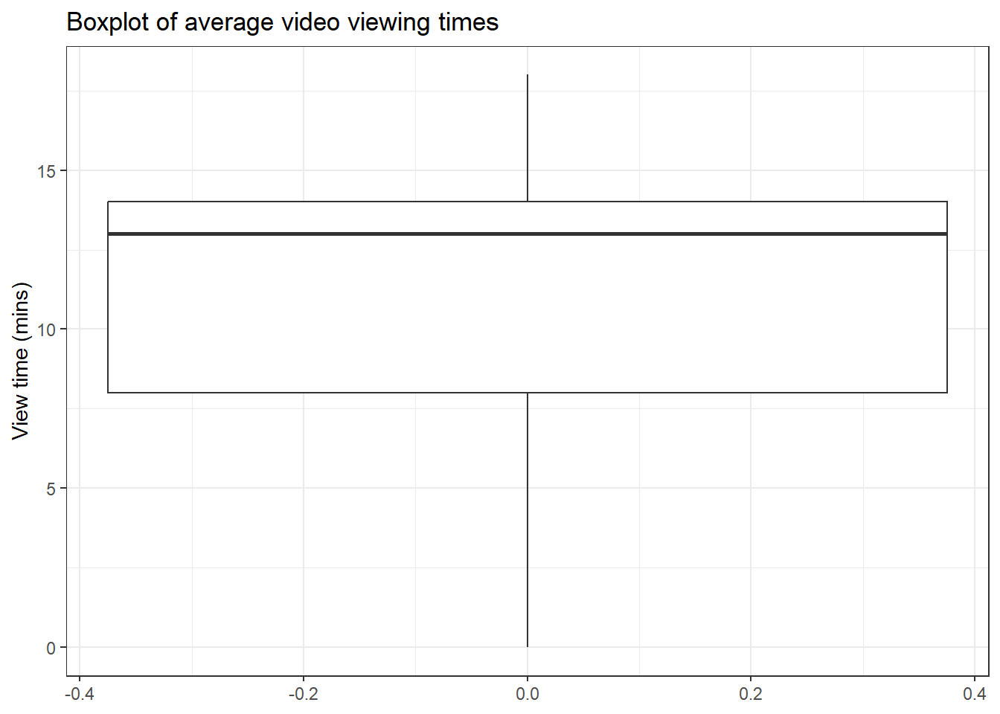
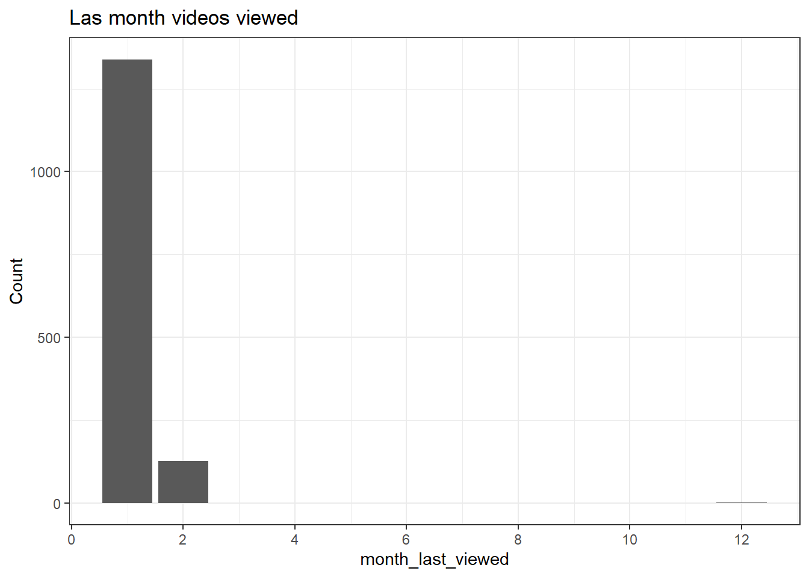
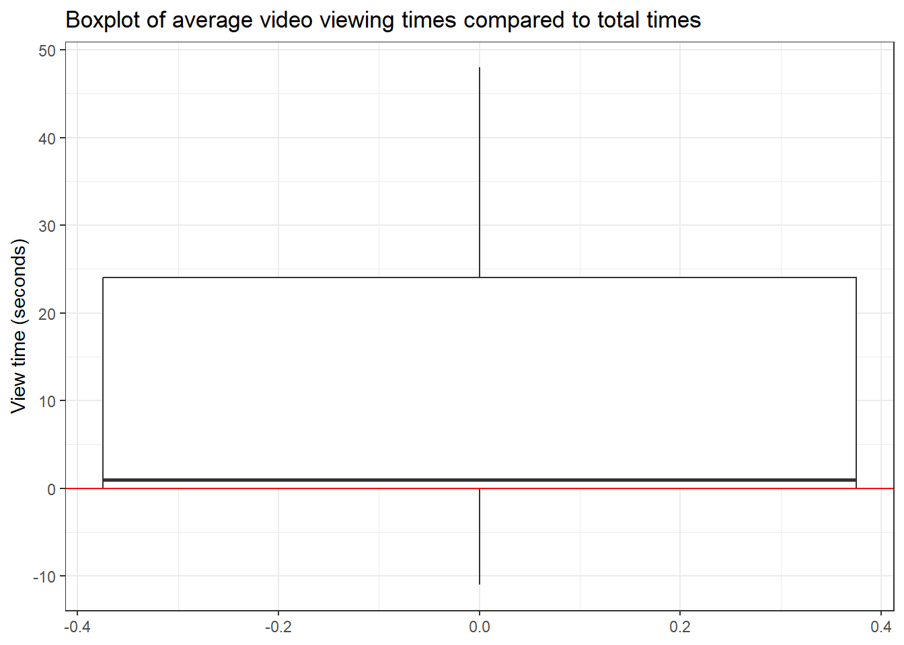
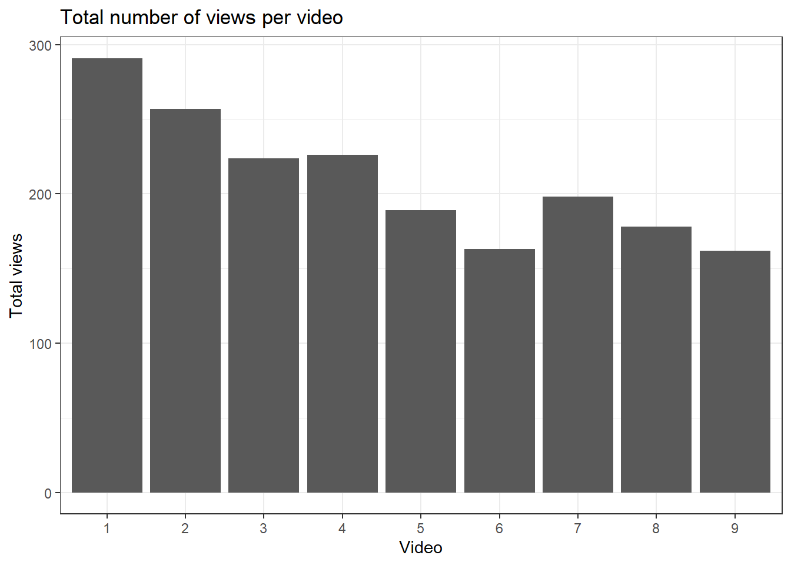
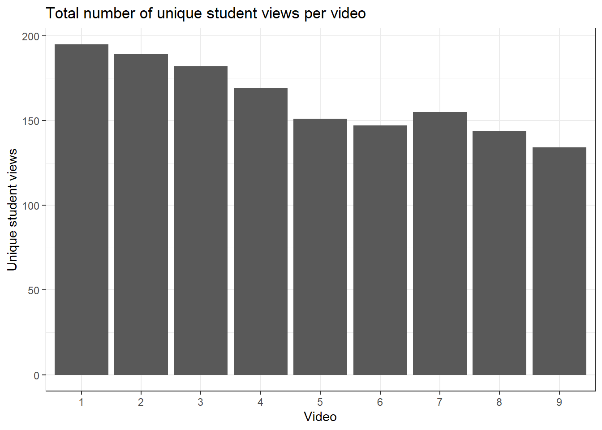
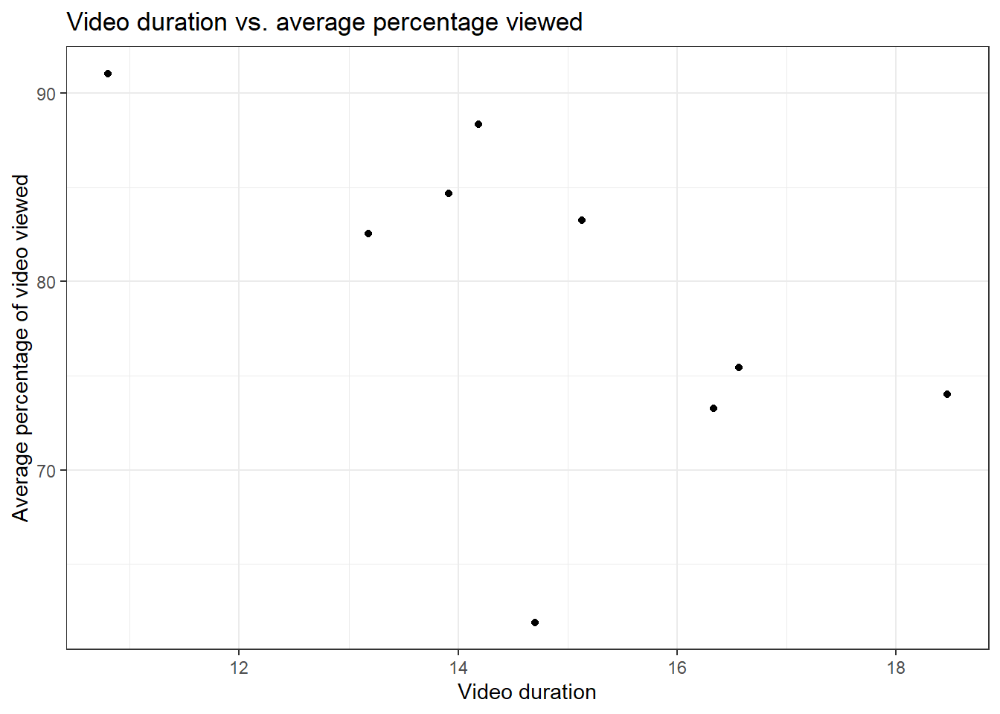

# Exploring Echo360 video/course level data in R with `tidyverse` {#Echo_course}


```r
library(tidyverse)
library(plotly)
library(ggpubr)
library(scales)
```


```r
# Obtain list of files from directory
files <- list.files(path = "data/Echo360_Data/", 
                    pattern=".csv") 

# Read in all files
data <- read_csv(paste0("data/Echo360_Data/", files), id="file_name")
```

```
## Rows: 1466 Columns: 16
## ── Column specification ────────────────────────────────────────────────────────
## Delimiter: ","
## chr  (8): media_id, media_name, create_date, owner_name, course, user_name, ...
## dbl  (4): total_views, on_demand_views, live_view_count, downloads
## time (3): duration, total_view_time, average_view_time
## 
## ℹ Use `spec()` to retrieve the full column specification for this data.
## ℹ Specify the column types or set `show_col_types = FALSE` to quiet this message.
```

```r
# Fill in spaces between column names
data <- tibble(data, .name_repair = "universal")

data$file_name <- as.numeric(as.factor(data$file_name))
colnames(data)[1] <- "Video"
```


## Handling date/time data with `lubridate`
Handling data that is of a date/time format in R is somewhat different from other variable types and should be treated differently and handled with care. The `lubridate` package in R (loaded as part of the tidyverse) allows us to easily handle tricky date/time data and extract useful variables from these. 

### Converting data to date/time format
The first task will be to convert any date/time data we have into the correct format. In the sample data we are working with, we have five variables which contain such data which are: `Create.Date, Duration, Total.View.Time,Average.View.Time` and `Last.Viewed`. 

These variables fall into two types on closer inspection:

- `Create.Data` & `Last.Viewed` - These are listed as a date (a particular day)
- `Duration, Total.View.Time` and `Average.View.Time` - These are listed as a time, recorded in hours, minutes and seconds.

Several functions can be used to take a string of data and convert it into the desired date/time format. There is a useful cheat sheet for the `lubridate` library which contains examples of such functions which can be found [here](https://evoldyn.gitlab.io/evomics-2018/ref-sheets/R_lubridate.pdf). For our data, we will use the `mdy` and `hms` functions as follows:


```r
data<-data %>%
  mutate_at(c('duration', 'total_view_time', 'average_view_time'), hms) %>%
  mutate_at(c('create_date', 'last_viewed'), mdy)
```

Here, the `mutate_at()` function allows us to update selected variables and modify these by the specified function that follows. `hms` converts a string into a date/time object which is set by hours-minutes-seconds. `mdy` converts a string into a date/time object which is set by month-day-year (note Echo360 data saves date/times in US format).

We can take a look at these transformations more closely:


```r
head(data$duration)
head(data$last_viewed)
```

```
## [1] "13M 11S" "13M 11S" "13M 11S" "13M 11S" "13M 11S" "13M 11S"
## [1] "2023-01-16" "2023-01-18" "2023-01-24" "2023-01-15" "2023-01-16"
## [6] "2023-02-15"
```

We can see that those variables converted using `hms`are printed in the format `10M 20S`. If you would prefer to visualise these in a more standard format, you can use `hms::as_hms()` to do so.


### Extracting elements from date/time data
Sometimes we may wish to obtain specific parts of a date/time such as month, minutes etc. There are several functions in `lubridate` which allow us to extract these easily from a date/time object.

Say we wish to only obtain the minutes from `Average.View.Time`, we can obtain this easily using the `minute` function. The commands below show the spread of duration in minutes with a boxplot


```r
data <- data %>% mutate(average_view_minute=minute(data$average_view_time))

ggplot(data,aes(y=average_view_minute)) + geom_boxplot() + labs(title="Boxplot of average video viewing times") + ylab("View time (mins)") + theme_bw()
```



We can also produce an interactive version of the boxplot by using `plotly`


```r
fig_avg_views <- plot_ly(data,y=~ average_view_minute,type="box",name="")
fig_avg_views <- fig_avg_views %>% layout(title="Boxplot of average video viewing times")
fig_avg_views
```

```{=html}
<div class="plotly html-widget html-fill-item-overflow-hidden html-fill-item" id="htmlwidget-7e13593db83137d4887c" style="width:100%;height:480px;"></div>
<script type="application/json" data-for="htmlwidget-7e13593db83137d4887c">{"x":{"visdat":{"b383d5b57dd":["function () ","plotlyVisDat"]},"cur_data":"b383d5b57dd","attrs":{"b383d5b57dd":{"y":{},"name":"","alpha_stroke":1,"sizes":[10,100],"spans":[1,20],"type":"box"}},"layout":{"margin":{"b":40,"l":60,"t":25,"r":10},"title":"Boxplot of average video viewing times","yaxis":{"domain":[0,1],"automargin":true,"title":"average_view_minute"},"xaxis":{"domain":[0,1],"automargin":true},"hovermode":"closest","showlegend":false},"source":"A","config":{"modeBarButtonsToAdd":["hoverclosest","hovercompare"],"showSendToCloud":false},"data":[{"fillcolor":"rgba(31,119,180,0.5)","y":[10,12,13,5,9,2,6,5,12,13,8,0,10,13,13,12,13,6,13,12,11,6,6,0,13,12,12,12,13,13,13,2,13,13,13,13,13,7,13,6,6,13,6,6,6,13,13,0,4,13,4,13,13,6,6,2,13,11,10,11,13,3,6,8,13,6,13,1,4,11,13,13,13,13,1,12,13,5,11,13,7,13,6,13,12,6,13,13,13,13,3,9,10,13,6,3,13,6,3,12,13,6,13,6,0,13,13,12,13,12,12,6,12,13,13,2,13,13,6,13,13,12,10,13,6,13,4,13,3,6,6,10,6,6,0,6,13,13,13,7,13,13,6,6,6,12,4,12,7,12,13,6,13,11,5,13,6,9,13,8,13,13,13,6,6,13,4,4,4,12,13,11,13,13,13,13,10,12,10,13,5,11,4,2,13,4,5,13,13,13,6,13,11,13,13,12,13,13,6,13,12,6,13,13,11,12,13,13,12,12,6,13,11,12,6,13,0,7,7,12,13,6,13,13,13,12,13,13,13,6,13,6,13,4,13,13,12,11,13,13,13,13,10,13,13,0,6,13,12,11,13,3,6,0,12,3,13,0,11,7,13,12,13,7,1,7,13,12,13,13,13,13,6,13,13,6,13,13,13,7,13,11,6,12,13,6,5,13,7,9,13,13,13,12,0,4,13,13,13,13,13,13,3,13,13,12,5,12,7,13,0,13,4,13,12,6,12,12,13,13,3,13,12,10,6,6,11,13,13,13,9,12,13,13,6,13,13,4,13,13,13,13,12,13,12,13,13,9,13,6,13,13,13,13,4,13,6,6,13,13,7,13,12,2,6,13,9,13,12,12,6,4,6,7,6,6,3,13,13,13,10,13,13,13,14,14,14,13,12,14,3,15,6,12,5,15,14,4,13,14,15,9,4,7,11,0,15,15,14,14,15,14,15,7,14,15,15,14,15,14,15,3,15,7,12,5,14,10,15,13,15,14,14,15,12,0,15,15,15,6,14,0,14,6,14,0,6,6,14,14,7,15,2,15,15,12,6,15,14,15,15,12,12,7,15,15,14,14,8,8,15,0,6,15,14,1,10,15,15,8,7,15,15,14,15,15,12,5,15,14,6,7,14,15,14,14,14,14,14,6,1,9,13,9,15,6,15,10,15,14,6,13,14,15,15,6,13,15,14,5,5,7,14,15,15,15,15,14,12,15,8,7,15,15,15,14,14,14,7,15,5,9,2,14,14,14,13,15,14,9,7,10,14,3,8,15,7,4,13,13,14,15,9,15,11,15,15,15,16,14,16,16,16,16,0,16,16,16,16,16,8,16,13,14,8,3,8,16,8,0,16,8,16,6,16,16,16,16,5,15,16,16,16,16,16,16,5,16,16,15,4,8,16,1,16,16,16,7,16,8,8,7,0,3,8,16,16,0,16,16,16,15,16,11,16,16,15,6,8,7,16,16,8,16,8,2,8,16,0,12,16,16,12,16,16,13,8,16,14,8,16,16,16,16,16,8,8,16,16,10,14,16,16,5,13,8,10,10,16,8,16,16,7,16,16,16,1,12,16,15,5,16,15,16,0,8,16,16,14,16,16,13,16,14,16,10,16,16,15,16,16,8,15,8,11,16,16,0,5,16,5,12,12,8,16,13,2,16,7,5,7,0,16,0,13,10,3,10,5,5,5,10,0,10,10,10,10,10,10,10,8,2,10,10,10,10,10,10,10,5,10,10,10,10,5,10,10,10,10,7,10,10,10,10,10,9,10,10,10,10,10,10,10,10,10,4,5,10,10,1,10,10,10,10,10,9,10,10,10,6,5,10,5,10,10,10,5,3,1,0,5,10,10,10,10,5,10,5,0,10,10,10,10,10,5,10,10,5,10,10,9,5,10,5,9,10,7,10,10,10,8,10,10,10,10,10,10,10,10,5,10,10,10,10,10,10,10,5,10,4,10,10,10,5,5,10,10,10,6,5,10,6,10,10,4,10,10,10,10,10,10,0,6,5,10,10,10,16,14,13,7,8,13,10,16,3,11,14,16,16,3,10,15,14,9,8,7,8,16,16,16,14,15,16,8,7,16,16,16,11,12,16,16,16,10,9,16,16,16,16,16,16,13,9,12,6,11,15,5,0,15,9,16,11,16,3,16,16,14,5,7,16,16,6,16,16,16,5,0,15,16,16,11,6,12,16,12,13,13,10,8,10,13,16,16,16,16,10,9,14,16,5,4,16,7,0,16,14,11,16,16,16,16,16,12,11,4,5,9,16,16,16,0,16,14,16,8,5,16,11,14,16,16,14,16,16,16,13,16,16,14,16,16,4,13,13,8,16,2,13,14,15,11,14,14,5,7,4,14,2,14,14,6,13,14,14,14,7,0,12,14,14,13,14,14,14,14,14,14,14,14,14,12,14,14,14,14,13,14,14,13,14,6,7,14,0,14,14,14,14,7,14,14,14,14,14,14,4,7,10,14,14,1,7,2,14,14,14,9,14,14,13,14,14,4,14,7,14,13,9,12,14,7,8,14,6,14,14,14,14,13,13,14,7,14,14,14,13,12,11,13,14,14,7,14,7,4,14,14,5,14,14,14,14,14,14,14,13,14,13,14,14,14,14,14,14,12,0,14,13,14,14,13,13,0,14,7,14,14,0,7,14,14,13,14,14,14,12,14,14,7,7,7,14,14,14,7,14,14,14,4,14,3,14,14,14,3,14,5,14,14,13,12,14,14,14,14,14,14,14,7,14,9,14,14,14,14,14,14,14,14,14,14,13,14,14,14,14,14,14,14,14,14,14,14,14,14,14,14,14,7,14,14,7,2,14,14,14,14,14,14,14,14,7,14,14,14,14,6,14,7,3,9,12,14,7,14,14,7,14,7,14,14,14,14,13,7,14,14,14,7,14,14,2,14,14,7,0,14,14,7,14,14,5,3,14,14,14,14,14,14,14,14,2,14,14,14,14,14,13,14,6,14,14,4,7,14,14,14,11,14,14,2,14,5,1,7,14,12,14,14,14,5,8,11,14,7,15,18,18,8,18,8,18,18,2,15,18,14,18,18,14,13,9,16,18,18,7,18,18,18,14,18,0,5,0,15,14,18,14,9,17,18,15,18,18,17,14,16,13,18,7,9,16,18,18,14,9,18,9,13,11,11,13,6,18,15,16,18,4,6,15,7,9,15,7,18,18,13,18,8,18,18,18,3,5,12,17,4,18,7,18,8,0,18,18,14,15,18,18,14,12,6,17,15,18,18,18,1,16,18,18,18,13,18,9,10,12,18,18,17,9,18,18,15,18,9,14,9,0,9,8,5,8,13,16],"name":"","type":"box","marker":{"color":"rgba(31,119,180,1)","line":{"color":"rgba(31,119,180,1)"}},"line":{"color":"rgba(31,119,180,1)"},"xaxis":"x","yaxis":"y","frame":null}],"highlight":{"on":"plotly_click","persistent":false,"dynamic":false,"selectize":false,"opacityDim":0.20000000000000001,"selected":{"opacity":1},"debounce":0},"shinyEvents":["plotly_hover","plotly_click","plotly_selected","plotly_relayout","plotly_brushed","plotly_brushing","plotly_clickannotation","plotly_doubleclick","plotly_deselect","plotly_afterplot","plotly_sunburstclick"],"base_url":"https://plot.ly"},"evals":[],"jsHooks":[]}</script>
```

Suppose we want to look at the last month students viewed videos across the course. We can obtain this by applying the `month` function to the `Last.Viewed` variable


```r
data <- data %>% mutate(month_last_viewed=month(data$last_viewed))

last_viewed <- ggplot(data,aes(x=month_last_viewed)) + geom_bar() + labs(title="Las month videos viewed") + ylab("Count") + theme_bw() + scale_x_continuous(breaks= pretty_breaks())
last_viewed
```



We can easily display the above plot in `plotly` using the command `ggplotly` with our stored `ggplot` output:


```r
ggplotly(last_viewed)
```

```{=html}
<div class="plotly html-widget html-fill-item-overflow-hidden html-fill-item" id="htmlwidget-75ba22c0bc5fc7c52f31" style="width:100%;height:480px;"></div>
<script type="application/json" data-for="htmlwidget-75ba22c0bc5fc7c52f31">{"x":{"data":[{"orientation":"v","width":[0.89999999999999991,0.90000000000000013,0.89999999999999858],"base":[0,0,0],"x":[1,2,12],"y":[1339,126,1],"text":["count: 1339<br />month_last_viewed:  1","count:  126<br />month_last_viewed:  2","count:    1<br />month_last_viewed: 12"],"type":"bar","textposition":"none","marker":{"autocolorscale":false,"color":"rgba(89,89,89,1)","line":{"width":1.8897637795275593,"color":"transparent"}},"showlegend":false,"xaxis":"x","yaxis":"y","hoverinfo":"text","frame":null}],"layout":{"margin":{"t":43.762557077625573,"r":7.3059360730593621,"b":40.182648401826491,"l":48.949771689497723},"plot_bgcolor":"rgba(255,255,255,1)","paper_bgcolor":"rgba(255,255,255,1)","font":{"color":"rgba(0,0,0,1)","family":"","size":14.611872146118724},"title":{"text":"Las month videos viewed","font":{"color":"rgba(0,0,0,1)","family":"","size":17.534246575342465},"x":0,"xref":"paper"},"xaxis":{"domain":[0,1],"automargin":true,"type":"linear","autorange":false,"range":[-0.044999999999999929,13.045],"tickmode":"array","ticktext":["0","2","4","6","8","10","12"],"tickvals":[0,2,4,6,8,10,12],"categoryorder":"array","categoryarray":["0","2","4","6","8","10","12"],"nticks":null,"ticks":"outside","tickcolor":"rgba(51,51,51,1)","ticklen":3.6529680365296811,"tickwidth":0.66417600664176002,"showticklabels":true,"tickfont":{"color":"rgba(77,77,77,1)","family":"","size":11.68949771689498},"tickangle":-0,"showline":false,"linecolor":null,"linewidth":0,"showgrid":true,"gridcolor":"rgba(235,235,235,1)","gridwidth":0.66417600664176002,"zeroline":false,"anchor":"y","title":{"text":"month_last_viewed","font":{"color":"rgba(0,0,0,1)","family":"","size":14.611872146118724}},"hoverformat":".2f"},"yaxis":{"domain":[0,1],"automargin":true,"type":"linear","autorange":false,"range":[-66.950000000000003,1405.95],"tickmode":"array","ticktext":["0","500","1000"],"tickvals":[0,500.00000000000006,1000],"categoryorder":"array","categoryarray":["0","500","1000"],"nticks":null,"ticks":"outside","tickcolor":"rgba(51,51,51,1)","ticklen":3.6529680365296811,"tickwidth":0.66417600664176002,"showticklabels":true,"tickfont":{"color":"rgba(77,77,77,1)","family":"","size":11.68949771689498},"tickangle":-0,"showline":false,"linecolor":null,"linewidth":0,"showgrid":true,"gridcolor":"rgba(235,235,235,1)","gridwidth":0.66417600664176002,"zeroline":false,"anchor":"x","title":{"text":"Count","font":{"color":"rgba(0,0,0,1)","family":"","size":14.611872146118724}},"hoverformat":".2f"},"shapes":[{"type":"rect","fillcolor":"transparent","line":{"color":"rgba(51,51,51,1)","width":0.66417600664176002,"linetype":"solid"},"yref":"paper","xref":"paper","x0":0,"x1":1,"y0":0,"y1":1}],"showlegend":false,"legend":{"bgcolor":"rgba(255,255,255,1)","bordercolor":"transparent","borderwidth":1.8897637795275593,"font":{"color":"rgba(0,0,0,1)","family":"","size":11.68949771689498}},"hovermode":"closest","barmode":"relative"},"config":{"doubleClick":"reset","modeBarButtonsToAdd":["hoverclosest","hovercompare"],"showSendToCloud":false},"source":"A","attrs":{"b389276f1d":{"x":{},"type":"bar"}},"cur_data":"b389276f1d","visdat":{"b389276f1d":["function (y) ","x"]},"highlight":{"on":"plotly_click","persistent":false,"dynamic":false,"selectize":false,"opacityDim":0.20000000000000001,"selected":{"opacity":1},"debounce":0},"shinyEvents":["plotly_hover","plotly_click","plotly_selected","plotly_relayout","plotly_brushed","plotly_brushing","plotly_clickannotation","plotly_doubleclick","plotly_deselect","plotly_afterplot","plotly_sunburstclick"],"base_url":"https://plot.ly"},"evals":[],"jsHooks":[]}</script>
```

### Maths with date-times
Sometimes, we may wish to compare the difference in time between certain events. Again, `lubridate` provides some useful functions to help us with this. For example, we can look at the difference in average view time to total view time by for a certain video by using simple arithmetic operators


```r
data_video1 <- data[data$Video==1,]
data_video1 <- data_video1 %>% mutate(time_difference=average_view_time-duration)
head(data_video1$time_difference)
```

```
## [1] "-3M 44S"  "-1M 35S"  "-2S"      "-8M 5S"   "-4M 48S"  "-11M -9S"
```
As this data returns values in minutes and seconds, we will have to transform this to one unit type to visualise


```r
data_video1$time_difference <- second(data_video1$time_difference)

time_difference <- ggplot(data_video1,aes(y=time_difference)) + geom_boxplot() + labs(title="Boxplot of average video viewing times compared to total times") + ylab("View time (seconds)") + theme_bw() + geom_hline(yintercept=0,color="red")
time_difference
```




```r
ggplotly(time_difference)
```

```{=html}
<div class="plotly html-widget html-fill-item-overflow-hidden html-fill-item" id="htmlwidget-3c84f3e896bcbe87965f" style="width:100%;height:480px;"></div>
<script type="application/json" data-for="htmlwidget-3c84f3e896bcbe87965f">{"x":{"data":[{"y":[44,35,-2,5,48,-9,9,37,44,0,48,4,47,0,0,32,0,0,-1,46,14,22,19,-5,0,40,32,27,0,-1,0,48,-2,0,0,-1,-4,2,-6,21,-4,-6,35,43,7,0,0,-9,10,0,-3,0,-2,31,-11,34,-3,-10,48,-2,0,47,19,3,0,15,0,47,40,30,-2,0,-5,0,1,44,-5,48,14,0,18,0,2,-3,20,12,-3,0,0,0,3,13,18,-7,6,7,0,15,3,44,0,25,0,24,37,0,-1,23,0,44,20,-5,17,0,-1,33,0,0,31,-7,0,-1,-6,-2,13,0,-9,0,27,-2,15,5,27,27,6,33,0,0,0,35,0,0,25,24,25,24,9,20,-11,48,0,23,-7,20,20,-4,29,46,0,19,0,0,0,26,25,0,13,43,11,21,0,39,0,-2,0,0,4,24,-4,0,46,-11,13,29,0,10,6,-3,0,-1,13,0,43,0,0],"hoverinfo":"y","type":"box","fillcolor":"rgba(255,255,255,1)","marker":{"opacity":null,"outliercolor":"rgba(0,0,0,1)","line":{"width":1.8897637795275593,"color":"rgba(0,0,0,1)"},"size":5.6692913385826778},"line":{"color":"rgba(51,51,51,1)","width":1.8897637795275593},"showlegend":false,"xaxis":"x","yaxis":"y","frame":null},{"x":[-0.41249999999999998,0.41249999999999998],"y":[0,0],"text":"yintercept: 0","type":"scatter","mode":"lines","line":{"width":1.8897637795275593,"color":"rgba(255,0,0,1)","dash":"solid"},"hoveron":"points","showlegend":false,"xaxis":"x","yaxis":"y","hoverinfo":"text","frame":null}],"layout":{"margin":{"t":43.762557077625573,"r":7.3059360730593621,"b":25.570776255707766,"l":43.105022831050235},"plot_bgcolor":"rgba(255,255,255,1)","paper_bgcolor":"rgba(255,255,255,1)","font":{"color":"rgba(0,0,0,1)","family":"","size":14.611872146118724},"title":{"text":"Boxplot of average video viewing times compared to total times","font":{"color":"rgba(0,0,0,1)","family":"","size":17.534246575342465},"x":0,"xref":"paper"},"xaxis":{"domain":[0,1],"automargin":true,"type":"linear","autorange":false,"range":[-0.41249999999999998,0.41249999999999998],"tickmode":"array","ticktext":["-0.4","-0.2","0.0","0.2","0.4"],"tickvals":[-0.40000000000000002,-0.19999999999999998,0,0.20000000000000007,0.40000000000000002],"categoryorder":"array","categoryarray":["-0.4","-0.2","0.0","0.2","0.4"],"nticks":null,"ticks":"outside","tickcolor":"rgba(51,51,51,1)","ticklen":3.6529680365296811,"tickwidth":0.66417600664176002,"showticklabels":true,"tickfont":{"color":"rgba(77,77,77,1)","family":"","size":11.68949771689498},"tickangle":-0,"showline":false,"linecolor":null,"linewidth":0,"showgrid":true,"gridcolor":"rgba(235,235,235,1)","gridwidth":0.66417600664176002,"zeroline":false,"anchor":"y","title":{"text":"","font":{"color":"rgba(0,0,0,1)","family":"","size":14.611872146118724}},"hoverformat":".2f"},"yaxis":{"domain":[0,1],"automargin":true,"type":"linear","autorange":false,"range":[-13.949999999999999,50.950000000000003],"tickmode":"array","ticktext":["-10","0","10","20","30","40","50"],"tickvals":[-10,0,10,20.000000000000004,30.000000000000004,40,50],"categoryorder":"array","categoryarray":["-10","0","10","20","30","40","50"],"nticks":null,"ticks":"outside","tickcolor":"rgba(51,51,51,1)","ticklen":3.6529680365296811,"tickwidth":0.66417600664176002,"showticklabels":true,"tickfont":{"color":"rgba(77,77,77,1)","family":"","size":11.68949771689498},"tickangle":-0,"showline":false,"linecolor":null,"linewidth":0,"showgrid":true,"gridcolor":"rgba(235,235,235,1)","gridwidth":0.66417600664176002,"zeroline":false,"anchor":"x","title":{"text":"View time (seconds)","font":{"color":"rgba(0,0,0,1)","family":"","size":14.611872146118724}},"hoverformat":".2f"},"shapes":[{"type":"rect","fillcolor":"transparent","line":{"color":"rgba(51,51,51,1)","width":0.66417600664176002,"linetype":"solid"},"yref":"paper","xref":"paper","x0":0,"x1":1,"y0":0,"y1":1}],"showlegend":false,"legend":{"bgcolor":"rgba(255,255,255,1)","bordercolor":"transparent","borderwidth":1.8897637795275593,"font":{"color":"rgba(0,0,0,1)","family":"","size":11.68949771689498}},"hovermode":"closest","barmode":"relative"},"config":{"doubleClick":"reset","modeBarButtonsToAdd":["hoverclosest","hovercompare"],"showSendToCloud":false},"source":"A","attrs":{"b383272537":{"y":{},"type":"box"},"b3837d910d0":{"yintercept":{}}},"cur_data":"b383272537","visdat":{"b383272537":["function (y) ","x"],"b3837d910d0":["function (y) ","x"]},"highlight":{"on":"plotly_click","persistent":false,"dynamic":false,"selectize":false,"opacityDim":0.20000000000000001,"selected":{"opacity":1},"debounce":0},"shinyEvents":["plotly_hover","plotly_click","plotly_selected","plotly_relayout","plotly_brushed","plotly_brushing","plotly_clickannotation","plotly_doubleclick","plotly_deselect","plotly_afterplot","plotly_sunburstclick"],"base_url":"https://plot.ly"},"evals":[],"jsHooks":[]}</script>
```

## Total views for each video
In the following sections we will mostly be creating plots of our data summarised at video level. Given that our data is currently stored at student level (one row per student per video) we will transform our data into a new data set called `video_data` which will group the data by video and create some variables of interest. Firstly, let's create this new data set with two columns:

* `Video`: The video number stored as a factor (this will make it easier to plot later on);
* `Total_Views`: The total number of views per video.


```r
video_data <- data %>% group_by(Video) %>%
  summarise(total_views=sum(total_views)) %>%
  mutate_at('Video', factor)
```

We can now easily create a bar chart of the total number of views per video as follows:


```r
fig.total.views <- ggplot(video_data, aes(x=Video, y=total_views)) +
  geom_bar(stat = "identity") + 
  labs(title="Total number of views per video") + 
  ylab("Total views") +
  xlab("Video") +
  theme_bw()

fig.total.views
```




Here we plot the video number along the x-axis and the total number of views for each video on the y-axis. These numbers include duplications from students who have watched the videos multiple times. We may also be interested in the total number of unique views, i.e. the total number of students who watched the video at least once. To do this, we need to create a new variable called `unique_views` which will contain the sum of the rows for each video. We can add this to the video-level data set `video_data`.


```r
video_data <- data %>% group_by(Video) %>%
  summarise(Total_Views=sum(total_views), unique_views=n()) %>%
  mutate_at('Video', factor)
```
We can edit the code for the previous bar cahrt to create a bar chart of the total number of unique student views per video as follows:


```r
fig.unique.views<-ggplot(video_data, aes(x=Video, y=unique_views)) +
  geom_bar(stat = "identity") + 
  labs(title="Total number of unique student views per video") + 
  ylab("Unique student views") +
  xlab("Video") +
  theme_bw()

fig.unique.views
```



### Creating an interactive version using `plotly`.

We can create mor interactive plots, allowing us to share information on our data in a more interactive environment using `plotly`. First start by installing and loading the `plotly` library.


```r
library(plotly)
```

Let's start by creating a `plotly` version of the barchart of unique student views using the following the `ggplotly()` function.

```r
ggplotly(fig.unique.views)
```

```{=html}
<div class="plotly html-widget html-fill-item-overflow-hidden html-fill-item" id="htmlwidget-35458e96f013e7ab2b75" style="width:100%;height:480px;"></div>
<script type="application/json" data-for="htmlwidget-35458e96f013e7ab2b75">{"x":{"data":[{"orientation":"v","width":[0.89999999999999991,0.90000000000000013,0.90000000000000036,0.90000000000000036,0.90000000000000036,0.90000000000000036,0.90000000000000036,0.89999999999999947,0.89999999999999858],"base":[0,0,0,0,0,0,0,0,0],"x":[1,2,3,4,5,6,7,8,9],"y":[195,189,182,169,151,147,155,144,134],"text":["Video: 1<br />unique_views: 195","Video: 2<br />unique_views: 189","Video: 3<br />unique_views: 182","Video: 4<br />unique_views: 169","Video: 5<br />unique_views: 151","Video: 6<br />unique_views: 147","Video: 7<br />unique_views: 155","Video: 8<br />unique_views: 144","Video: 9<br />unique_views: 134"],"type":"bar","textposition":"none","marker":{"autocolorscale":false,"color":"rgba(89,89,89,1)","line":{"width":1.8897637795275593,"color":"transparent"}},"showlegend":false,"xaxis":"x","yaxis":"y","hoverinfo":"text","frame":null}],"layout":{"margin":{"t":43.762557077625573,"r":7.3059360730593621,"b":40.182648401826491,"l":43.105022831050235},"plot_bgcolor":"rgba(255,255,255,1)","paper_bgcolor":"rgba(255,255,255,1)","font":{"color":"rgba(0,0,0,1)","family":"","size":14.611872146118724},"title":{"text":"Total number of unique student views per video","font":{"color":"rgba(0,0,0,1)","family":"","size":17.534246575342465},"x":0,"xref":"paper"},"xaxis":{"domain":[0,1],"automargin":true,"type":"linear","autorange":false,"range":[0.40000000000000002,9.5999999999999996],"tickmode":"array","ticktext":["1","2","3","4","5","6","7","8","9"],"tickvals":[1,2,3,4,5,6,6.9999999999999991,8,9],"categoryorder":"array","categoryarray":["1","2","3","4","5","6","7","8","9"],"nticks":null,"ticks":"outside","tickcolor":"rgba(51,51,51,1)","ticklen":3.6529680365296811,"tickwidth":0.66417600664176002,"showticklabels":true,"tickfont":{"color":"rgba(77,77,77,1)","family":"","size":11.68949771689498},"tickangle":-0,"showline":false,"linecolor":null,"linewidth":0,"showgrid":true,"gridcolor":"rgba(235,235,235,1)","gridwidth":0.66417600664176002,"zeroline":false,"anchor":"y","title":{"text":"Video","font":{"color":"rgba(0,0,0,1)","family":"","size":14.611872146118724}},"hoverformat":".2f"},"yaxis":{"domain":[0,1],"automargin":true,"type":"linear","autorange":false,"range":[-9.75,204.75],"tickmode":"array","ticktext":["0","50","100","150","200"],"tickvals":[0,50,100.00000000000001,150,200],"categoryorder":"array","categoryarray":["0","50","100","150","200"],"nticks":null,"ticks":"outside","tickcolor":"rgba(51,51,51,1)","ticklen":3.6529680365296811,"tickwidth":0.66417600664176002,"showticklabels":true,"tickfont":{"color":"rgba(77,77,77,1)","family":"","size":11.68949771689498},"tickangle":-0,"showline":false,"linecolor":null,"linewidth":0,"showgrid":true,"gridcolor":"rgba(235,235,235,1)","gridwidth":0.66417600664176002,"zeroline":false,"anchor":"x","title":{"text":"Unique student views","font":{"color":"rgba(0,0,0,1)","family":"","size":14.611872146118724}},"hoverformat":".2f"},"shapes":[{"type":"rect","fillcolor":"transparent","line":{"color":"rgba(51,51,51,1)","width":0.66417600664176002,"linetype":"solid"},"yref":"paper","xref":"paper","x0":0,"x1":1,"y0":0,"y1":1}],"showlegend":false,"legend":{"bgcolor":"rgba(255,255,255,1)","bordercolor":"transparent","borderwidth":1.8897637795275593,"font":{"color":"rgba(0,0,0,1)","family":"","size":11.68949771689498}},"hovermode":"closest","barmode":"relative"},"config":{"doubleClick":"reset","modeBarButtonsToAdd":["hoverclosest","hovercompare"],"showSendToCloud":false},"source":"A","attrs":{"b382a975e06":{"x":{},"y":{},"type":"bar"}},"cur_data":"b382a975e06","visdat":{"b382a975e06":["function (y) ","x"]},"highlight":{"on":"plotly_click","persistent":false,"dynamic":false,"selectize":false,"opacityDim":0.20000000000000001,"selected":{"opacity":1},"debounce":0},"shinyEvents":["plotly_hover","plotly_click","plotly_selected","plotly_relayout","plotly_brushed","plotly_brushing","plotly_clickannotation","plotly_doubleclick","plotly_deselect","plotly_afterplot","plotly_sunburstclick"],"base_url":"https://plot.ly"},"evals":[],"jsHooks":[]}</script>
```

**Advanced**
We can add additional information such as total views, duration of video and average view time into the hover text as follows.


```r
video_data <- data %>%
  group_by(Video) %>%
  summarise(total_views=sum(total_views), video_data=n(), average_view_time=mean(period_to_seconds(average_view_time), na.rm=T)) %>%
  mutate(average_view_time=round(seconds_to_period(average_view_time),0),
         repeated_views=total_views-video_data,
         duration = hms(c('00:10:48', '00:13:11', '00:13:55', '00:14:11', '00:14:42', '00:15:08', '00:16:20', '00:16:34', '00:18:28')),
         percentage_viewed=average_view_time/duration*100)

fig.all.views <- plot_ly(video_data,
  x = ~as.factor(Video),
  y = ~video_data,
  name = "Unique Views",
  type = "bar",
  hovertemplate = paste0("Video %{x}",
                         "<br>Total views:", video_data$total_views,
                         "<br>Unique views: %{y}",
                         "<br> Duration: ", video_data$duration,
                         "<br> Average view time: ", video_data$average_view_time,
                         "<extra></extra>")

)%>%
  layout(title = 'Video views', xaxis = list(title = 'Video number'),
         yaxis = list(title = 'Unique views'))

fig.all.views
```

```{=html}
<div class="plotly html-widget html-fill-item-overflow-hidden html-fill-item" id="htmlwidget-96fb09bb8ea91f624c54" style="width:100%;height:480px;"></div>
<script type="application/json" data-for="htmlwidget-96fb09bb8ea91f624c54">{"x":{"visdat":{"b38330163bd":["function () ","plotlyVisDat"]},"cur_data":"b38330163bd","attrs":{"b38330163bd":{"x":{},"y":{},"hovertemplate":["Video %{x}<br>Total views:291<br>Unique views: %{y}<br> Duration: 10M 48S<br> Average view time: 9M 50S<extra><\/extra>","Video %{x}<br>Total views:257<br>Unique views: %{y}<br> Duration: 13M 11S<br> Average view time: 10M 53S<extra><\/extra>","Video %{x}<br>Total views:224<br>Unique views: %{y}<br> Duration: 13M 55S<br> Average view time: 11M 47S<extra><\/extra>","Video %{x}<br>Total views:226<br>Unique views: %{y}<br> Duration: 14M 11S<br> Average view time: 12M 32S<extra><\/extra>","Video %{x}<br>Total views:189<br>Unique views: %{y}<br> Duration: 14M 42S<br> Average view time: 9M 6S<extra><\/extra>","Video %{x}<br>Total views:163<br>Unique views: %{y}<br> Duration: 15M 8S<br> Average view time: 12M 36S<extra><\/extra>","Video %{x}<br>Total views:198<br>Unique views: %{y}<br> Duration: 16M 20S<br> Average view time: 11M 58S<extra><\/extra>","Video %{x}<br>Total views:178<br>Unique views: %{y}<br> Duration: 16M 34S<br> Average view time: 12M 30S<extra><\/extra>","Video %{x}<br>Total views:162<br>Unique views: %{y}<br> Duration: 18M 28S<br> Average view time: 13M 40S<extra><\/extra>"],"name":"Unique Views","alpha_stroke":1,"sizes":[10,100],"spans":[1,20],"type":"bar"}},"layout":{"margin":{"b":40,"l":60,"t":25,"r":10},"title":"Video views","xaxis":{"domain":[0,1],"automargin":true,"title":"Video number","type":"category","categoryorder":"array","categoryarray":["1","2","3","4","5","6","7","8","9"]},"yaxis":{"domain":[0,1],"automargin":true,"title":"Unique views"},"hovermode":"closest","showlegend":false},"source":"A","config":{"modeBarButtonsToAdd":["hoverclosest","hovercompare"],"showSendToCloud":false},"data":[{"x":["1","2","3","4","5","6","7","8","9"],"y":[195,189,182,169,151,147,155,144,134],"hovertemplate":["Video %{x}<br>Total views:291<br>Unique views: %{y}<br> Duration: 10M 48S<br> Average view time: 9M 50S<extra><\/extra>","Video %{x}<br>Total views:257<br>Unique views: %{y}<br> Duration: 13M 11S<br> Average view time: 10M 53S<extra><\/extra>","Video %{x}<br>Total views:224<br>Unique views: %{y}<br> Duration: 13M 55S<br> Average view time: 11M 47S<extra><\/extra>","Video %{x}<br>Total views:226<br>Unique views: %{y}<br> Duration: 14M 11S<br> Average view time: 12M 32S<extra><\/extra>","Video %{x}<br>Total views:189<br>Unique views: %{y}<br> Duration: 14M 42S<br> Average view time: 9M 6S<extra><\/extra>","Video %{x}<br>Total views:163<br>Unique views: %{y}<br> Duration: 15M 8S<br> Average view time: 12M 36S<extra><\/extra>","Video %{x}<br>Total views:198<br>Unique views: %{y}<br> Duration: 16M 20S<br> Average view time: 11M 58S<extra><\/extra>","Video %{x}<br>Total views:178<br>Unique views: %{y}<br> Duration: 16M 34S<br> Average view time: 12M 30S<extra><\/extra>","Video %{x}<br>Total views:162<br>Unique views: %{y}<br> Duration: 18M 28S<br> Average view time: 13M 40S<extra><\/extra>"],"name":"Unique Views","type":"bar","marker":{"color":"rgba(31,119,180,1)","line":{"color":"rgba(31,119,180,1)"}},"error_y":{"color":"rgba(31,119,180,1)"},"error_x":{"color":"rgba(31,119,180,1)"},"xaxis":"x","yaxis":"y","frame":null}],"highlight":{"on":"plotly_click","persistent":false,"dynamic":false,"selectize":false,"opacityDim":0.20000000000000001,"selected":{"opacity":1},"debounce":0},"shinyEvents":["plotly_hover","plotly_click","plotly_selected","plotly_relayout","plotly_brushed","plotly_brushing","plotly_clickannotation","plotly_doubleclick","plotly_deselect","plotly_afterplot","plotly_sunburstclick"],"base_url":"https://plot.ly"},"evals":[],"jsHooks":[]}</script>
```
We might also want to create a stacked barchart with the total number of views split into unique student views and repeated views. We can do this in `plotly` as follows.


```r
fig.all.views <- fig.all.views %>% add_trace(y = ~repeated_views, name = 'Repeated views')

fig.all.views <- fig.all.views %>% layout(yaxis = list(title = 'Count'), barmode = 'stack')

fig.all.views
```

```{=html}
<div class="plotly html-widget html-fill-item-overflow-hidden html-fill-item" id="htmlwidget-180af33113cfb7cae7a9" style="width:100%;height:480px;"></div>
<script type="application/json" data-for="htmlwidget-180af33113cfb7cae7a9">{"x":{"visdat":{"b38330163bd":["function () ","plotlyVisDat"]},"cur_data":"b38330163bd","attrs":{"b38330163bd":{"x":{},"y":{},"hovertemplate":["Video %{x}<br>Total views:291<br>Unique views: %{y}<br> Duration: 10M 48S<br> Average view time: 9M 50S<extra><\/extra>","Video %{x}<br>Total views:257<br>Unique views: %{y}<br> Duration: 13M 11S<br> Average view time: 10M 53S<extra><\/extra>","Video %{x}<br>Total views:224<br>Unique views: %{y}<br> Duration: 13M 55S<br> Average view time: 11M 47S<extra><\/extra>","Video %{x}<br>Total views:226<br>Unique views: %{y}<br> Duration: 14M 11S<br> Average view time: 12M 32S<extra><\/extra>","Video %{x}<br>Total views:189<br>Unique views: %{y}<br> Duration: 14M 42S<br> Average view time: 9M 6S<extra><\/extra>","Video %{x}<br>Total views:163<br>Unique views: %{y}<br> Duration: 15M 8S<br> Average view time: 12M 36S<extra><\/extra>","Video %{x}<br>Total views:198<br>Unique views: %{y}<br> Duration: 16M 20S<br> Average view time: 11M 58S<extra><\/extra>","Video %{x}<br>Total views:178<br>Unique views: %{y}<br> Duration: 16M 34S<br> Average view time: 12M 30S<extra><\/extra>","Video %{x}<br>Total views:162<br>Unique views: %{y}<br> Duration: 18M 28S<br> Average view time: 13M 40S<extra><\/extra>"],"name":"Unique Views","alpha_stroke":1,"sizes":[10,100],"spans":[1,20],"type":"bar"},"b38330163bd.1":{"x":{},"y":{},"hovertemplate":["Video %{x}<br>Total views:291<br>Unique views: %{y}<br> Duration: 10M 48S<br> Average view time: 9M 50S<extra><\/extra>","Video %{x}<br>Total views:257<br>Unique views: %{y}<br> Duration: 13M 11S<br> Average view time: 10M 53S<extra><\/extra>","Video %{x}<br>Total views:224<br>Unique views: %{y}<br> Duration: 13M 55S<br> Average view time: 11M 47S<extra><\/extra>","Video %{x}<br>Total views:226<br>Unique views: %{y}<br> Duration: 14M 11S<br> Average view time: 12M 32S<extra><\/extra>","Video %{x}<br>Total views:189<br>Unique views: %{y}<br> Duration: 14M 42S<br> Average view time: 9M 6S<extra><\/extra>","Video %{x}<br>Total views:163<br>Unique views: %{y}<br> Duration: 15M 8S<br> Average view time: 12M 36S<extra><\/extra>","Video %{x}<br>Total views:198<br>Unique views: %{y}<br> Duration: 16M 20S<br> Average view time: 11M 58S<extra><\/extra>","Video %{x}<br>Total views:178<br>Unique views: %{y}<br> Duration: 16M 34S<br> Average view time: 12M 30S<extra><\/extra>","Video %{x}<br>Total views:162<br>Unique views: %{y}<br> Duration: 18M 28S<br> Average view time: 13M 40S<extra><\/extra>"],"name":"Repeated views","alpha_stroke":1,"sizes":[10,100],"spans":[1,20],"type":"bar","inherit":true}},"layout":{"margin":{"b":40,"l":60,"t":25,"r":10},"title":"Video views","xaxis":{"domain":[0,1],"automargin":true,"title":"Video number","type":"category","categoryorder":"array","categoryarray":["1","2","3","4","5","6","7","8","9"]},"yaxis":{"domain":[0,1],"automargin":true,"title":"Count"},"barmode":"stack","hovermode":"closest","showlegend":true},"source":"A","config":{"modeBarButtonsToAdd":["hoverclosest","hovercompare"],"showSendToCloud":false},"data":[{"x":["1","2","3","4","5","6","7","8","9"],"y":[195,189,182,169,151,147,155,144,134],"hovertemplate":["Video %{x}<br>Total views:291<br>Unique views: %{y}<br> Duration: 10M 48S<br> Average view time: 9M 50S<extra><\/extra>","Video %{x}<br>Total views:257<br>Unique views: %{y}<br> Duration: 13M 11S<br> Average view time: 10M 53S<extra><\/extra>","Video %{x}<br>Total views:224<br>Unique views: %{y}<br> Duration: 13M 55S<br> Average view time: 11M 47S<extra><\/extra>","Video %{x}<br>Total views:226<br>Unique views: %{y}<br> Duration: 14M 11S<br> Average view time: 12M 32S<extra><\/extra>","Video %{x}<br>Total views:189<br>Unique views: %{y}<br> Duration: 14M 42S<br> Average view time: 9M 6S<extra><\/extra>","Video %{x}<br>Total views:163<br>Unique views: %{y}<br> Duration: 15M 8S<br> Average view time: 12M 36S<extra><\/extra>","Video %{x}<br>Total views:198<br>Unique views: %{y}<br> Duration: 16M 20S<br> Average view time: 11M 58S<extra><\/extra>","Video %{x}<br>Total views:178<br>Unique views: %{y}<br> Duration: 16M 34S<br> Average view time: 12M 30S<extra><\/extra>","Video %{x}<br>Total views:162<br>Unique views: %{y}<br> Duration: 18M 28S<br> Average view time: 13M 40S<extra><\/extra>"],"name":"Unique Views","type":"bar","marker":{"color":"rgba(31,119,180,1)","line":{"color":"rgba(31,119,180,1)"}},"error_y":{"color":"rgba(31,119,180,1)"},"error_x":{"color":"rgba(31,119,180,1)"},"xaxis":"x","yaxis":"y","frame":null},{"x":["1","2","3","4","5","6","7","8","9"],"y":[96,68,42,57,38,16,43,34,28],"hovertemplate":["Video %{x}<br>Total views:291<br>Unique views: %{y}<br> Duration: 10M 48S<br> Average view time: 9M 50S<extra><\/extra>","Video %{x}<br>Total views:257<br>Unique views: %{y}<br> Duration: 13M 11S<br> Average view time: 10M 53S<extra><\/extra>","Video %{x}<br>Total views:224<br>Unique views: %{y}<br> Duration: 13M 55S<br> Average view time: 11M 47S<extra><\/extra>","Video %{x}<br>Total views:226<br>Unique views: %{y}<br> Duration: 14M 11S<br> Average view time: 12M 32S<extra><\/extra>","Video %{x}<br>Total views:189<br>Unique views: %{y}<br> Duration: 14M 42S<br> Average view time: 9M 6S<extra><\/extra>","Video %{x}<br>Total views:163<br>Unique views: %{y}<br> Duration: 15M 8S<br> Average view time: 12M 36S<extra><\/extra>","Video %{x}<br>Total views:198<br>Unique views: %{y}<br> Duration: 16M 20S<br> Average view time: 11M 58S<extra><\/extra>","Video %{x}<br>Total views:178<br>Unique views: %{y}<br> Duration: 16M 34S<br> Average view time: 12M 30S<extra><\/extra>","Video %{x}<br>Total views:162<br>Unique views: %{y}<br> Duration: 18M 28S<br> Average view time: 13M 40S<extra><\/extra>"],"name":"Repeated views","type":"bar","marker":{"color":"rgba(255,127,14,1)","line":{"color":"rgba(255,127,14,1)"}},"error_y":{"color":"rgba(255,127,14,1)"},"error_x":{"color":"rgba(255,127,14,1)"},"xaxis":"x","yaxis":"y","frame":null}],"highlight":{"on":"plotly_click","persistent":false,"dynamic":false,"selectize":false,"opacityDim":0.20000000000000001,"selected":{"opacity":1},"debounce":0},"shinyEvents":["plotly_hover","plotly_click","plotly_selected","plotly_relayout","plotly_brushed","plotly_brushing","plotly_clickannotation","plotly_doubleclick","plotly_deselect","plotly_afterplot","plotly_sunburstclick"],"base_url":"https://plot.ly"},"evals":[],"jsHooks":[]}</script>
```

## Video duration vs. average percentage viewed

We will now create a scatterplot of video duration vs. the average percentage of video viewed using `ggplot` as follows.


```r
fig.duration.viewed<-ggplot(video_data, aes(x=as.numeric(duration, 'minutes'), y=percentage_viewed)) +
  geom_point()+ 
  labs(title="Video duration vs. average percentage viewed") + 
  ylab("Average percentage of video viewed") +
  xlab("Video duration") +
  theme_bw()

fig.duration.viewed
```




```r
ggplotly(fig.duration.viewed)
```

```{=html}
<div class="plotly html-widget html-fill-item-overflow-hidden html-fill-item" id="htmlwidget-e6be668a62299f8b2129" style="width:100%;height:480px;"></div>
<script type="application/json" data-for="htmlwidget-e6be668a62299f8b2129">{"x":{"data":[{"x":[10.800000000000001,13.183333333333334,13.916666666666666,14.183333333333334,14.699999999999999,15.133333333333333,16.333333333333332,16.566666666666666,18.466666666666665],"y":[91.049382716049394,82.553729456384332,84.670658682634723,88.366627497062282,61.904761904761905,83.259911894273131,73.265306122448976,75.452716297786708,74.007220216606498],"text":["as.numeric(duration, \"minutes\"): 10.80000<br />percentage_viewed: 91.04938","as.numeric(duration, \"minutes\"): 13.18333<br />percentage_viewed: 82.55373","as.numeric(duration, \"minutes\"): 13.91667<br />percentage_viewed: 84.67066","as.numeric(duration, \"minutes\"): 14.18333<br />percentage_viewed: 88.36663","as.numeric(duration, \"minutes\"): 14.70000<br />percentage_viewed: 61.90476","as.numeric(duration, \"minutes\"): 15.13333<br />percentage_viewed: 83.25991","as.numeric(duration, \"minutes\"): 16.33333<br />percentage_viewed: 73.26531","as.numeric(duration, \"minutes\"): 16.56667<br />percentage_viewed: 75.45272","as.numeric(duration, \"minutes\"): 18.46667<br />percentage_viewed: 74.00722"],"type":"scatter","mode":"markers","marker":{"autocolorscale":false,"color":"rgba(0,0,0,1)","opacity":1,"size":5.6692913385826778,"symbol":"circle","line":{"width":1.8897637795275593,"color":"rgba(0,0,0,1)"}},"hoveron":"points","showlegend":false,"xaxis":"x","yaxis":"y","hoverinfo":"text","frame":null}],"layout":{"margin":{"t":43.762557077625573,"r":7.3059360730593621,"b":40.182648401826491,"l":37.260273972602747},"plot_bgcolor":"rgba(255,255,255,1)","paper_bgcolor":"rgba(255,255,255,1)","font":{"color":"rgba(0,0,0,1)","family":"","size":14.611872146118724},"title":{"text":"Video duration vs. average percentage viewed","font":{"color":"rgba(0,0,0,1)","family":"","size":17.534246575342465},"x":0,"xref":"paper"},"xaxis":{"domain":[0,1],"automargin":true,"type":"linear","autorange":false,"range":[10.416666666666668,18.849999999999998],"tickmode":"array","ticktext":["12","14","16","18"],"tickvals":[12,14,16,18],"categoryorder":"array","categoryarray":["12","14","16","18"],"nticks":null,"ticks":"outside","tickcolor":"rgba(51,51,51,1)","ticklen":3.6529680365296811,"tickwidth":0.66417600664176002,"showticklabels":true,"tickfont":{"color":"rgba(77,77,77,1)","family":"","size":11.68949771689498},"tickangle":-0,"showline":false,"linecolor":null,"linewidth":0,"showgrid":true,"gridcolor":"rgba(235,235,235,1)","gridwidth":0.66417600664176002,"zeroline":false,"anchor":"y","title":{"text":"Video duration","font":{"color":"rgba(0,0,0,1)","family":"","size":14.611872146118724}},"hoverformat":".2f"},"yaxis":{"domain":[0,1],"automargin":true,"type":"linear","autorange":false,"range":[60.447530864197532,92.506613756613774],"tickmode":"array","ticktext":["70","80","90"],"tickvals":[70,80,90],"categoryorder":"array","categoryarray":["70","80","90"],"nticks":null,"ticks":"outside","tickcolor":"rgba(51,51,51,1)","ticklen":3.6529680365296811,"tickwidth":0.66417600664176002,"showticklabels":true,"tickfont":{"color":"rgba(77,77,77,1)","family":"","size":11.68949771689498},"tickangle":-0,"showline":false,"linecolor":null,"linewidth":0,"showgrid":true,"gridcolor":"rgba(235,235,235,1)","gridwidth":0.66417600664176002,"zeroline":false,"anchor":"x","title":{"text":"Average percentage of video viewed","font":{"color":"rgba(0,0,0,1)","family":"","size":14.611872146118724}},"hoverformat":".2f"},"shapes":[{"type":"rect","fillcolor":"transparent","line":{"color":"rgba(51,51,51,1)","width":0.66417600664176002,"linetype":"solid"},"yref":"paper","xref":"paper","x0":0,"x1":1,"y0":0,"y1":1}],"showlegend":false,"legend":{"bgcolor":"rgba(255,255,255,1)","bordercolor":"transparent","borderwidth":1.8897637795275593,"font":{"color":"rgba(0,0,0,1)","family":"","size":11.68949771689498}},"hovermode":"closest","barmode":"relative"},"config":{"doubleClick":"reset","modeBarButtonsToAdd":["hoverclosest","hovercompare"],"showSendToCloud":false},"source":"A","attrs":{"b3875254a1b":{"x":{},"y":{},"type":"scatter"}},"cur_data":"b3875254a1b","visdat":{"b3875254a1b":["function (y) ","x"]},"highlight":{"on":"plotly_click","persistent":false,"dynamic":false,"selectize":false,"opacityDim":0.20000000000000001,"selected":{"opacity":1},"debounce":0},"shinyEvents":["plotly_hover","plotly_click","plotly_selected","plotly_relayout","plotly_brushed","plotly_brushing","plotly_clickannotation","plotly_doubleclick","plotly_deselect","plotly_afterplot","plotly_sunburstclick"],"base_url":"https://plot.ly"},"evals":[],"jsHooks":[]}</script>
```

**Advanced**
We can add additional information such as video number average view time into the hover text as follows.

```r
fig.duration.viewed.2 <- plot_ly(video_data,
               x = ~as.numeric(duration, 'minutes'),
               y = ~percentage_viewed,
               type = "scatter",
               mode = "markers",
               hovertemplate = paste0("Video ", video_data$Video,
                                      "<br>Average percentage viewed: ", round(video_data$percentage_viewed,1), "%",
                                      "<br> Duration: ", video_data$duration,
                                      "<br> Average view time: ", video_data$average_view_time,
                                      "<extra></extra>"))%>%
  layout(xaxis = list(title = 'Duration of video'),
         yaxis = list(title = 'Percentage of video viewed'))

fig.duration.viewed.2
```

```{=html}
<div class="plotly html-widget html-fill-item-overflow-hidden html-fill-item" id="htmlwidget-84a880c7da4051a4dd1b" style="width:100%;height:480px;"></div>
<script type="application/json" data-for="htmlwidget-84a880c7da4051a4dd1b">{"x":{"visdat":{"b38c486279":["function () ","plotlyVisDat"]},"cur_data":"b38c486279","attrs":{"b38c486279":{"x":{},"y":{},"mode":"markers","hovertemplate":["Video 1<br>Average percentage viewed: 91%<br> Duration: 10M 48S<br> Average view time: 9M 50S<extra><\/extra>","Video 2<br>Average percentage viewed: 82.6%<br> Duration: 13M 11S<br> Average view time: 10M 53S<extra><\/extra>","Video 3<br>Average percentage viewed: 84.7%<br> Duration: 13M 55S<br> Average view time: 11M 47S<extra><\/extra>","Video 4<br>Average percentage viewed: 88.4%<br> Duration: 14M 11S<br> Average view time: 12M 32S<extra><\/extra>","Video 5<br>Average percentage viewed: 61.9%<br> Duration: 14M 42S<br> Average view time: 9M 6S<extra><\/extra>","Video 6<br>Average percentage viewed: 83.3%<br> Duration: 15M 8S<br> Average view time: 12M 36S<extra><\/extra>","Video 7<br>Average percentage viewed: 73.3%<br> Duration: 16M 20S<br> Average view time: 11M 58S<extra><\/extra>","Video 8<br>Average percentage viewed: 75.5%<br> Duration: 16M 34S<br> Average view time: 12M 30S<extra><\/extra>","Video 9<br>Average percentage viewed: 74%<br> Duration: 18M 28S<br> Average view time: 13M 40S<extra><\/extra>"],"alpha_stroke":1,"sizes":[10,100],"spans":[1,20],"type":"scatter"}},"layout":{"margin":{"b":40,"l":60,"t":25,"r":10},"xaxis":{"domain":[0,1],"automargin":true,"title":"Duration of video"},"yaxis":{"domain":[0,1],"automargin":true,"title":"Percentage of video viewed"},"hovermode":"closest","showlegend":false},"source":"A","config":{"modeBarButtonsToAdd":["hoverclosest","hovercompare"],"showSendToCloud":false},"data":[{"x":[10.800000000000001,13.183333333333334,13.916666666666666,14.183333333333334,14.699999999999999,15.133333333333333,16.333333333333332,16.566666666666666,18.466666666666665],"y":[91.049382716049394,82.553729456384332,84.670658682634723,88.366627497062282,61.904761904761905,83.259911894273131,73.265306122448976,75.452716297786708,74.007220216606498],"mode":"markers","hovertemplate":["Video 1<br>Average percentage viewed: 91%<br> Duration: 10M 48S<br> Average view time: 9M 50S<extra><\/extra>","Video 2<br>Average percentage viewed: 82.6%<br> Duration: 13M 11S<br> Average view time: 10M 53S<extra><\/extra>","Video 3<br>Average percentage viewed: 84.7%<br> Duration: 13M 55S<br> Average view time: 11M 47S<extra><\/extra>","Video 4<br>Average percentage viewed: 88.4%<br> Duration: 14M 11S<br> Average view time: 12M 32S<extra><\/extra>","Video 5<br>Average percentage viewed: 61.9%<br> Duration: 14M 42S<br> Average view time: 9M 6S<extra><\/extra>","Video 6<br>Average percentage viewed: 83.3%<br> Duration: 15M 8S<br> Average view time: 12M 36S<extra><\/extra>","Video 7<br>Average percentage viewed: 73.3%<br> Duration: 16M 20S<br> Average view time: 11M 58S<extra><\/extra>","Video 8<br>Average percentage viewed: 75.5%<br> Duration: 16M 34S<br> Average view time: 12M 30S<extra><\/extra>","Video 9<br>Average percentage viewed: 74%<br> Duration: 18M 28S<br> Average view time: 13M 40S<extra><\/extra>"],"type":"scatter","marker":{"color":"rgba(31,119,180,1)","line":{"color":"rgba(31,119,180,1)"}},"error_y":{"color":"rgba(31,119,180,1)"},"error_x":{"color":"rgba(31,119,180,1)"},"line":{"color":"rgba(31,119,180,1)"},"xaxis":"x","yaxis":"y","frame":null}],"highlight":{"on":"plotly_click","persistent":false,"dynamic":false,"selectize":false,"opacityDim":0.20000000000000001,"selected":{"opacity":1},"debounce":0},"shinyEvents":["plotly_hover","plotly_click","plotly_selected","plotly_relayout","plotly_brushed","plotly_brushing","plotly_clickannotation","plotly_doubleclick","plotly_deselect","plotly_afterplot","plotly_sunburstclick"],"base_url":"https://plot.ly"},"evals":[],"jsHooks":[]}</script>
```


