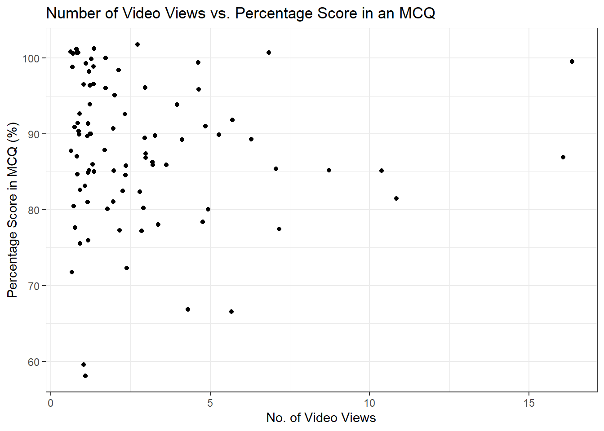

# Combining Echo360 data with other sources of data with `tidyverse` {#Echo_combine}

## Introduction

So far, we have focused on analysing Echo360 data in isolation. However, you might be interested in combining data from multiple sources to explore if there are relationships between lecture capture and engagement/attainment data. 

In this tutorial, we will demonstrate how you can combine data from multiple sources and the kind of identifiers you will need to match people across data sets. In addition to Echo360 data we have used so far, we also have two types of data from the virtual learning environment (VLE) Moodle, based on an introductory research methods course (RM1). We have mock checklist data for how many tasks people complete each week and mock attainment data for scores on a multiple choice quiz (MCQ). We applied the same synthetic data process and created anonymous names and emails to provide consistent information across files to join. 

To follow the tutorial, please download the Echo360 and Moodle data from [this .zip file. ](data/Combine_data.zip). 


```r
library(tidyverse) # Package of packages for plotting and wrangling 
library(plotly) # Creates interactive plots 
```

```
## 
## Attaching package: 'plotly'
```

```
## The following object is masked from 'package:ggplot2':
## 
##     last_plot
```

```
## The following object is masked from 'package:stats':
## 
##     filter
```

```
## The following object is masked from 'package:graphics':
## 
##     layout
```

```r
library(ggpubr) # Builds on ggplot2 to build specific publication ready plots 
```

## Reading in the data

The first step is to read in the data we need for the tutorial. For the first example, we will read in data from one lecture. For later examples, we will combine data from multiple lectures. We only have three lectures of Echo360 data for this course, but to reduce repetition and scale better if you are working with more files, we will still read in data by listing files instead of assigning each file individually to an object. We are using relatives paths for the tutorial and assume you have a folder called `data` in your working directory and two subfolders called `RM1_duplicate` and `Moodle_duplicate`. If you saved the data in another way, you will need to edit the paths. 


```r
# One lecture for an example 
lecture_01 <- read_csv("data/RM1_duplicate/Lecture01.csv")

# Reading the Echo360 data from three lectures into one data object
# Obtain list of files from directory
files <- list.files(path="data/RM1_duplicate/", 
                    pattern=".csv", 
                    full.names = TRUE) 

# Read in all the files to one object and label each file name
Echo360_data <- read_csv(files,
                         id="file_name")

# Preview the columns and data
glimpse(Echo360_data)
```

```
## Rows: 145
## Columns: 16
## $ file_name         <chr> "data/RM1_duplicate/Lecture01.csv", "data/RM1_duplic…
## $ media_id          <chr> "28dcfb20-a198-438b-8dbe-1b5725514231", "28dcfb20-a1…
## $ media_name        <chr> "RM1 Lecture 1", "RM1 Lecture 1", "RM1 Lecture 1", "…
## $ create_date       <chr> "09/23/2022", "09/23/2022", "09/23/2022", "09/23/202…
## $ duration          <time> 01:00:00, 01:00:00, 01:00:00, 01:00:00, 01:00:00, 0…
## $ owner_name        <chr> "James Bartlett", "James Bartlett", "James Bartlett"…
## $ course            <chr> "Research Methods 1 (PGT Conv)", "Research Methods 1…
## $ user_name         <chr> "Yaw, Collin", "Viaan, Jordan", NA, NA, "Sunny, Hali…
## $ email_address     <chr> "214488@university.ac.uk", "211717@university.ac.uk"…
## $ total_views       <dbl> 1, 1, 1, 3, 1, 1, 1, 2, 2, 2, 1, 2, 1, 3, 3, 1, 1, 5…
## $ total_view_time   <time> 00:00:30, 00:01:00, 00:00:08, 00:04:30, 00:01:00, 0…
## $ average_view_time <time> 00:00:30, 00:01:00, 00:00:08, 00:01:30, 00:01:00, 0…
## $ on_demand_views   <dbl> 1, 1, 1, 3, 1, 1, 1, 2, 2, 2, 1, 2, 1, 3, 3, 1, 1, 5…
## $ live_view_count   <dbl> 0, 0, 0, 0, 0, 0, 0, 0, 0, 0, 0, 0, 0, 0, 0, 0, 0, 0…
## $ downloads         <dbl> 0, 0, 0, 0, 0, 0, 0, 0, 0, 0, 0, 0, 0, 0, 0, 0, 0, 0…
## $ last_viewed       <chr> "11/04/2022", "09/30/2022", "02/10/2023", "10/21/202…
```

We only have individual files for the checklist and MCQ data, so we can assign those to individual objects. 


```r
# Reading student data from other Moodle activities into two data objects
Checklist <- read.csv("data/Moodle_duplicate/Checklist.csv")  #A log of checklist elements clicked

MCQ <- read.csv("data/Moodle_duplicate/MCQ.csv")  #Results from Multiple Choice Quiz
```

## Joining data using `dplyr`

The <code class='package'>dplyr</code> package in `tidyverse` has several functions that merge or "join" data. There are several versions of these functions depending on how you want to join the files. For a detailed overview, please refer to the [dplyr reference page online](https://dplyr.tidyverse.org/reference/mutate-joins.html).

There are two main types of joins which add and match columns from two data frames. There is <code><span><span class='fu'>inner_join</span><span class='op'>(</span><span class='op'>)</span></span></code> which only retains observations from data frame 1 that also has a matching case in data frame 2. There are then different types of outer joins which retain observations that appear in at least one data frame, such as <code><span><span class='fu'>left_join</span><span class='op'>(</span><span class='op'>)</span></span></code> which retains all observations in data frame 1. 

To illustrate these functions, we will consider data from Echo360 together with data from a checklist which records the percentage of tasks that student have marked as complete and also with data containing the results of a multiple choice quiz. In both the checklist and MCQ data objects, each student only appears once.

### Merging data where each student only appears once in each data object

If you are interested in combining Echo360 data from just one lecture (and thus where each student will appear once) together with the MCQ data we could follow the following steps.

First, select the variables of interest from each data object, where `lecture_01` contains the Echo360 data from the first lecture.


```r
# Manually select which columns to retain
lecture_01_merge <- lecture_01 %>% 
  select(user_name,
         email_address,
         total_views,
         total_view_time,
         average_view_time,
         last_viewed)

MCQ_merge <- MCQ %>% 
  select(first_name,
         surname,
         id_number,
         email_address,
         quiz_mcq_summative_assessment_real,
         quiz_mcq_summative_assessment_perc)
```

Second, specify the type of 'join' to apply. For this tutorial, we will demonstrate the different types of join to show how the resulting objects differ. Echo360 and Moodle store data differently, so we will need an identifier to use as a key to link people from both files. The participants' email is the only consistent identifier, so we will use that to link participants across files. Other identifying information like the name and student ID number are not consistent across files. 

#### `left_join()`

The first type is <code><span><span class='fu'>left_join</span><span class='op'>(</span><span class='op'>)</span></span></code> which retains all observations in data frame 1, meaning we keep everything in `lecture_01_merge` and add information from `MCQ_merge`. We state `email_address` as the shared variable to act as the key. 


```r
lecture_01_MCQ_left <- left_join(lecture_01_merge,
                                MCQ_merge, 
                                by = "email_address")
```

It is important you explore the resulting data frame to make sure everything is as expected. 


```r
glimpse(lecture_01_MCQ_left)
```

```
## Rows: 67
## Columns: 11
## $ user_name                          <chr> "Yaw, Collin", "Viaan, Jordan", NA,…
## $ email_address                      <chr> "214488@university.ac.uk", "211717@…
## $ total_views                        <dbl> 1, 1, 1, 3, 1, 1, 1, 2, 2, 2, 1, 2,…
## $ total_view_time                    <time> 00:00:30, 00:01:00, 00:00:08, 00:0…
## $ average_view_time                  <time> 00:00:30, 00:01:00, 00:00:08, 00:0…
## $ last_viewed                        <chr> "11/04/2022", "09/30/2022", "02/10/…
## $ first_name                         <chr> "Collin", "Jordan", NA, NA, "Hali",…
## $ surname                            <chr> "Yaw", "Viaan", NA, NA, "Sunny", "T…
## $ id_number                          <int> 214488, 211717, NA, NA, 278359, 272…
## $ quiz_mcq_summative_assessment_real <int> 17, 22, NA, NA, 19, 19, 22, NA, 20,…
## $ quiz_mcq_summative_assessment_perc <dbl> 77.27273, 100.00000, NA, NA, 86.363…
```

We started with 67 rows for the Echo360 data and 243 rows for the MCQ data, but because we only wanted to retain all Echo360 observations, we ended up with 67 rows. 

::: {.info data-latex=""}
If you do not enter a column to act as the key, `dplyr` will do its best to identify if there are two columns with the same name. It will warn you about this to make sure you double check it is using the right variables. In the first example, the variable also has the same name which makes things easier. However, you might find the same information has a different name, so you can tell `dplyr` which two columns you want to use as the joining key. See what these alternatives look like below. 
:::


```r
# Warning which column it is joining by
lecture_01_MCQ_left <- left_join(lecture_01_merge,
                                MCQ_merge)
```

```
## Joining with `by = join_by(email_address)`
```


```r
# Rename email
lecture_01_email <- lecture_01_merge %>% 
  rename(email = email_address)

lecture_01_MCQ_left <- left_join(lecture_01_email,
                                MCQ_merge, 
                                by = c("email" = "email_address"))
```

#### `right_join()`

In contrast, <code><span><span class='fu'>right_join</span><span class='op'>(</span><span class='op'>)</span></span></code> retains all observations in data frame 2, which is the MCQ data in this example. 


```r
lecture_01_MCQ_right <- right_join(lecture_01_merge,
                                  MCQ_merge, 
                                  by = "email_address")
```

It is important you explore the resulting data frame to make sure everything is as expected. 


```r
glimpse(lecture_01_MCQ_right)
```

```
## Rows: 243
## Columns: 11
## $ user_name                          <chr> "Yaw, Collin", "Viaan, Jordan", "Su…
## $ email_address                      <chr> "214488@university.ac.uk", "211717@…
## $ total_views                        <dbl> 1, 1, 1, 1, 1, 2, 2, 2, 1, 2, 1, 3,…
## $ total_view_time                    <time> 00:00:30, 00:01:00, 00:01:00, 00:0…
## $ average_view_time                  <time> 00:00:30, 00:01:00, 00:01:00, 00:0…
## $ last_viewed                        <chr> "11/04/2022", "09/30/2022", "10/08/…
## $ first_name                         <chr> "Collin", "Jordan", "Hali", "Franki…
## $ surname                            <chr> "Yaw", "Viaan", "Sunny", "Tzivia", …
## $ id_number                          <int> 214488, 211717, 278359, 272061, 275…
## $ quiz_mcq_summative_assessment_real <int> 17, 22, 19, 19, 22, NA, 20, 21, 18,…
## $ quiz_mcq_summative_assessment_perc <dbl> 77.27273, 100.00000, 86.36364, 86.3…
```

We started with 67 rows for the Echo360 data and 243 rows for the MCQ data, but because we wanted to retain all MCQ observations, we ended up with 243 rows. 

#### `full_join()`

Finally, <code><span><span class='fu'>right_join</span><span class='op'>(</span><span class='op'>)</span></span></code> retains all observations in data frame 1 and data frame 2. 


```r
lecture_01_MCQ_full <- full_join(lecture_01_merge,
                                MCQ_merge, 
                                by = "email_address")
```

It is important you explore the resulting data frame to make sure everything is as expected. 


```r
glimpse(lecture_01_MCQ_full)
```

```
## Rows: 245
## Columns: 11
## $ user_name                          <chr> "Yaw, Collin", "Viaan, Jordan", NA,…
## $ email_address                      <chr> "214488@university.ac.uk", "211717@…
## $ total_views                        <dbl> 1, 1, 1, 3, 1, 1, 1, 2, 2, 2, 1, 2,…
## $ total_view_time                    <time> 00:00:30, 00:01:00, 00:00:08, 00:0…
## $ average_view_time                  <time> 00:00:30, 00:01:00, 00:00:08, 00:0…
## $ last_viewed                        <chr> "11/04/2022", "09/30/2022", "02/10/…
## $ first_name                         <chr> "Collin", "Jordan", NA, NA, "Hali",…
## $ surname                            <chr> "Yaw", "Viaan", NA, NA, "Sunny", "T…
## $ id_number                          <int> 214488, 211717, NA, NA, 278359, 272…
## $ quiz_mcq_summative_assessment_real <int> 17, 22, NA, NA, 19, 19, 22, NA, 20,…
## $ quiz_mcq_summative_assessment_perc <dbl> 77.27273, 100.00000, NA, NA, 86.363…
```

We started with 67 rows for the Echo360 data and 243 rows for the MCQ data, but because we wanted to retain all MCQ observations, we ended up with 245 rows. 

To summarise:

- The `left` join retains all `nrow(lecture_01_MCQ_left)` student email addresses listed in the Echo360 `lecture_01_merge` object;

- Tthe `right` join retains all `nrow(lecture_01_MCQ_right)` student email addresses listed in the `MCQ_merge` object;

- The `full` join retains all `nrow(lecture_01_MCQ_full)` unique student email addresses listed in both `lecture_01_merge` and `MCQ_merge`.  

On inspection, there are two observations in `lecture_01_merge` that have missing values (`NA`) for `email_address` and these correspond to the two "extra" observations in `lecture_01_MCQ_full` compared to `lecture_01_MCQ_right`.

## Merging data where each student may appear more than once

If we are interested in combining Echo360 data from *multiple* lectures (and thus where students may appear more than once) together with another data object where the students appear only once (such as the checklist and MCQ data described above), then we can still use the `left_join()` function. Despite the function including the argument `multiple` for the "handling of rows in x with multiple matches in y", this argument is not relevant to our scenario since if the Echo360 data is the `x` argument and has multiple rows for each student it can be merged with another data source as the `y` argument (within which each student only appears once) in one of the ways shown previously. 

First, select the variables of interest from each data object, where `Echo360_data` contains the data from the first three lectures.


```r
Echo360_data_merge <- Echo360_data %>% 
  select(user_name, 
         email_address,
         media_name,
         total_views,
         total_view_time,
         average_view_time,
         last_viewed)

MCQ_merge <- MCQ %>% 
  select(first_name,
         surname,
         id_number,
         email_address,
         quiz_mcq_summative_assessment_real,
         quiz_mcq_summative_assessment_perc)
```

::: {.info data-latex=""}
Where students may appear more than once, its necessary to include a variable that distinguishes between the repeated appearances.  In this case its the variable `media_name` which identifies the lecture that the Echo360 data is from.
:::

Second, specify the type of 'join', in this case there is only one.


```r
Echo360_data_MCQ_left <- left_join(Echo360_data_merge,
                                    MCQ_merge,
                                    by = "email_address")
```

Third, check that the input and output data objects are as we expect. 


```r
# Dimensions of original echo 360 data
glimpse(Echo360_data_merge)

# Dimensions of echo 360 data joined with MCQ data 
glimpse(Echo360_data_MCQ_left)
```

```
## Rows: 145
## Columns: 7
## $ user_name         <chr> "Yaw, Collin", "Viaan, Jordan", NA, NA, "Sunny, Hali…
## $ email_address     <chr> "214488@university.ac.uk", "211717@university.ac.uk"…
## $ media_name        <chr> "RM1 Lecture 1", "RM1 Lecture 1", "RM1 Lecture 1", "…
## $ total_views       <dbl> 1, 1, 1, 3, 1, 1, 1, 2, 2, 2, 1, 2, 1, 3, 3, 1, 1, 5…
## $ total_view_time   <time> 00:00:30, 00:01:00, 00:00:08, 00:04:30, 00:01:00, 0…
## $ average_view_time <time> 00:00:30, 00:01:00, 00:00:08, 00:01:30, 00:01:00, 0…
## $ last_viewed       <chr> "11/04/2022", "09/30/2022", "02/10/2023", "10/21/202…
## Rows: 145
## Columns: 12
## $ user_name                          <chr> "Yaw, Collin", "Viaan, Jordan", NA,…
## $ email_address                      <chr> "214488@university.ac.uk", "211717@…
## $ media_name                         <chr> "RM1 Lecture 1", "RM1 Lecture 1", "…
## $ total_views                        <dbl> 1, 1, 1, 3, 1, 1, 1, 2, 2, 2, 1, 2,…
## $ total_view_time                    <time> 00:00:30, 00:01:00, 00:00:08, 00:0…
## $ average_view_time                  <time> 00:00:30, 00:01:00, 00:00:08, 00:0…
## $ last_viewed                        <chr> "11/04/2022", "09/30/2022", "02/10/…
## $ first_name                         <chr> "Collin", "Jordan", NA, NA, "Hali",…
## $ surname                            <chr> "Yaw", "Viaan", NA, NA, "Sunny", "T…
## $ id_number                          <int> 214488, 211717, NA, NA, 278359, 272…
## $ quiz_mcq_summative_assessment_real <int> 17, 22, NA, NA, 19, 19, 22, NA, 20,…
## $ quiz_mcq_summative_assessment_perc <dbl> 77.27273, 100.00000, NA, NA, 86.363…
```

The `left` join retains all 145 observations listed in the `Echo360_data_merge` object and combines them with the (single) corresponding observations in `MCQ_merge`. 

## Visualizing merged data

Merging data enables the exploration of how video engagement (recorded in the Echo360 data) may be related to student performance. For example, the number of times each student views video content can be combined with their performance in an assessment (such as contained in the the MCQ data above). 

First, we need some brief wrangling to summarise the total number of video views per student and repeat the joining process from before.


```r
student_data <- Echo360_data %>% 
  group_by(email_address) %>%
  summarise(total_views = sum(total_views)) %>%
  mutate(email_address = factor(email_address)) %>% 
  ungroup()

student_MCQ <- left_join(student_data,
                         MCQ_merge,
                         by = "email_address") %>% 
  rename(MCQ_perc = quiz_mcq_summative_assessment_perc) # Rename super long name
```

We now have Echo360 and student attainment data that we can use to explore for potential patterns. For example, we can look at the relationship between these two variables in a scatterplot. There is a lot of overlap, so we have added a little jitter to the data points so its easier to see the density. This is why some of the points look like they extend beyond 100%. 


```r
fig.no_viewed.mcq <- student_MCQ %>% 
  ggplot(aes(x = total_views, y = MCQ_perc)) +
  geom_jitter() + 
  labs(title= "Number of Video Views vs. Percentage Score in an MCQ") + 
  ylab("Percentage Score in MCQ (%)") +
  xlab("No. of Video Views") +
  theme_bw()

fig.no_viewed.mcq
```



From this plot, it does not look like there is a clear relationship as there are far more video views between 0 and 5, and clustered in the top left to show very good performance above 80%. 

As in the previous chapter, you might want to identify some of these data points in an interactive version of the plot, so you could convert it using <code class='package'>plotly</code>:


```r
ggplotly(fig.no_viewed.mcq)
```

```{=html}
<div class="plotly html-widget html-fill-item-overflow-hidden html-fill-item" id="htmlwidget-9d3d3558c42ada1d33eb" style="width:100%;height:480px;"></div>
<script type="application/json" data-for="htmlwidget-9d3d3558c42ada1d33eb">{"x":{"data":[{"x":[1.8949221402406693,1.132533923536539,4.6820285638794301,2.3778170958161353,2.0997370079159738,0.93833447378128765,1.768845946341753,3.0006489373743532,0.73014517202973361,5.1457912681624292,1.9548783939331771,1.1566665200516582,2.0470230804756282,1.3146476166322829,1.1441035950556397,6.6272682324051857,2.1598340507596729,1.2167537696659565,3.163694036193192,6.3590112462639805,1.3869137406349181,0.91959676966071124,2.1998566495254637,2.7212115997448563,3.3520663399249315,0.97799998074769978,1.1048413213342427,10.622723840177059,1.7401143938302994,3.3037448277696968,0.65020241495221853,5.9779194762930272,1.0015888513997198,1.3419560406357052,0.91598160918802018,1.0222423251718282,0.64260369986295696,2.8230396579951047,6.6632386654615399,3.8673164715990422,4.0087468219920996,3.6635758444666862,5.0293472178280352,1.0616789499297739,2.8646805467084051,0.8471119483932853,1.96221832241863,2.1999133301898839,5.8240940930321816,0.98315284438431261,2.3076704807579516,2.9539038449525834,1.0284258918836713,0.91954167820513244,5.0609936865046619,5.0448824819177389,8.6682608619332306,1.0243784422054887,3.2854642903432252,1.2164926711469888,0.6164626581594348,0.74128849357366566,1.3400650035589934,2.2390532976016404,9.6171686762943871,0.70233902391046277,5.852865802310407,2.0078915724530817,0.89833817575126884,0.65973323713988063,2.7149521104991434,15.788173276744782,1.1515916271135211,2.1439516790211202,0.92163308076560502,0.87964044772088523,6.6216236673295494,0.73197106271982193,3.3478084843605758,1.1713184405118227,2.8349945303052664,2.1414160082116722,16.279381401836872,1.0503808224573732,4.2584107184782622,1.1421785226091743,0.71617982089519505,4.761988114006817,1.3569483427330851,0.82305107004940514,1.1437571108341218,6.3324813626706602],"y":[94.63922117752108,86.365490003742948,76.457295074042946,87.435367970981375,85.752891860902309,99.692173579030424,75.794354169206187,101.56261493536559,77.878809220750213,90.062013510614634,90.013274259187952,86.256617933342397,96.726752527227447,92.109707061370656,92.216624162921846,77.096213077787638,82.08069402639839,82.225386792455211,87.529041746800587,90.574771404605016,86.104619801891118,101.27478038807484,100.86955601095475,75.842708144336939,81.854394184086814,71.145547377792283,77.632721548222676,83.635928464884117,72.713174600662157,89.568470272828236,98.539970374073505,null,90.113749974830583,99.768110915849149,94.579660890793264,89.894381065598949,58.526041763411328,84.640745324167341,98.730725685811862,69.310816989534274,93.714976988055497,89.872834320942104,100.89053765447302,82.754128455099746,91.358423617414445,94.73217311738567,80.782109156081631,86.021245629103348,90.553852080960169,76.778990937904879,80.348036657510846,85.682246166874066,100.87358405220915,91.73339300788939,83.493690661747351,97.203502086075858,84.698438210920855,86.645749389109284,78.003148998726488,99.872292242944241,81.129424496638521,100.54333829320967,98.678205368871048,92.362404719672412,86.202965734357178,87.34916940839453,67.349984940480098,98.997203426604926,91.726231776516542,100.25823578661816,93.678475790233776,100.82487952387469,89.561443050307304,86.134809849106446,98.383953887969255,91.186267052015111,88.040137798948706,85.806952241638839,80.139356571334346,58.163624995980754,86.267416331578374,null,84.571314879100427,100.42538962326944,87.01186818324706,90.53405301306735,96.697858056392178,90.846725314516917,95.928025100888178,80.517254632643684,86.242430064488531,null],"text":["total_views:  2<br />MCQ_perc:  95.45455","total_views:  1<br />MCQ_perc:  86.36364","total_views:  5<br />MCQ_perc:  77.27273","total_views:  2<br />MCQ_perc:  86.36364","total_views:  2<br />MCQ_perc:  86.36364","total_views:  1<br />MCQ_perc: 100.00000","total_views:  2<br />MCQ_perc:  77.27273","total_views:  3<br />MCQ_perc: 100.00000","total_views:  1<br />MCQ_perc:  77.27273","total_views:  5<br />MCQ_perc:  90.90909","total_views:  2<br />MCQ_perc:  90.90909","total_views:  1<br />MCQ_perc:  86.36364","total_views:  2<br />MCQ_perc:  95.45455","total_views:  1<br />MCQ_perc:  90.90909","total_views:  1<br />MCQ_perc:  90.90909","total_views:  7<br />MCQ_perc:  77.27273","total_views:  2<br />MCQ_perc:  81.81818","total_views:  1<br />MCQ_perc:  81.81818","total_views:  3<br />MCQ_perc:  86.36364","total_views:  6<br />MCQ_perc:  90.90909","total_views:  1<br />MCQ_perc:  86.36364","total_views:  1<br />MCQ_perc: 100.00000","total_views:  2<br />MCQ_perc: 100.00000","total_views:  3<br />MCQ_perc:  77.27273","total_views:  3<br />MCQ_perc:  81.81818","total_views:  1<br />MCQ_perc:  72.72727","total_views:  1<br />MCQ_perc:  77.27273","total_views: 11<br />MCQ_perc:  81.81818","total_views:  2<br />MCQ_perc:  72.72727","total_views:  3<br />MCQ_perc:  90.90909","total_views:  1<br />MCQ_perc: 100.00000","total_views:  6<br />MCQ_perc:        NA","total_views:  1<br />MCQ_perc:  90.90909","total_views:  1<br />MCQ_perc: 100.00000","total_views:  1<br />MCQ_perc:  95.45455","total_views:  1<br />MCQ_perc:  90.90909","total_views:  1<br />MCQ_perc:  59.09091","total_views:  3<br />MCQ_perc:  86.36364","total_views:  7<br />MCQ_perc: 100.00000","total_views:  4<br />MCQ_perc:  68.18182","total_views:  4<br />MCQ_perc:  95.45455","total_views:  4<br />MCQ_perc:  90.90909","total_views:  5<br />MCQ_perc: 100.00000","total_views:  1<br />MCQ_perc:  81.81818","total_views:  3<br />MCQ_perc:  90.90909","total_views:  1<br />MCQ_perc:  95.45455","total_views:  2<br />MCQ_perc:  81.81818","total_views:  2<br />MCQ_perc:  86.36364","total_views:  6<br />MCQ_perc:  90.90909","total_views:  1<br />MCQ_perc:  77.27273","total_views:  2<br />MCQ_perc:  81.81818","total_views:  3<br />MCQ_perc:  86.36364","total_views:  1<br />MCQ_perc: 100.00000","total_views:  1<br />MCQ_perc:  90.90909","total_views:  5<br />MCQ_perc:  81.81818","total_views:  5<br />MCQ_perc:  95.45455","total_views:  9<br />MCQ_perc:  86.36364","total_views:  1<br />MCQ_perc:  86.36364","total_views:  3<br />MCQ_perc:  77.27273","total_views:  1<br />MCQ_perc: 100.00000","total_views:  1<br />MCQ_perc:  81.81818","total_views:  1<br />MCQ_perc: 100.00000","total_views:  1<br />MCQ_perc: 100.00000","total_views:  2<br />MCQ_perc:  90.90909","total_views: 10<br />MCQ_perc:  86.36364","total_views:  1<br />MCQ_perc:  86.36364","total_views:  6<br />MCQ_perc:  68.18182","total_views:  2<br />MCQ_perc: 100.00000","total_views:  1<br />MCQ_perc:  90.90909","total_views:  1<br />MCQ_perc: 100.00000","total_views:  3<br />MCQ_perc:  95.45455","total_views: 16<br />MCQ_perc: 100.00000","total_views:  1<br />MCQ_perc:  90.90909","total_views:  2<br />MCQ_perc:  86.36364","total_views:  1<br />MCQ_perc: 100.00000","total_views:  1<br />MCQ_perc:  90.90909","total_views:  7<br />MCQ_perc:  86.36364","total_views:  1<br />MCQ_perc:  86.36364","total_views:  3<br />MCQ_perc:  81.81818","total_views:  1<br />MCQ_perc:  59.09091","total_views:  3<br />MCQ_perc:  86.36364","total_views:  2<br />MCQ_perc:        NA","total_views: 16<br />MCQ_perc:  86.36364","total_views:  1<br />MCQ_perc: 100.00000","total_views:  4<br />MCQ_perc:  86.36364","total_views:  1<br />MCQ_perc:  90.90909","total_views:  1<br />MCQ_perc:  95.45455","total_views:  5<br />MCQ_perc:  90.90909","total_views:  1<br />MCQ_perc:  95.45455","total_views:  1<br />MCQ_perc:  81.81818","total_views:  1<br />MCQ_perc:  86.36364","total_views:  6<br />MCQ_perc:        NA"],"type":"scatter","mode":"markers","marker":{"autocolorscale":false,"color":"rgba(0,0,0,1)","opacity":1,"size":5.6692913385826778,"symbol":"circle","line":{"width":1.8897637795275593,"color":"rgba(0,0,0,1)"}},"hoveron":"points","showlegend":false,"xaxis":"x","yaxis":"y","hoverinfo":"text","frame":null}],"layout":{"margin":{"t":43.762557077625573,"r":7.3059360730593621,"b":40.182648401826491,"l":43.105022831050235},"plot_bgcolor":"rgba(255,255,255,1)","paper_bgcolor":"rgba(255,255,255,1)","font":{"color":"rgba(0,0,0,1)","family":"","size":14.611872146118724},"title":{"text":"Number of Video Views vs. Percentage Score in an MCQ","font":{"color":"rgba(0,0,0,1)","family":"","size":17.534246575342465},"x":0,"xref":"paper"},"xaxis":{"domain":[0,1],"automargin":true,"type":"linear","autorange":false,"range":[-0.16668327902443714,17.062527339020743],"tickmode":"array","ticktext":["0","5","10","15"],"tickvals":[0,5,10,15],"categoryorder":"array","categoryarray":["0","5","10","15"],"nticks":null,"ticks":"outside","tickcolor":"rgba(51,51,51,1)","ticklen":3.6529680365296811,"tickwidth":0.66417600664176002,"showticklabels":true,"tickfont":{"color":"rgba(77,77,77,1)","family":"","size":11.68949771689498},"tickangle":-0,"showline":false,"linecolor":null,"linewidth":0,"showgrid":true,"gridcolor":"rgba(235,235,235,1)","gridwidth":0.66417600664176002,"zeroline":false,"anchor":"y","title":{"text":"No. of Video Views","font":{"color":"rgba(0,0,0,1)","family":"","size":14.611872146118724}},"hoverformat":".2f"},"yaxis":{"domain":[0,1],"automargin":true,"type":"linear","autorange":false,"range":[55.993675499011516,103.73256443233483],"tickmode":"array","ticktext":["60","70","80","90","100"],"tickvals":[60,70,80,90,100],"categoryorder":"array","categoryarray":["60","70","80","90","100"],"nticks":null,"ticks":"outside","tickcolor":"rgba(51,51,51,1)","ticklen":3.6529680365296811,"tickwidth":0.66417600664176002,"showticklabels":true,"tickfont":{"color":"rgba(77,77,77,1)","family":"","size":11.68949771689498},"tickangle":-0,"showline":false,"linecolor":null,"linewidth":0,"showgrid":true,"gridcolor":"rgba(235,235,235,1)","gridwidth":0.66417600664176002,"zeroline":false,"anchor":"x","title":{"text":"Percentage Score in MCQ (%)","font":{"color":"rgba(0,0,0,1)","family":"","size":14.611872146118724}},"hoverformat":".2f"},"shapes":[{"type":"rect","fillcolor":"transparent","line":{"color":"rgba(51,51,51,1)","width":0.66417600664176002,"linetype":"solid"},"yref":"paper","xref":"paper","x0":0,"x1":1,"y0":0,"y1":1}],"showlegend":false,"legend":{"bgcolor":"rgba(255,255,255,1)","bordercolor":"transparent","borderwidth":1.8897637795275593,"font":{"color":"rgba(0,0,0,1)","family":"","size":11.68949771689498}},"hovermode":"closest","barmode":"relative"},"config":{"doubleClick":"reset","modeBarButtonsToAdd":["hoverclosest","hovercompare"],"showSendToCloud":false},"source":"A","attrs":{"3eec366c14c8":{"x":{},"y":{},"type":"scatter"}},"cur_data":"3eec366c14c8","visdat":{"3eec366c14c8":["function (y) ","x"]},"highlight":{"on":"plotly_click","persistent":false,"dynamic":false,"selectize":false,"opacityDim":0.20000000000000001,"selected":{"opacity":1},"debounce":0},"shinyEvents":["plotly_hover","plotly_click","plotly_selected","plotly_relayout","plotly_brushed","plotly_brushing","plotly_clickannotation","plotly_doubleclick","plotly_deselect","plotly_afterplot","plotly_sunburstclick"],"base_url":"https://plot.ly"},"evals":[],"jsHooks":[]}</script>
```

The purpose of our tutorials has not been to introduce you to inferential statistics, but having the data available means you can explore in different ways. The scatterplot did not suggest there was a clear relationship visually between total video views and MCQ attainment, but maybe there is a subtle statistical relationship. 

Here, we can apply a Spearman correlation since the data may not meet parametric assumptions given the distribution of each variable.  


```r
cor.test(student_MCQ$total_views, 
         student_MCQ$MCQ_perc, 
         method = "spearman")
```

```
## Warning in cor.test.default(student_MCQ$total_views, student_MCQ$MCQ_perc, :
## Cannot compute exact p-value with ties
```

```
## 
## 	Spearman's rank correlation rho
## 
## data:  student_MCQ$total_views and student_MCQ$MCQ_perc
## S = 133575, p-value = 0.2004
## alternative hypothesis: true rho is not equal to 0
## sample estimates:
##        rho 
## -0.1370056
```

The correlation coefficient is slightly negative suggesting as the number of video views increases, the MCQ percentage tends to decrease, but the relationship is not statistically significant. 

This might inspire you to explore additional relationships and variables to see if there patterns worth investigating further to answer research questions you might have. 
